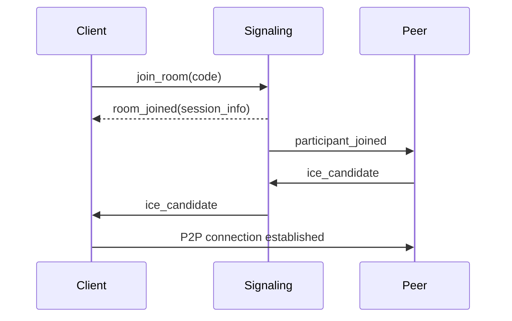
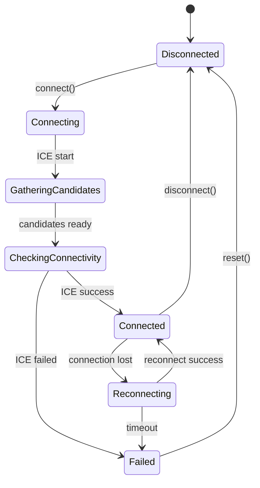

---
paths:
  - "docs-spec/**"
  - "docs-site/**"
  - "docs/**"
---

# 仕様書・ドキュメント作成ガイドライン

## 記述原則

- 感情的・抽象的な表現を避ける
- 判断理由を必ず明示する
- 「なぜそうするか」を残す（= ADR）

❌ 悪い例

```
高品質で低遅延な音声通話を実現する
```

⭕ 良い例

```
アプリ起因の片道遅延は 2ms 未満を目標とする（ADR-008）。
音声は非圧縮PCM 32-bit float / 48kHz をデフォルトとする。
```

## 曖昧さ排除ルール

- 「高速」「高品質」「低遅延」は禁止
- 数値 or 条件で書く

❌ `低遅延を目指す`
⭕ `アプリ起因の片道遅延 < 2ms（遅延 ≒ ネットワークRTT）`

※ 例中の数値は本プロジェクトの決定値（ADR-003 / ADR-008）と整合させること。

---

## 図解のルール

**ドキュメントには積極的に図解を入れる。**

テキストだけで説明するより、図解があることで理解が格段に速くなる。
特に以下の場面では、図解がないドキュメントは不完全とみなす:

- 複数コンポーネント間の通信フロー
- 状態を持つオブジェクトのライフサイクル
- 処理の順序が重要なシーケンス
- アーキテクチャの全体像

図解作成のルール:

- mermaid で表現可能な図は mermaid を使用する
- mermaid に不向きな図（ASCII アート、複雑なレイアウト等）はその限りではない
- 新規ドキュメント作成時は、図解を入れられる箇所がないか必ず検討する
- 既存ドキュメントを更新する際も、図解追加の機会を見逃さない

### 必須で図解すべきケース

**シーケンス図（sequenceDiagram）**
一連の処理の流れがある場合は必ずシーケンス図を書く:

- 複数コンポーネント間のメッセージ交換
- API呼び出しの順序が重要な処理
- 非同期処理のフロー



**状態遷移図（stateDiagram-v2）**
状態遷移を管理する必要がある場合は必ずステートマシンを書く:

- 接続状態の管理
- セッションライフサイクル
- UI状態の遷移



### mermaid 推奨ケース

- フローチャート、シーケンス図、状態遷移図
- クラス図、ER 図
- アーキテクチャ概要図

### mermaid 不向きケース

- パケットフォーマットのバイナリレイアウト
- 細かい位置調整が必要な図
- 既存の ASCII アートで十分表現できている図

---

## architecture.md 作成ルール

### 必須項目（決定事項のみ記載、選択肢や検討中の案は書かない）

- 対応 OS（macOS / Windows / Linux）
- 使用言語（例：C++20 / Rust stable）
- 音声 I/O
  - macOS: CoreAudio
  - Windows: WASAPI
  - Linux: ALSA / PipeWire
- ネットワーク方式（例：WebRTC Native）
- codec（Opus 等）
- スレッドモデル
- リアルタイム制約

---

## ADR（Architecture Decision Record）

### 役割

- Claude Code が勝手に設計を変えないための杭
- 後から見て「なぜそうなったか」を説明する

### テンプレート

```markdown
# ADR-XXX: <Decision Title>

## Context
なぜこの判断が必要だったか。

## Decision
何を採用 / 不採用にしたか。

## Consequences
この判断によるメリット・デメリット。
```

### 音声通信で必須になりやすいADR

- 通信方式（WebRTC / 独自実装）
- codec 選定
- ネイティブ UI 方針
- Electron / WebView を使わない判断
- リアルタイムスレッドの扱い

---

## BDD / Gherkin 作成ルール

### 目的

- 音声品質・ネットワーク劣化時の振る舞いを明文化
- テストやシミュレーションに直結させる

### 書き方

- 環境条件を `Given` に書く
- ユーザー操作 or イベントを `When`
- 観測可能な結果を `Then`

### 例

```gherkin
Scenario: Packet loss
  Given packet loss is 5%
  When audio streaming is active
  Then audio remains intelligible
```

※「intelligible」が何かは architecture or ADR 側で定義する

---

## API仕様作成ルール

### 目的

- UI / 音声エンジン / ネットワークの責務分離
- 実装が境界を越えないようにする

### 記載項目

- API 名
- 入力
- 出力
- スレッド制約
- 呼び出しタイミング

### 例（audio_engine.md）

```
start_capture(device_id)
- Must be called from non-realtime thread
- Returns immediately
```
