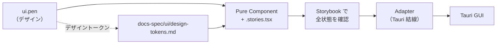

---
paths:
  - "ui/src/**"
---

# UI Component Design Rules

## Core Principle

**Storybook is the single source of truth for UI components.**

All UI components must be designed for both Storybook and Tauri without code duplication.
Differences between environments must be handled through the Adapter pattern.

## Architecture: Pure Component + Adapter Pattern

```
+------------------+     +---------------------+
|  Pure Component  | <-- |  Storybook Stories  |
|  (ChatPanel.tsx) |     |  (.stories.tsx)     |
+------------------+     +---------------------+
         ^
         |
+---------------------+     +----------------+
|  Adapter Component  | <-- |  Tauri App     |
|  (ChatPanelAdapter) |     |  (MainScreen)  |
+---------------------+     +----------------+
```

### Pure Component (Required)

Location: `ui/src/components/{ComponentName}/{ComponentName}.tsx`

Requirements:
- **No Tauri imports** (`@tauri-apps/api/*` is forbidden)
- **No backend state** (use Props for all data)
- **Props-driven** (all inputs via Props, all outputs via callbacks)
- **Stateless or minimal state** (UI state only, e.g., hover, focus)
- **Environment agnostic** (works in any React environment)

Example:
```tsx
// ChatPanel.tsx - Pure component
export interface ChatPanelProps {
  messages: ChatMessageData[];
  onSend?: (message: string) => void;
  disabled?: boolean;
}

export function ChatPanel({ messages, onSend, disabled }: ChatPanelProps) {
  // No Tauri imports, no backend calls
  return (/* JSX */);
}
```

### Adapter Component (For Tauri integration)

Location: `ui/src/components/{ComponentName}/{ComponentName}Adapter.tsx`

Requirements:
- Imports and uses Tauri APIs (`invoke`, `listen`, etc.)
- Manages backend state and polling
- Converts Tauri data formats to Pure component Props
- Wraps Pure component with state management

Example:
```tsx
// ChatPanelAdapter.tsx - Tauri adapter
import { invoke } from "@tauri-apps/api/core";
import { ChatPanel } from "./ChatPanel";

export function ChatPanelAdapter({ connId }: ChatPanelAdapterProps) {
  const [messages, setMessages] = useState<ChatMessageData[]>([]);

  // Poll Tauri backend for messages
  useEffect(() => {
    const poll = async () => {
      const data = await invoke<TauriChatMessage[]>("signaling_get_chat_messages");
      setMessages(convertMessages(data));
    };
    // ...
  }, []);

  return <ChatPanel messages={messages} onSend={handleSend} />;
}
```

## File Structure

```
ui/src/components/
  {ComponentName}/
    {ComponentName}.tsx         # Pure component (Storybook-ready)
    {ComponentName}.stories.tsx # Storybook stories
    {ComponentName}.css         # Component styles
    {ComponentName}.test.tsx    # Unit tests
    {ComponentName}Adapter.tsx  # Tauri adapter (if needed)
    index.ts                    # Exports
```

## Mandatory Rules

### 1. Storybook Coverage

Every Pure component MUST have a corresponding `.stories.tsx` file.

Required story variants:
- `Default` - Standard usage
- `Empty` - Empty/null state
- `Disabled` - Disabled state (if applicable)
- `Error` - Error state (if applicable)
- Edge cases specific to the component

### 2. No Environment Detection

Do not use environment detection in Pure components.

Forbidden:
```tsx
// BAD: Environment detection in Pure component
if (typeof window.__TAURI__ !== 'undefined') {
  // Tauri-specific code
}
```

Correct approach:
```tsx
// GOOD: Use Adapter for environment-specific behavior
// Pure component remains environment-agnostic
```

### 3. Data Format Conversion

Tauri backend data formats must be converted in the Adapter, not in the Pure component.

```tsx
// In Adapter
function convertMessage(msg: TauriChatMessage): ChatMessageData {
  return {
    id: msg.id,
    type: msg.isSystem ? "system" : "other",
    content: msg.content,
    // ...
  };
}
```

### 4. Callback Pattern

Pure components use callback props for actions.
Adapters implement callbacks with Tauri API calls.

```tsx
// Pure component
interface Props {
  onSend?: (message: string) => void;
}

// Adapter implements the callback
const handleSend = async (content: string) => {
  await invoke("signaling_send_chat", { content });
};
```

### 5. Story-First Development

When creating new UI:
1. Design the component API (Props interface)
2. Create the Pure component
3. Write Storybook stories to verify all states
4. Create Adapter for Tauri integration
5. Integrate Adapter into the app

## Verification Checklist

Before merging UI changes:

- [ ] Pure component has no Tauri imports
- [ ] All component states are documented in stories
- [ ] Storybook builds successfully (`npm run storybook:build`)
- [ ] Component works identically in Storybook and Tauri app
- [ ] Props interface is documented with JSDoc comments
- [ ] CSS uses design tokens (variables), not hardcoded values

## Prohibited Patterns

1. **Direct Tauri calls in Pure components**
   ```tsx
   // FORBIDDEN in Pure component
   import { invoke } from "@tauri-apps/api/core";
   ```

2. **Conditional Tauri usage**
   ```tsx
   // FORBIDDEN
   const data = isTauri ? await invoke("...") : mockData;
   ```

3. **Global state in Pure components**
   ```tsx
   // FORBIDDEN - use Props instead
   const [data] = useAtom(globalAtom);
   ```

4. **Deleting or weakening Storybook stories**
   ```tsx
   // FORBIDDEN - stories are the source of truth
   // Do not remove stories to "fix" failing tests
   ```

## Testing

- Pure components: Test with React Testing Library
- Adapters: Test with Tauri test utilities (mock `invoke`)
- Visual regression: Use Storybook snapshot testing
- Whole app (real backend + IPC + webview): GUI E2E in `tests/e2e/tests/gui.rs` (ADR-025).
  Storybook and unit tests never traverse `invoke`, so this is the only layer that
  proves the Adapter wiring works.

### `data-testid` convention (ADR-025)

GUI E2E selects elements by `data-testid`. Class names and visible strings are not
usable as selectors: the former change with styling, the latter with the locale
(the app starts in English on a default machine).

| Rule | Detail |
|------|--------|
| Naming | `kebab-case`, prefixed with the component: `connection-panel`, `connection-panel-create-room` |
| Where | The Pure component's root, plus each control the user can operate |
| Screen state | Expose it as `data-state` on the root (`idle` / `connecting` / `error`) rather than making tests infer it from which elements exist |
| Do not add | When a stable semantic attribute already exists. Settings tabs use `id="tab-<id>"` and `aria-selected`, so they carry no test id |

Add them as scenarios need them. A blanket pass over every component produces
attributes nothing selects on, which then rot.

```tsx
<div className="connection-panel" data-testid="connection-panel" data-state={hasError ? "error" : "idle"}>
  <button data-testid="connection-panel-create-room" onClick={onCreateRoom}>...</button>
</div>
```

**Rebuild `ui/` before running GUI E2E.** The app embeds `ui/dist` at compile time,
so a test id that is only in the source is invisible to the running app.

## Pencil デザインファイル連携

UI のデザインは `ui.pen`（プロジェクトルート）で管理する。Pencil は MCP ベースのデザインキャンバスで、デザインファイルを Git 管理できる。

### 現在の構成

| 項目 | 値 |
|------|-----|
| デザインファイル | `ui.pen`（Git 管理下、約1MB） |
| 構成 | Atoms / Molecules / Organisms / Screens（アトミックデザイン） |
| 収録数 | 再利用コンポーネント 48、トップレベルノード 101 |

### MCP サーバーの設定

**リポジトリには設定を置かない。** Pencil の MCP サーバーバイナリはプラットフォーム固有のパス（macOS arm64 なら `/Applications/Pencil.app/Contents/Resources/app.asar.unpacked/out/mcp-server-darwin-arm64`）にあり、リポジトリにコミットすると他プラットフォームで壊れる。

各開発者がユーザーレベル（`~/.claude.json` の `mcpServers`）に設定する:

```json
{
  "mcpServers": {
    "pencil": {
      "type": "stdio",
      "command": "<Pencil.app 内の mcp-server-<platform> への絶対パス>",
      "args": ["--app", "desktop", "--agent", "claudeCodeCLI"]
    }
  }
}
```

### 絶対禁止

1. **`.pen` ファイルを Read / Grep / Edit で扱わない**
   - 暗号化されており、テキストとして読めない。破損させる
   - 必ず `mcp__pencil__*` ツール経由で読み書きする

2. **`.pen` を `.gitignore` に入れない**
   - デザインファイルを Git 管理することが Pencil を選んだ理由である

### ワークフロー



1. `mcp__pencil__get_editor_state` で現在のドキュメント状態とスキーマを取得する
2. `mcp__pencil__batch_get` で該当コンポーネントを読む（一件ずつではなく一括で）
3. デザイン値（色・間隔・タイポグラフィ）は `docs-spec/ui/design-tokens.md` のトークンに落とし、CSS 変数として使う。`.pen` の生の値を CSS へ直接書き写さない
4. Pure Component と `.stories.tsx` を作る（本ファイル冒頭の Pure + Adapter パターンに従う）
5. Storybook で全状態を確認する
6. Adapter を作り Tauri と結線する

### デザインと実装が食い違ったとき

`ui.pen` はデザインの意図、`docs-spec/ui/` は仕様である。食い違いを見つけた場合:

| 状況 | 対応 |
|------|------|
| 実装がデザインから逸脱 | 実装を直す |
| デザインが仕様（docs-spec/ui/）と矛盾 | どちらが正しいかを確認してから、片方を直す。勝手にどちらかへ寄せない |
| デザインに存在しない画面を実装する必要がある | `ui.pen` にも追加する。実装だけ先に進めない |

## Related Documents

- [ADR-008: Zero Latency Mode](../../docs-spec/adr/ADR-008-zero-latency-mode.md)
- [docs-spec/ui/design-tokens.md](../../docs-spec/ui/design-tokens.md) - デザイントークン
- [Implementation Quality Rules](./implementation-quality.md)
