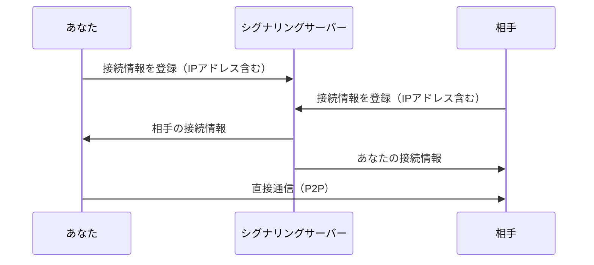

# プライバシーとセキュリティ

jamjamを使用する前に、以下のプライバシーに関する情報をご確認ください。

## アカウント登録は不要です

jamjamに会員登録はありません。メールアドレスも電話番号も収集しません。アプリを起動したらそのまま
セッションに参加できます。

### 端末識別子について

アカウントの代わりに、**初回起動時にお使いの端末ごとの識別子が自動生成されます**。

| 項目 | 内容 |
|------|------|
| 生成場所 | お使いのパソコン内（サーバーには問い合わせません） |
| 保存場所 | アプリの設定フォルダ内の `device_identity.json` |
| 形式 | 26文字の英数字（例: `7K2MQ4XJ9VBTN3RHDW8FCL5PZY`） |
| 内容 | 端末内で生成した鍵から計算した値のみ。氏名・メールアドレス・ハードウェア情報は含みません |

この識別子は署名付きでシグナリングサーバーに提示されるため、**他の人があなたの識別子を名乗ることは
できません**。

識別子はセッションの他の参加者には送られず、参加者どうしで共有されることはありません。

## ベータ版の遠隔デバッグについて

**ベータ版（`-beta` の付いた版）だけ**、動作の検証のために、開発者が遠隔からアプリを操作できる仕組みを持っています。
正式リリース版には、この仕組みのコードそのものが入っていません。

- ベータ版は、起動時とその後 30 分ごとに、jamjam のサーバーへ**この端末が登録されているか**を問い合わせます。
  送るのは端末識別子の署名（[端末識別子について](#端末識別子について)と同じもの）だけです。
- サーバーに登録された端末だけが、サーバーへの接続を保ち、遠隔からの操作を受け付けます。登録は開発者がサーバー側で行い、
  お使いの端末の画面や設定には、有効にする操作も表示もありません。登録されていない端末は、問い合わせのほかに何も送りません。
- 登録された端末では、開発者が、アプリの画面、診断ログ、音声設定や音声デバイスの一覧を読み、アプリを操作できます。
  端末を登録するのは、開発者自身の検証用の機材だけです。

## 設定の手伝い

同じルームの人が、あなたの音声の設定を手伝ってくれる機能があります。**あなたが許可したときだけ**始まり、**あなたがいつでも止められます**。

- 手伝いたい人が申し出ると、あなたの画面に問いかけが出ます。許可を押すまで何も起きません。**許可は始めの 1 回だけ**で、そのあとの 1 つ 1 つの操作は聞かれません。
- 手伝う人の手元には、あなたのアプリと同じ画面が別のウィンドウで開きます。手伝う人がそこで操作すると、あなたのアプリに届きます。
  あなたの画面と、手伝う人の画面には、互いの状態（音声のメーター・ミュート・設定など）が映ります。この通信は、jamjam のサーバーの中継を通ります。
- 手伝う人がしてよいことは決まっています。**マイクのミュートや音量・音声の設定の変更**、診断はできます。**あなたの代わりにチャットを送ること、
  退室やほかのルームへ移ること、接続先や利用状況の送信の設定を変えること、入ったことのあるルームの履歴を見ることはできません。**
  してよい操作の一覧は、あなたのアプリが 1 件ずつ確かめます。手伝う人のアプリがどう作られていても、この決まりは変わりません
  （一覧: [手伝いで相手に何をされうるか](https://github.com/koedame/jamjam-client/blob/main/docs-spec/api/remote-permissions.md)）。
- 手伝う人には、**機器のデバイス ID、失敗したときのエラーの文面、ほかの参加者のネットワークアドレスは渡りません。** 機器は名前で見えます。
- 手伝っているあいだ、あなたの画面には**手伝っている人の名前と「停止」**が出続けます。ルームのチャットには、手伝いの開始と終了、音声の設定を変えたことが記録されます
  （ミュートや音量の変更は記録されません）。
- 止めるのは、あなたの「停止」、手伝う人がやめる、どちらかが退室する、接続が切れる、ルームが閉じる、のどれか。**アプリを起動し直しても、手伝いは続きません。**

## P2P通信とIPアドレス

:::warning 重要
jamjamはP2P（Peer-to-Peer）通信を使用しています。**セッション参加者同士でIPアドレスが共有されます。**
:::

### なぜIPアドレスが見えるのか

P2P通信では、音声データを直接相手に送信するために、お互いのIPアドレスを知る必要があります。

### 相手に見える情報

| 情報 | 見える？ | 説明 |
|------|----------|------|
| パブリックIPアドレス | ✓ | インターネット上のIPアドレス |
| 使用ポート番号 | ✓ | UDP通信に使用するポート |
| ユーザー名 | ✓ | セッション参加時に設定した名前 |
| 音声データ | ✓ | 送信した音声（暗号化済み） |
| ローカルIPアドレス | △ | 同一LAN内の場合のみ |
| 端末識別子 | ✗ | 他の参加者には送られません |

### 相手に見えない情報

- MACアドレス
- OSの種類・バージョン
- その他のネットワークトラフィック

## なぜリレーサーバーを使わないのか

IPアドレスを隠すにはリレーサーバー（TURN）経由で通信する方法がありますが、jamjamでは**遅延最小化を最優先**としているため採用していません。

| 方式 | IPアドレス | 追加遅延 |
|------|-----------|----------|
| P2P直接接続（現在） | 露出する | なし |
| TURN経由 | 隠せる | +10-50ms |

音楽セッションでは10ms以上の遅延増加が演奏体験に大きく影響するため、P2P直接接続を採用しています。

## 利用状況の送信（任意・既定はオフ）

jamjamは、お使いの端末での動作の様子をjamjamのサーバーに送る機能を持っています。特定の機材や回線で起きる不具合を見つけて直すためのものです。**既定ではオフで、初回起動でも確認のダイアログは出ません。** 設定の「診断」タブにある「利用状況を送る」を、ご自身でオンにしたときだけ動きます。

オフの間は、何も集めず、何も送らず、後述のインストールIDも作りません。

### 送るもの・送らないもの

| 送るもの | 内容 |
|----------|------|
| 環境 | アプリの版、OS（メジャー・マイナーまで）、CPUのコア数、メモリ量（2の冪に丸めた値）、表示言語、オーディオAPIの種類 |
| 音声デバイス | 入力と出力の**名前**と**ID**、種類（USB・内蔵など）、チャンネル数、対応するサンプルレートと最小バッファ |
| 設定 | 設定ファイルの項目のうち、下の「送らないもの」を除く全部（プリセット、サンプルレート、バッファサイズなど）。自前のサーバーを指定しているときは、そのURLの**ホストとポートまで**（ユーザー名・パスワード・パス・クエリは送りません）と、既定のサーバーかどうか |
| セッションごとの集計 | 部屋を作ったか入ったか、継続時間、終了の理由、再接続の回数、最大人数、遅延（RTT）・パケットロスの集計、音切れ（xrun）の回数、音声が通った経路の種類（同じネットワーク内か、公開アドレス経由か）、接続にかかった時間と最初の音声が届くまでの時間 |
| ご自身のIPアドレス | 相手に伝えた、お使いのネットワーク上のIPアドレスと、外から見える公開IPアドレス（ポート番号は送りません） |
| エラー | 起きた場所と種類（サーバーに繋がらなかった理由の区分、相手からの音声が途絶えたこと、など決まった区分だけ。メッセージ本文は送りません） |
| クラッシュ | 落ちた場所（ファイル名・行・関数名）だけ。次の起動で送ります |

| 送らないもの |
|--------------|
| 表示名、入った部屋の履歴、端末識別子、音声、チャット、部屋の名前・パスワード・招待コード、**相手の情報（相手のIPアドレスを含む）**、ホスト名、ユーザー名、ファイルのパス |

:::warning デバイスの名前とIPアドレスについて
オーディオデバイスの名前は、お使いのOSが返すとおりに送ります。「太郎のAirPods」のように、**ご自身の名前がデバイス名に入っていると、それも送られます。** また、**ご自身のIPアドレスも送られます。** どちらも、オンにした人のものだけです。オンにする前に、次の「送る内容を見る」で実際の文字列を確かめてください。
:::

### 送る内容を見る

設定の「診断」タブの「送る内容を見る」を押すと、**次に送る内容を、送る本文のままそのまま**表示します。

### インストールID

オンにすると、報告をひとまとめにするための**乱数のインストールID**を作ります。アカウント・端末識別子・ハードウェアの値とは結びつけません。端末識別子（上記）とは別のもので、設定ファイルとも別の場所に保存します。

### 止め方

設定の「利用状況を送る」をオフにします。**オフにすると、まだ送っていない内容と、インストールIDを捨てます。** オンにし直すと、別のインストールIDになります。

### 送り方

- アプリの起動時と、セッションが終わったときに、まとめて送ります（1回あたり64KB・200行まで）
- 送れなかった分は捨てます。溜め込んで送り直すことはしません
- 送り先は、アプリが接続先として持っているサーバーです。設定に自前のサーバーを指定していても、そちらには送りません
- 診断ログ`jamjam.log`とは別の経路です。`jamjam.log`は端末の中に残るだけで、送りません

## 自動更新のための通信

jamjamは、新しい版が出ていないかを確かめるために、起動の少しあととその後6時間おきに、GitHub（`github.com`）へ接続します。取りに行くのは更新情報のファイルだけで、**アプリの版とOSの種類が相手に見える以外は、何も送りません**（あなたのIPアドレスは、GitHubから見えます）。上の「利用状況の送信」とは別のもので、設定の「利用状況を送る」がオフでも動きます。

新しい版があれば、アプリに埋め込んだ公開鍵で署名を確かめてから入れます。署名が合わないものは入れません。止め方は [インストール](./installation.md#自動更新) を参照してください。

## 推奨される使い方

### 信頼できる相手とのみセッションを行う

- 招待コードは信頼できる相手にのみ共有してください
- 公開ルームへの参加は、IPアドレスが他の参加者に見えることを理解した上で行ってください

### VPNの使用（オプション）

IPアドレスを隠したい場合は、VPNサービスを使用してからjamjamに接続することで、実際のIPアドレスの代わりにVPNサーバーのIPアドレスが相手に見えるようになります。

:::note VPN使用時の注意
VPNを使用すると遅延が増加する可能性があります。低遅延が重要な音楽セッションでは、VPNの遅延特性を確認してから使用してください。
:::

## 通信の暗号化

jamjamは以下の暗号化を実装しています：

| 対象 | 暗号化方式 | 説明 |
|------|-----------|------|
| 鍵交換 | X25519 | 楕円曲線Diffie-Hellman |
| 音声データ | AES-256-GCM | 認証付き暗号化 |

音声データは暗号化されているため、**第三者が通信を傍受しても内容を解読することはできません**。ただし、通信の宛先（IPアドレス）は暗号化できません。

## シグナリングサーバー

シグナリングサーバーは接続の仲介のみを行います：

- ルーム作成・参加の管理
- 参加者間の接続情報の交換
- **音声データはシグナリングサーバーを経由しません**

## まとめ

| 項目 | 状態 |
|------|------|
| アカウント登録 | ✓ 不要（メールアドレスを収集しません） |
| 音声データの暗号化 | ✓ 暗号化済み |
| IPアドレスの秘匿 | ✗ 参加者間で共有される |
| 端末識別子の秘匿 | ✓ 参加者間では共有されない |
| 設定の手伝い | あなたが許可したときだけ。範囲は決まっていて、いつでも止められる |
| 利用状況の送信 | 既定はオフ。オンにしたときだけ、上の内容を送る |
| 第三者からの傍受 | ✓ 暗号化により保護 |

**jamjamは信頼できる相手との音楽セッションを想定して設計されています。** IPアドレスの共有が問題になる場合は、VPNの使用をご検討ください。
