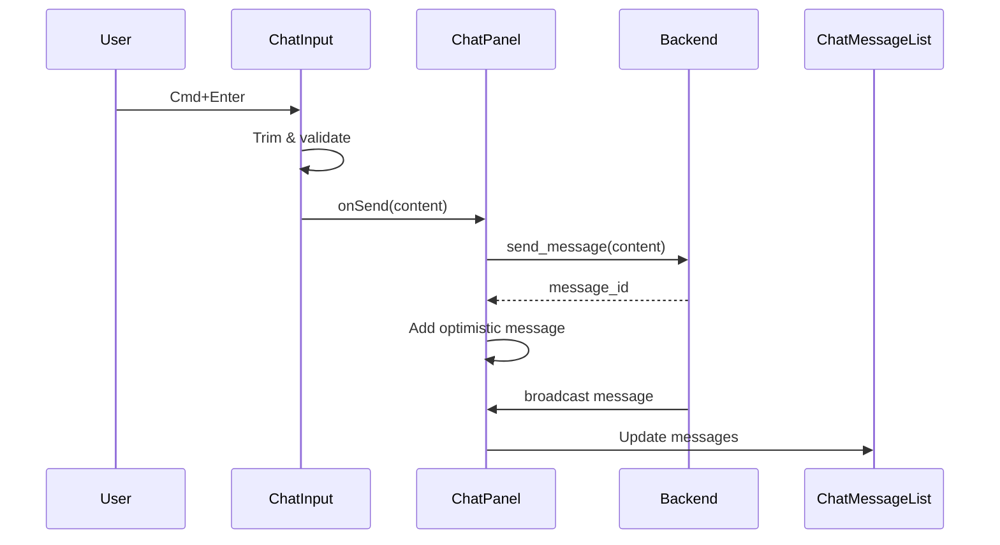
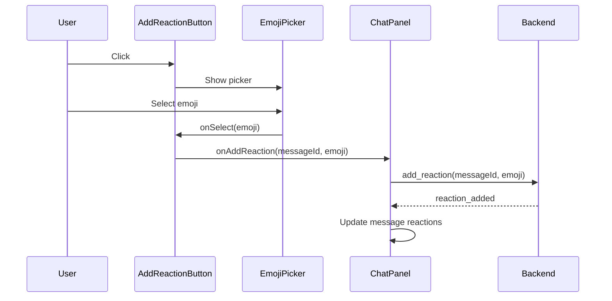

# ChatPanel - チャットパネル

音声セッション中のテキストチャットコンポーネント。
MixerPanel トンマナ準拠のシンプルなデザイン。

---

## 概要

### 目的

- セッション中の参加者間でテキストメッセージをやり取り
- システムメッセージ（参加・退出通知）の表示
- メッセージへのリアクション機能

### 使用場面

- セッション画面のサブウィンドウ（ChatWindow）
- 音声通話と並行して利用

### デザイン

MixerPanel トンマナ準拠:
- モノクロームベース
- 1px ボーダー、角丸なし
- シャドウなし

---

## ビジュアル仕様

### レイアウト

```
┌────────────────────────────────────────────┐
│ チャット                                   │ ← ヘッダー
├────────────────────────────────────────────┤
│                                            │
│  ┌────────────────────────────┐            │
│  │ 山田太郎さんが参加しました │ 12:34      │ ← システムメッセージ
│  └────────────────────────────┘            │
│                                            │
│ 山田太郎                             12:35 │ ← 相手メッセージ
│  ┌──────────────────────────────┐          │
│  │ こんにちは！                 │          │
│  └──────────────────────────────┘          │
│  👍 2  ❤️ 1  [☺]                           │ ← リアクション
│                                            │
│                             12:36  自分    │ ← 自分メッセージ
│          ┌──────────────────────────────┐  │
│          │ よろしくお願いします         │  │
│          └──────────────────────────────┘  │
│          [☺]                               │
│                                            │
├────────────────────────────────────────────┤
│ ┌────────────────────────────────────┬───┐ │ ← 入力フィールド
│ │ メッセージを入力...               │ ⬆ │ │
│ └────────────────────────────────────┴───┘ │
└────────────────────────────────────────────┘
```

### メッセージタイプ別表示

```
システムメッセージ（中央寄せ・グレー背景）
┌────────────────────────────┐
│ 山田太郎さんが参加しました │ 12:34
└────────────────────────────┘

相手メッセージ（左寄せ・白背景）
山田太郎                             12:35
┌──────────────────────────────┐
│ こんにちは！                 │
└──────────────────────────────┘
👍 2  ❤️ 1  [☺]

自分メッセージ（右寄せ・黒背景・白文字）
                            12:36  自分
         ┌──────────────────────────────┐
         │ よろしくお願いします         │
         └──────────────────────────────┘
         [☺]
```

### EmojiPicker

```
┌─────────────────────────────┐
│ 絵文字                    × │ ← ヘッダー
├─────────────────────────────┤
│ [🕐] [😀] [👍] [❤️] [🎵] [⭐] │ ← カテゴリータブ
├─────────────────────────────┤
│ 😀 😃 😄 😁 😆 😅 🤣 😂    │
│ 🙂 😉 😊 😇 🥰 😍 🤩 😘    │ ← 絵文字グリッド
│ 😋 😛 😜 🤪 😝 🤑 🤗 🤭    │
│ 🤔 🤐 🤨 😐 😑 😶 😏 😒    │
└─────────────────────────────┘
```

---

## コンポーネント構成

### ChatPanel（ルート）

全体を管理するコンテナコンポーネント。

```typescript
interface ChatPanelProps {
  /** 表示するメッセージ */
  messages: ChatMessageData[];
  /** メッセージ送信コールバック */
  onSend?: (message: string) => void;
  /** リアクションクリックコールバック */
  onReactionClick?: (messageId: string, emoji: string) => void;
  /** リアクション追加コールバック */
  onAddReaction?: (messageId: string, emoji: string) => void;
  /** 最近使った絵文字（ピッカー用） */
  recentEmojis?: string[];
  /** 入力無効化 */
  disabled?: boolean;
  /** パネルタイトル */
  title?: string;
  /** 入力プレースホルダー */
  placeholder?: string;
  /** 空状態メッセージ */
  emptyMessage?: string;
  /** 時刻フォーマット用ロケール */
  locale?: string;
}
```

---

### サブコンポーネント

#### ChatMessage（個別メッセージ）

```typescript
interface ChatMessageProps {
  /** メッセージタイプ（表示スタイルを決定） */
  type: "own" | "other" | "system";
  /** 送信者名（own, system では表示しない） */
  senderName?: string;
  /** メッセージ内容 */
  content: string;
  /** タイムスタンプ（ミリ秒） */
  timestamp: number;
  /** 時刻フォーマット用ロケール */
  locale?: string;
  /** このメッセージのリアクション */
  reactions?: Reaction[];
  /** リアクションクリックコールバック */
  onReactionClick?: (emoji: string) => void;
  /** リアクション追加コールバック */
  onAddReaction?: (emoji: string) => void;
  /** 最近使った絵文字 */
  recentEmojis?: string[];
  /** アクションバー表示（デフォルト: onAddReaction が提供されている場合 true） */
  showActions?: boolean;
}

type ChatMessageType = "own" | "other" | "system";
```

#### ChatMessageList（メッセージ一覧）

```typescript
interface ChatMessageListProps {
  /** 表示するメッセージ */
  messages: ChatMessageData[];
  /** 各メッセージのレンダー関数 */
  renderMessage: (message: ChatMessageData) => ReactNode;
  /** 空状態メッセージ */
  emptyMessage?: string;
  /** 新規メッセージ時に自動スクロール */
  autoScroll?: boolean;
}

interface ChatMessageData {
  id: string;
  type: "own" | "other" | "system";
  senderName?: string;
  content: string;
  timestamp: number;
  reactions?: Reaction[];
}
```

#### ChatInput（入力フィールド）

複数行対応の入力フィールド。Cmd/Ctrl+Enter で送信。

```typescript
interface ChatInputProps {
  /** プレースホルダーテキスト */
  placeholder?: string;
  /** メッセージ送信コールバック */
  onSend: (message: string) => void;
  /** 入力無効化 */
  disabled?: boolean;
  /** スクロール開始前の最大行数 */
  maxRows?: number;
  /** 送信ボタンラベル（アクセシビリティ用） */
  sendLabel?: string;
}
```

**キーボード操作**:
- Cmd+Enter (macOS) / Ctrl+Enter (Windows/Linux): メッセージ送信
- Enter / Shift+Enter: 改行（通常動作）

**自動リサイズ**:
- 入力内容に応じて高さが自動調整
- maxRows 到達後はスクロール

#### ReactionBar（リアクション表示）

```typescript
interface ReactionBarProps {
  /** 表示するリアクション */
  reactions: Reaction[];
  /** リアクションクリックコールバック */
  onReactionClick?: (emoji: string) => void;
  /** 全リアクション無効化 */
  disabled?: boolean;
}

interface Reaction {
  emoji: string;       // 絵文字（例: "👍"）
  count: number;       // リアクション数
  isActive: boolean;   // 自分が押しているか
}
```

#### AddReactionButton（リアクション追加ボタン）

```typescript
interface AddReactionButtonProps {
  /** 絵文字選択コールバック */
  onSelect?: (emoji: string) => void;
  /** 最近使った絵文字 */
  recentEmojis?: string[];
  /** ボタン無効化 */
  disabled?: boolean;
}
```

#### EmojiPicker（絵文字ピッカー）

```typescript
interface EmojiPickerProps {
  /** 絵文字選択コールバック */
  onSelect?: (emoji: string) => void;
  /** ピッカーを閉じるコールバック */
  onClose?: () => void;
  /** 最近使った絵文字 */
  recentEmojis?: string[];
  /** 選択無効化 */
  disabled?: boolean;
}

type EmojiCategory = "recent" | "smileys" | "gestures" | "hearts" | "music" | "objects";
```

**カテゴリー**:
- `recent`: 最近使った絵文字（recentEmojis が空の場合は表示しない）
- `smileys`: 顔（😀 😃 😄 など）
- `gestures`: 手・ジェスチャー（👍 👎 👏 など）
- `hearts`: ハート（❤️ 🧡 💛 など）
- `music`: 音楽（🎵 🎶 🎸 など）
- `objects`: その他オブジェクト（⭐ ✨ 💯 など）

---

## サイズ仕様

| 項目 | 値 |
|------|-----|
| ウィンドウサイズ | 320 x 480 px（推奨） |
| ヘッダー高さ | 40px |
| 入力フィールド最小高さ | 52px |
| メッセージバブル最大幅 | 70% |
| リアクションボタン | 32px x 24px |
| 絵文字ピッカー | 280px x 320px |
| 絵文字グリッド（1個） | 32px x 32px |

---

## スタイル仕様

### ヘッダー

```css
.chat-panel-container__header {
  height: 40px;
  padding: var(--space-sm);
  border-bottom: 1px solid var(--color-border);
  font-size: var(--font-size-body);
  font-weight: 600;
  display: flex;
  align-items: center;
}
```

### メッセージバブル（相手）

```css
.chat-message--other .chat-message__bubble {
  background: var(--color-bg-primary);
  border: 1px solid var(--color-border);
  color: var(--color-text-primary);
  padding: var(--space-sm);
  max-width: 70%;
}
```

### メッセージバブル（自分）

```css
.chat-message--own .chat-message__bubble {
  background: var(--color-text-primary);
  border: 1px solid var(--color-text-primary);
  color: var(--color-bg-primary);
  padding: var(--space-sm);
  max-width: 70%;
  margin-left: auto;
}
```

### システムメッセージ

```css
.chat-message--system {
  text-align: center;
  color: var(--color-text-secondary);
  font-size: var(--font-size-caption);
  padding: var(--space-xs) 0;
}

.chat-message__system-content {
  background: var(--color-bg-secondary);
  border: 1px solid var(--color-border);
  display: inline-block;
  padding: var(--space-xs) var(--space-sm);
}
```

### 入力フィールド

```css
.chat-input {
  display: flex;
  gap: var(--space-xs);
  padding: var(--space-sm);
  border-top: 1px solid var(--color-border);
}

.chat-input__textarea {
  flex: 1;
  min-height: 36px;
  max-height: 120px; /* maxRows=4 の場合 */
  padding: var(--space-xs) var(--space-sm);
  background: transparent;
  border: 1px solid var(--color-border);
  color: var(--color-text-primary);
  font-family: inherit;
  font-size: var(--font-size-body);
  resize: none;
  overflow-y: auto;
}

.chat-input__textarea:focus {
  border-color: var(--color-text-primary);
  outline: none;
}
```

### 送信ボタン

```css
.chat-input__send-btn {
  width: 36px;
  height: 36px;
  background: var(--color-text-primary);
  color: var(--color-bg-primary);
  border: 1px solid var(--color-text-primary);
  display: flex;
  align-items: center;
  justify-content: center;
  cursor: pointer;
}

.chat-input__send-btn:disabled {
  opacity: 0.5;
  cursor: not-allowed;
}

.chat-input__send-btn:hover:not(:disabled) {
  opacity: 0.9;
}
```

### リアクションボタン

```css
.reaction-button {
  height: 24px;
  padding: 0 var(--space-xs);
  background: transparent;
  border: 1px solid var(--color-border);
  color: var(--color-text-primary);
  font-size: var(--font-size-caption);
  display: inline-flex;
  align-items: center;
  gap: 4px;
  cursor: pointer;
}

.reaction-button--active {
  background: var(--color-bg-secondary);
  border-color: var(--color-text-primary);
}

.reaction-button:hover {
  border-color: var(--color-text-primary);
}
```

### 絵文字ピッカー

```css
.emoji-picker {
  width: 280px;
  height: 320px;
  background: var(--color-bg-primary);
  border: 1px solid var(--color-border);
  display: flex;
  flex-direction: column;
  position: absolute;
  bottom: 100%;
  right: 0;
  z-index: 1000;
}

.emoji-picker__header {
  height: 36px;
  padding: 0 var(--space-sm);
  border-bottom: 1px solid var(--color-border);
  display: flex;
  align-items: center;
  justify-content: space-between;
}

.emoji-picker__categories {
  display: flex;
  border-bottom: 1px solid var(--color-border);
}

.emoji-picker__category {
  flex: 1;
  height: 36px;
  background: transparent;
  border: none;
  font-size: 20px;
  cursor: pointer;
}

.emoji-picker__category--active {
  background: var(--color-bg-secondary);
}

.emoji-picker__grid {
  flex: 1;
  padding: var(--space-xs);
  overflow-y: auto;
  display: grid;
  grid-template-columns: repeat(8, 1fr);
  gap: 4px;
  align-content: start;
}

.emoji-picker__emoji {
  width: 32px;
  height: 32px;
  background: transparent;
  border: 1px solid transparent;
  font-size: 20px;
  cursor: pointer;
  display: flex;
  align-items: center;
  justify-content: center;
}

.emoji-picker__emoji:hover {
  border-color: var(--color-border);
  background: var(--color-bg-secondary);
}
```

---

## アクセシビリティ

### ARIA属性

```tsx
// ChatInput
<textarea
  aria-label={placeholder}
/>
<button
  aria-label={sendLabel}
/>

// ChatMessageList (empty state)
<div role="status" aria-label={emptyMessage}>
  {emptyMessage}
</div>

// ReactionButton
<button
  aria-label={`${emoji} ${count}`}
  aria-pressed={isActive}
/>

// AddReactionButton
<button
  aria-label="リアクションを追加"
  aria-expanded={showPicker}
/>

// EmojiPicker
<div role="dialog" aria-label="Emoji picker">
  <div role="tablist">
    <button
      role="tab"
      aria-selected={activeCategory === category}
      aria-label={categoryLabel}
    />
  </div>
  <div role="tabpanel">
    <button aria-label={emoji} />
  </div>
</div>
```

### キーボード操作

| 要素 | キー | 動作 |
|------|------|------|
| 入力フィールド | Cmd/Ctrl+Enter | メッセージ送信 |
| 入力フィールド | Enter | 改行 |
| 入力フィールド | Shift+Enter | 改行 |
| 絵文字ピッカー | Tab | フォーカス移動 |
| 絵文字ピッカー | Escape | ピッカーを閉じる |
| リアクションボタン | Space/Enter | リアクション切替 |

### フォーカス順序

1. メッセージ一覧（スクロール可能）
2. 入力フィールド
3. 送信ボタン
4. リアクション追加ボタン（各メッセージ）
5. 絵文字ピッカー（開いている場合）

---

## i18n キー

```json
{
  "chat.title": "チャット",
  "chat.placeholder": "メッセージを入力...",
  "chat.sendLabel": "送信",
  "chat.emptyMessage": "メッセージはまだありません",
  "chat.addReaction": "リアクションを追加",
  "chat.emoji.title": "絵文字",
  "chat.emoji.close": "閉じる",
  "chat.emoji.recent": "最近",
  "chat.emoji.smileys": "顔",
  "chat.emoji.gestures": "手",
  "chat.emoji.hearts": "ハート",
  "chat.emoji.music": "音楽",
  "chat.emoji.objects": "その他",
  "chat.emoji.recentEmpty": "最近使った絵文字はありません",
  "chat.system.joined": "{{name}}さんが参加しました",
  "chat.system.left": "{{name}}さんが退出しました"
}
```

---

## 使用例

```tsx
import { useState } from "react";
import { ChatPanel } from "./ChatPanel";
import type { ChatMessageData } from "./ChatMessageList";

function App() {
  const [messages, setMessages] = useState<ChatMessageData[]>([
    {
      id: "1",
      type: "system",
      content: "山田太郎さんが参加しました",
      timestamp: Date.now() - 60000,
    },
    {
      id: "2",
      type: "other",
      senderName: "山田太郎",
      content: "こんにちは！",
      timestamp: Date.now() - 30000,
      reactions: [
        { emoji: "👍", count: 2, isActive: true },
        { emoji: "❤️", count: 1, isActive: false },
      ],
    },
    {
      id: "3",
      type: "own",
      content: "よろしくお願いします",
      timestamp: Date.now(),
    },
  ]);

  const [recentEmojis, setRecentEmojis] = useState<string[]>([
    "👍", "❤️", "😀", "🎵",
  ]);

  const handleSend = (content: string) => {
    const newMessage: ChatMessageData = {
      id: Date.now().toString(),
      type: "own",
      content,
      timestamp: Date.now(),
    };
    setMessages((prev) => [...prev, newMessage]);
  };

  const handleReactionClick = (messageId: string, emoji: string) => {
    setMessages((prev) =>
      prev.map((msg) => {
        if (msg.id !== messageId) return msg;

        const reactions = msg.reactions || [];
        const existing = reactions.find((r) => r.emoji === emoji);

        if (existing) {
          // Toggle own reaction
          if (existing.isActive) {
            return {
              ...msg,
              reactions: reactions
                .map((r) =>
                  r.emoji === emoji
                    ? { ...r, count: r.count - 1, isActive: false }
                    : r
                )
                .filter((r) => r.count > 0),
            };
          } else {
            return {
              ...msg,
              reactions: reactions.map((r) =>
                r.emoji === emoji
                  ? { ...r, count: r.count + 1, isActive: true }
                  : r
              ),
            };
          }
        }

        // Add new reaction
        return {
          ...msg,
          reactions: [...reactions, { emoji, count: 1, isActive: true }],
        };
      })
    );
  };

  const handleAddReaction = (messageId: string, emoji: string) => {
    // Add to recent emojis
    setRecentEmojis((prev) => {
      const filtered = prev.filter((e) => e !== emoji);
      return [emoji, ...filtered].slice(0, 16);
    });

    // Add reaction
    handleReactionClick(messageId, emoji);
  };

  return (
    <ChatPanel
      messages={messages}
      onSend={handleSend}
      onReactionClick={handleReactionClick}
      onAddReaction={handleAddReaction}
      recentEmojis={recentEmojis}
      title="チャット"
      placeholder="メッセージを入力..."
      emptyMessage="メッセージはまだありません"
      locale="ja-JP"
    />
  );
}
```

---

## 状態管理

### メッセージ追加フロー



### リアクション追加フロー



---

## 関連ドキュメント

- [MixerPanel](./mixer-panel) - デザインガイド元
- [コンポーネントカタログ](./) - 全コンポーネント一覧
