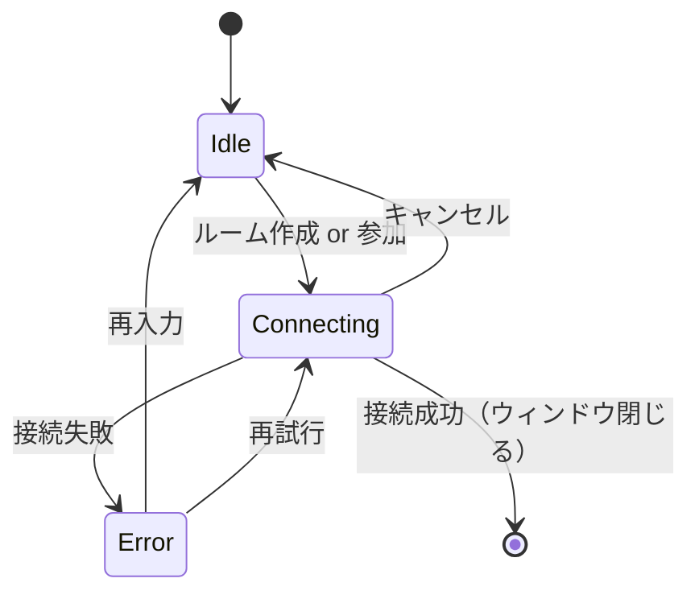

# ConnectionPanel - 接続画面

セッション参加/作成のためのシンプルな接続画面コンポーネント。

---

## 概要

### 目的

- セッション作成またはコード入力による参加
- 最小限のステップでセッション開始

### 使用場面

- アプリ起動時（未接続状態）
- セッション退室後

### デザイン

MixerPanel トンマナ準拠:
- モノクロームベース
- 1px ボーダー、角丸なし
- シャドウなし

---

## ビジュアル仕様

### レイアウト

```
┌────────────────────────────────┐
│          jamjam               │  ← ヘッダー（ロゴ/タイトル）
├────────────────────────────────┤
│                                │
│    ┌────────────────────┐      │
│    │  [ ルームを作成 ]  │      │  ← プライマリボタン
│    └────────────────────┘      │
│                                │
│    ─────── または ───────      │  ← 区切り線
│                                │
│    招待コード                  │  ← ラベル
│    ┌────────────────────┐      │
│    │  ABC234            │      │  ← コード入力フィールド
│    └────────────────────┘      │
│    ┌────────────────────┐      │
│    │      [ 参加 ]      │      │  ← セカンダリボタン
│    └────────────────────┘      │
│                                │
│                        [⚙]    │  ← 設定ボタン
└────────────────────────────────┘
```

### 接続中状態

```
┌────────────────────────────────┐
│          jamjam               │
├────────────────────────────────┤
│                                │
│                                │
│         ◯ 接続中...            │  ← スピナー + テキスト
│                                │
│        [ キャンセル ]          │
│                                │
│                                │
└────────────────────────────────┘
```

### エラー状態

```
┌────────────────────────────────┐
│          jamjam               │
├────────────────────────────────┤
│                                │
│    ┌────────────────────┐      │
│    │  [ ルームを作成 ]  │      │
│    └────────────────────┘      │
│                                │
│    ─────── または ───────      │
│                                │
│    招待コード                  │
│    ┌────────────────────┐      │
│    │  ABC234            │      │  ← エラー時ボーダー赤
│    └────────────────────┘      │
│    ⚠ 無効なコードです          │  ← エラーメッセージ
│    ┌────────────────────┐      │
│    │      [ 参加 ]      │      │
│    └────────────────────┘      │
│                                │
│                        [⚙]    │
└────────────────────────────────┘
```

---

## コンポーネント構成

### ConnectionPanel（ルート）

```typescript
interface ConnectionPanelProps {
  /** 現在の状態 */
  state: "idle" | "connecting" | "error";
  /** 入力されたコード */
  code: string;
  /** エラーメッセージ */
  errorMessage?: string;
  /** ルーム作成ボタンクリック */
  onCreateRoom?: () => void;
  /** 参加ボタンクリック */
  onJoinRoom?: (code: string) => void;
  /** コード入力変更 */
  onCodeChange?: (code: string) => void;
  /** キャンセルボタンクリック */
  onCancel?: () => void;
  /** 設定ボタンクリック */
  onOpenSettings?: () => void;
}
```

### サブコンポーネント

| コンポーネント | 役割 |
|--------------|------|
| `ConnectionHeader` | ロゴ/タイトル表示 |
| `CreateRoomButton` | ルーム作成ボタン |
| `CodeInput` | 招待コード入力フィールド |
| `JoinButton` | 参加ボタン |
| `SettingsButton` | 設定画面を開くボタン |
| `LoadingSpinner` | 接続中のスピナー |
| `ErrorMessage` | エラーメッセージ表示 |

---

## サイズ仕様

| 項目 | 値 |
|------|-----|
| ウィンドウサイズ | 400 x 300 px（固定） |
| コンテンツ幅 | 280px |
| ボタン高さ | 40px |
| 入力フィールド高さ | 40px |
| 要素間スペース | 16px (--space-md) |

---

## 状態遷移



---

## スタイル仕様

### ヘッダー

```css
.connection-header {
  font-size: var(--font-size-body);
  font-weight: 600;
  text-align: center;
  padding: var(--space-md);
  border-bottom: 1px solid var(--color-border);
}
```

### プライマリボタン（ルーム作成）

```css
.button-primary {
  width: 100%;
  height: 40px;
  background: var(--color-text-primary);
  color: var(--color-bg-primary);
  border: 1px solid var(--color-text-primary);
  font-weight: 600;
}

.button-primary:hover {
  opacity: 0.9;
}

.button-primary:focus-visible {
  box-shadow: var(--shadow-focus);
}
```

### セカンダリボタン（参加）

```css
.button-secondary {
  width: 100%;
  height: 40px;
  background: transparent;
  color: var(--color-text-primary);
  border: 1px solid var(--color-border);
}

.button-secondary:hover {
  border-color: var(--color-text-primary);
}

.button-secondary:disabled {
  opacity: 0.5;
  cursor: not-allowed;
}
```

### 入力フィールド

```css
.code-input {
  width: 100%;
  height: 40px;
  padding: 0 var(--space-sm);
  background: transparent;
  border: 1px solid var(--color-border);
  color: var(--color-text-primary);
  font-family: var(--font-family-mono);
  font-size: var(--font-size-body);
  text-align: center;
  text-transform: uppercase;
  letter-spacing: 0.1em;
}

.code-input:focus {
  border-color: var(--color-text-primary);
  outline: none;
}

.code-input--error {
  border-color: var(--color-danger);
}

.code-input::placeholder {
  color: var(--color-text-secondary);
  text-transform: none;
  letter-spacing: normal;
}
```

### 区切り線

```css
.divider {
  display: flex;
  align-items: center;
  gap: var(--space-sm);
  color: var(--color-text-secondary);
  font-size: var(--font-size-caption);
}

.divider::before,
.divider::after {
  content: "";
  flex: 1;
  height: 1px;
  background: var(--color-border);
}
```

### エラーメッセージ

```css
.error-message {
  color: var(--color-danger);
  font-size: var(--font-size-caption);
  margin-top: var(--space-xs);
}
```

### 設定ボタン

```css
.settings-button {
  position: absolute;
  bottom: var(--space-md);
  right: var(--space-md);
  width: 32px;
  height: 32px;
  background: transparent;
  border: 1px solid var(--color-border);
  color: var(--color-text-secondary);
  display: flex;
  align-items: center;
  justify-content: center;
}

.settings-button:hover {
  color: var(--color-text-primary);
  border-color: var(--color-text-primary);
}
```

---

## アクセシビリティ

### ARIA属性

```tsx
// コード入力
<input
  type="text"
  role="textbox"
  aria-label={t("connection.codeInput", "Invitation code")}
  aria-invalid={hasError}
  aria-describedby={hasError ? "error-message" : undefined}
/>

// エラーメッセージ
<p id="error-message" role="alert" aria-live="polite">
  {errorMessage}
</p>

// ローディング
<div role="status" aria-label={t("connection.connecting", "Connecting...")}>
  <LoadingSpinner />
</div>
```

### キーボード操作

| キー | 動作 |
|------|------|
| Tab | フォーカス移動 |
| Enter | フォーカス中のボタン押下 / コード入力時に参加 |
| Escape | 接続中の場合キャンセル |

### フォーカス順序

1. ルーム作成ボタン
2. コード入力フィールド
3. 参加ボタン
4. 設定ボタン

---

## i18n キー

```json
{
  "connection.title": "jamjam",
  "connection.createRoom": "ルームを作成",
  "connection.or": "または",
  "connection.codeLabel": "招待コード",
  "connection.codePlaceholder": "コードを入力",
  "connection.join": "参加",
  "connection.connecting": "接続中...",
  "connection.cancel": "キャンセル",
  "connection.settings": "設定",
  "connection.error.invalidCode": "無効なコードです",
  "connection.error.connectionFailed": "接続に失敗しました",
  "connection.error.roomNotFound": "ルームが見つかりません",
  "connection.error.roomFull": "ルームが満員です"
}
```

---

## バリデーション

### 招待コード

| ルール | 説明 |
|--------|------|
| 長さ | 6文字 |
| 文字種 | 英数字（大文字小文字を区別しない） |
| 自動変換 | 入力は自動で大文字に変換 |

```typescript
function validateCode(code: string): boolean {
  return /^[A-Z0-9]{6}$/i.test(code);
}
```

---

## 使用例

```tsx
import { useState } from "react";
import { ConnectionPanel } from "./ConnectionPanel";

function App() {
  const [state, setState] = useState<"idle" | "connecting" | "error">("idle");
  const [code, setCode] = useState("");
  const [error, setError] = useState<string>();

  const handleCreateRoom = async () => {
    setState("connecting");
    try {
      const roomId = await createRoom();
      // MixerWindow, ChatWindow を開く
    } catch (e) {
      setState("error");
      setError("接続に失敗しました");
    }
  };

  const handleJoinRoom = async (code: string) => {
    setState("connecting");
    try {
      await joinRoom(code);
      // MixerWindow, ChatWindow を開く
    } catch (e) {
      setState("error");
      setError("無効なコードです");
    }
  };

  return (
    <ConnectionPanel
      state={state}
      code={code}
      errorMessage={error}
      onCreateRoom={handleCreateRoom}
      onJoinRoom={handleJoinRoom}
      onCodeChange={setCode}
      onCancel={() => setState("idle")}
      onOpenSettings={openSettingsWindow}
    />
  );
}
```

---

---

## 追加機能

### 接続履歴（ConnectionHistory）

過去に接続したルームの履歴を表示・管理。

```typescript
interface ConnectionHistoryEntry {
  room_code: string;
  label?: string;
  connected_at: string; // ISO 8601 format
}

interface ConnectionPanelProps {
  // ... 既存のProps
  /** 接続履歴 */
  connectionHistory?: ConnectionHistoryEntry[];
  /** 履歴選択時のコールバック */
  onHistorySelect?: (roomCode: string) => void;
  /** 履歴削除時のコールバック */
  onHistoryRemove?: (roomCode: string) => void;
  /** 履歴タイトル */
  historyTitle?: string;
}
```

#### 日付表示フォーマット

| 条件 | 表示形式 |
|------|---------|
| 今日 | `HH:MM` |
| 昨日 | `Yesterday` |
| 7日以内 | `N days ago` |
| 7日以上 | `MMM D` (例: Jan 15) |

#### ビジュアル

```
┌────────────────────────────────┐
│         履歴                   │
├────────────────────────────────┤
│ ABC234          14:30    [✕]   │
│ XYZ789          Yesterday [✕]  │
│ DEF456          Jan 15    [✕]  │
└────────────────────────────────┘
```

---

### テストルーム機能

サーバーが示す、接続を試すためのルームへのクイックアクセス。アプリはコードを持たず、サーバーのルーム一覧でテストルームの印が付いたルームのコードを渡す。

```typescript
interface ConnectionPanelProps {
  // ... 既存のProps
  /** テストルームの招待コード。渡したときだけ表示 */
  testRoomCode?: string;
  /** テストルームリンクテキスト */
  testRoomText?: string;
}
```

#### 動作

- `testRoomCode` と `onJoinRoom` が設定されている場合に表示
- クリック時に `onJoinRoom(testRoomCode)` を呼び出し
- 通常の参加ボタンの下に配置

#### ビジュアル

```
┌────────────────────────────────┐
│         [ 参加 ]               │
│                                │
│     テストルームに接続          │  ← リンクスタイル
└────────────────────────────────┘
```

---

## 拡張 Props インターフェース

```typescript
export interface ConnectionPanelProps {
  /** 現在の状態 */
  state?: "idle" | "connecting" | "error";
  /** 入力されたコード */
  code?: string;
  /** エラーメッセージ */
  errorMessage?: string;

  // コールバック
  onCreateRoom?: () => void;
  onJoinRoom?: (code: string) => void;
  onCodeChange?: (code: string) => void;
  onCancel?: () => void;
  onOpenSettings?: () => void;

  // 履歴機能
  connectionHistory?: ConnectionHistoryEntry[];
  onHistorySelect?: (roomCode: string) => void;
  onHistoryRemove?: (roomCode: string) => void;

  // テストルーム機能
  testRoomCode?: string;
  testRoomText?: string;

  // i18n カスタマイズ
  title?: string;
  createRoomText?: string;
  orText?: string;
  codeLabel?: string;
  codePlaceholder?: string;
  joinText?: string;
  connectingText?: string;
  cancelText?: string;
  historyTitle?: string;
}
```

---

## 追加 i18n キー

```json
{
  "connection.historyTitle": "履歴",
  "connection.testRoom": "テストルームに接続",
  "connectionHistory.title": "履歴",
  "connectionHistory.remove": "削除"
}
```

---

## 関連ドキュメント

- [コンポーネントカタログ](./) - 全コンポーネント一覧
