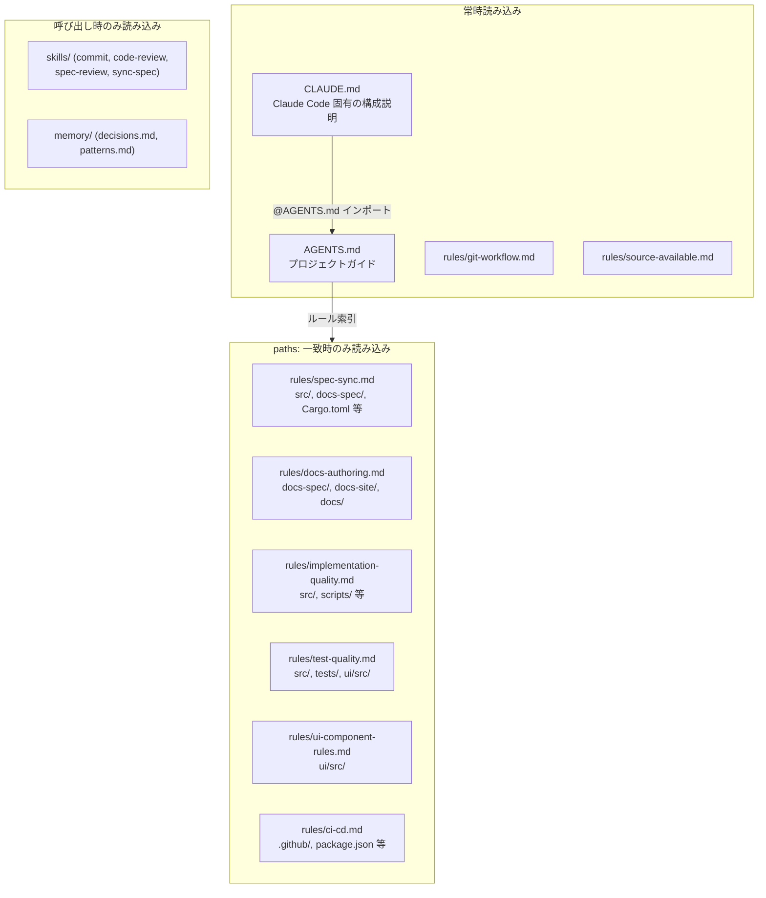

# ADR-014: Claude Code 設定構成の再編

## Context

2026-01 に claude-code-harness プラグイン（v2.9.22）を導入し、タスク管理・スキルゲート・メモリ機能を追加した。その後、Claude Code 本体が同等機能を標準搭載した:

- `.claude/rules/*.md`（`paths:` frontmatter によるパススコープ付きルール読み込み）
- `.claude/skills/<name>/SKILL.md`（スキル。旧 `.claude/commands/` の後継）
- プランモード・タスク管理（`/plan-with-agent`, `/work` 相当）
- CLAUDE.md からの `@path` インポート（AGENTS.md 標準との連携パターン）

その結果、以下の問題が発生していた:

1. **CLAUDE.md の肥大化**: 510行。公式推奨は200行以下。すべてのセッションで全文がコンテキストに載り、トピック別の関連性に関係なく常時消費されていた
2. **存在しないスキルへの参照**: `skills-gate.md` が参照するスキル（`impl`, `ui`, `auth`, `deploy`, `verify`, `session-init`）とコマンド（`/skills-update`, `/harness-mem`, `/plan-with-agent`, `/work`）はハーネスプラグイン由来で、本リポジトリには存在しない。ゲート機構（hooks）も未設定のため、ルールは機能しないまま全コード編集時にコンテキストへ注入されていた
3. **settings.json の無効・陳腐化した設定**: `allowAll`（スキーマに存在しないフィールド）、serena プラグインの MCP 権限（プラグイン未設定）、`claude-code-harness@claude-code-harness-marketplace`（マーケットプレイス未設定）
4. **内容の重複**: コミット規約が CLAUDE.md と commit スキルに、仕様同期ルールが CLAUDE.md と AGENTS.md と sync-spec スキルに重複
5. **スキル名の衝突**: プロジェクトスキル `review` が Claude Code ビルトインの `/review`（PRレビュー）と衝突

## Decision

**claude-code-harness プラグインへの依存を廃止し、Claude Code ネイティブ機能のみで構成する。**

### 新構成

| ファイル | 役割 | 読み込み |
|---------|------|---------|
| `AGENTS.md` | ツール非依存のプロジェクトガイド（概要・最優先要件・開発フロー・コマンド・ルール索引・対話ルール・言語規約） | CLAUDE.md からインポート |
| `CLAUDE.md` | `@AGENTS.md` インポート + Claude Code 固有の構成説明・メンテナンス規約 | 常時 |
| `.claude/rules/*.md` | トピック別ルール（`paths:` でスコープ指定） | 対象ファイル操作時 |
| `.claude/skills/*/SKILL.md` | ワークフロー手順（`review` のみ改名） | 呼び出し時 |
| `.claude/memory/*.md` | セッション間メモ（継続使用。自動読み込みなし） | 必要時に明示参照 |

読み込み構造:

非 Claude Code エージェントは `paths:` 自動読み込み機構を持たないため、AGENTS.md の「ルール一覧」から該当ルールを明示的に読む。

### 旧 CLAUDE.md の内容の移動先（欠落なし）

| 旧 CLAUDE.md セクション | 移動先 |
|------------------------|--------|
| プロジェクト概要・最優先要件 | `AGENTS.md` |
| 質問・提案時のルール、並列作業の効率化 | `AGENTS.md`（対話・作業ルール。ツール非依存の規約のため） |
| 記述原則、曖昧さ排除、図解のルール | `.claude/rules/docs-authoring.md` |
| architecture.md 作成ルール、ADR、BDD/Gherkin、API仕様作成ルール | `.claude/rules/docs-authoring.md` |
| 推奨ディレクトリ構成 | `AGENTS.md`（実態に合わせて更新） |
| 実装フェーズ指示、仕様書と実装の同期ルール | `.claude/rules/spec-sync.md` |
| ソースコード公開に関する注意事項、秘匿情報の保管場所 | `.claude/rules/source-available.md` |
| CI/ローカル環境の整合性ルール、GitHub機能の使用ルール | `.claude/rules/ci-cd.md` |
| Git コミットルール、Git Push ルール | `.claude/rules/git-workflow.md` |

### 旧 AGENTS.md の内容の移動先

| 旧 AGENTS.md セクション | 移動先 |
|------------------------|--------|
| ドキュメント体系、開発フロー、品質基準、メモリシステム、参照 | 新 `AGENTS.md`（ハーネス依存の記述を更新） |
| 主要スキル表の `/plan-with-agent`, `/work` | 削除（ハーネス専用。プランモード + Plans.md 直接編集で代替） |

### 削除したファイル・設定

| 対象 | 理由 |
|------|------|
| `.claude/rules/skills-gate.md` | ハーネスのテンプレート（v2.9.22）。参照先スキル・ゲート機構が存在せず機能していない |
| `.claude-code-harness-version` | ハーネスのバージョン追跡ファイル（自動生成） |
| `settings.json` の `allowAll` | スキーマに存在しないフィールド |
| `settings.json` の serena MCP 権限 5件 | serena プラグインが未設定 |
| `settings.json` の `enabledPlugins` | 参照先マーケットプレイスが未設定 |

### その他の変更

- スキル `review` → `spec-review` に改名（ビルトイン `/review` との衝突回避。内容は不変）
- `settings.json` に `$schema` と秘匿ファイルの `deny`（`.env` 等）を追加。`defaultMode: "plan"` と Edit/Write/Bash の包括許可は従来の運用判断を維持
- 既存ルール3件（implementation-quality, test-quality, ui-component-rules）に `paths:` を追加し、壊れていた相対リンク（`../../../docs-spec/` → `../../docs-spec/`）を修正

## Consequences

### メリット

- 常時読み込みコンテキストが削減される（旧 CLAUDE.md 510行 → 常時読み込みセットは CLAUDE.md + AGENTS.md + 常時ルール2件（git-workflow, source-available）の合計約330行。トピック別ルール6件は対象ファイル操作時のみ読み込み）
- 公式サポート機能のみで構成され、Claude Code のアップデートに追従しやすい
- AGENTS.md 標準により Claude Code 以外の AI エージェントでも同一ガイドを利用可能
- 各トピックのルールが1箇所に集約され、重複による矛盾リスクがなくなる

### デメリット

- claude-code-harness の `/work`, `/plan-with-agent` 等のワークフローコマンドは使用不可（プランモードと Plans.md の直接編集で代替）
- `paths:` スコープ付きルールは対象ファイルを操作しないセッションでは読み込まれない（設計相談のみのセッション等）。必要な場合はルールファイルを明示的に参照する
- `paths:` スコープ化により、旧 CLAUDE.md で常時適用されていたルールの適用範囲が狭まる。意図的な対象外: README.md・.claude/memory/ は docs-authoring の対象に含めない（仕様書ではないため）

### 制約

- CLAUDE.md は今後も簡潔に保つ（公式推奨: 200行以下）。トピック別の詳細ルールは `.claude/rules/` に追加する
- ADR に相当する重要な判断は従来どおり `docs-spec/adr/` に記録する（`.claude/memory/decisions.md` は軽量メモ用途）
- `permissions.allow` の包括的な `Bash` 許可の下では、`Read(...)` の deny ルールは補助的な防御にとどまる（deny は組み込みファイルツールと Bash の既知ファイルコマンドにのみ適用され、任意のサブプロセスによるファイル読み取りは防げない）。OSレベルの遮断が必要になった場合は、`Bash` 許可をコマンド単位（`Bash(cargo *)` 等）に絞るか、サンドボックスを有効化する
