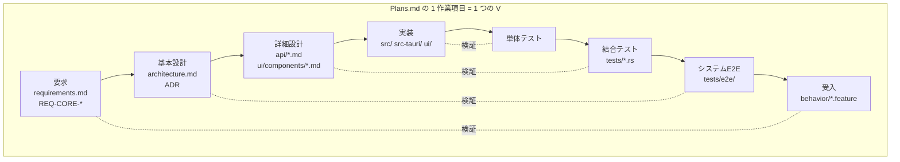

# ADR-018: 反復V字モデルとトレーサビリティ

## Status

Accepted

## Context

本プロジェクトは開発プロセスを明文化しておらず、結果として V 字モデル左辺（仕様）に対する右辺（検証）が部分的に空洞化していた。ADR-018 起票時点で確認された事実:

| 事実 | 証拠 |
|------|------|
| 最優先要件「アプリ起因片道遅延 2ms 以下」を検証するテストが存在しない | `tests/latency_test.rs` に閾値 2.0 の assert なし |
| ループバック E2E が自分自身と相互相関を取っており、遅延が常に約 0ms になる | `tests/e2e/src/scenarios/loopback.rs` の `let received = reference.clone();` |
| 2ノード / 8ノード / クロスプラットフォーム E2E が固定値を返し常に成功する | `two_node.rs` の `latency_ms: Some(12.0)`、`eight_node.rs` の `avg_latency = 18.0` |
| 空のテスト関数が `#[test]` として成功していた | `tests/latency_test.rs` のジッタバッファ 3 件、`tests/i18n_test.rs` の 7 件 |
| 仕様側の閾値とテスト側の閾値が乖離していた | `latency.feature` は ultra-low-latency 5ms、テストは `< 10.0` |
| プリセットの遅延値が 3 箇所に重複定義され互いに矛盾していた | ADR-008 の表 / `src-tauri/src/config.rs` / `tests/e2e/src/quality.rs` |
| UI テストが CI で一度も実行されていなかった | `.github/workflows/ci.yml` に `ui` ジョブなし |

これらは `.claude/rules/implementation-quality.md`「形骸化実装禁止」および `.claude/rules/test-quality.md`「形骸化テスト禁止」に違反する。個別に修正しても、検証層の欠落を検出する仕組みがなければ同じ状態に戻る。

一方で、古典的な V 字モデル（V-Modell XT、IEC 62304 / ISO 26262 が採用する形）をライフサイクルとして導入することは本プロジェクトに適合しない:

1. **要求が凍結されない**: ADR-016 は実装済みのホスト特権概念を撤廃した。古典的 V 字は設計前に要求ベースラインを確定し、変更管理経由でのみ変更する前提を置く。本プロジェクトの変更管理は「新規 ADR が旧 ADR を上書きする」であり、反復型である。
2. **フェーズゲートの受け手が存在しない**: 承認印・V&V 計画書の別文書化・レビュー記録は、組織間の受け渡し契約と監査証跡のために存在する。本プロジェクトには組織間の受け渡しも監査要件もない。
3. **検証が終盤に寄る**: Plans.md の作業項目は各々が要求→設計→実装→テストを回している。1 本の大きな V に直列化すると検証が終盤に集中し、遅延クリティカルな本プロジェクトには不利である。

## Decision

V 字モデルを**ライフサイクルとしては採用せず**、その中核である「左辺の各成果物に対応する右辺の検証層を持つ」規律と「要求 ID による機械検証可能なトレーサビリティ」のみを採用する。反復ごとに小さな V を回す形（反復V字 / W字モデル）とする。



### 1. 要求 ID

- 振る舞い要求は `behavior/*.feature` の Scenario に `@REQ-<領域>-1NN` タグを付ける（1 Scenario = 1 ID）
- 振る舞いに落ちない製品要求・設計要求は `requirements.md` に `REQ-<領域>-0NN` として定義する
- 各要求は `@must` / `@should` の criticality を持つ

### 2. 検証アノテーション

テスト関数の doc comment に `Verifies: REQ-XXX-NNN` を記述する。言語別の記法:

```rust
/// Verifies: REQ-LAT-115
#[test]
fn zero_latency_preset_meets_two_millisecond_budget() { ... }
```

```ts
// Verifies: REQ-I18N-103
it('falls back to English when a key is missing', () => { ... });
```

### 3. 機械検証

`tests/traceability_test.rs` が `cargo test` の一部として以下を強制する:

| 検査 | 失敗条件 |
|------|---------|
| ID 定義の一意性 | 同じ REQ-ID が 2 箇所で定義されている |
| タグの網羅性 | Scenario に REQ-ID タグまたは criticality タグがない |
| 参照の健全性 | テストが未定義の REQ-ID を参照している（dangling） |
| MUST 要求の検証 | `@must` 要求を検証するテストが 0 件 |
| 形骸化テストの排除 | `Verifies:` を持つテスト関数の本体にアサーションがない |
| 対応表の鮮度 | 生成結果が `docs-spec/traceability.md` と一致しない |

`should` 要求の未検証は失敗させず、`traceability.md` にギャップとして列挙する。これにより「検証していないこと」が暗黙ではなく明示になる。

### 4. 導入しないもの

以下は本プロジェクトの規模に対して費用が便益を上回るため採用しない:

- フェーズゲートと承認記録
- V&V 計画書の独立文書化
- 要求ベースラインの凍結と変更管理委員会
- 要求の階層分割（利用者要求 / システム要求 / コンポーネント要求の 3 層化）

## Consequences

### メリット

- 非機能要件（遅延・音質）が「どの単体テストの担当でもない」状態で抜け落ちることを構造的に防げる
- 要求と検証の対応が機械可読になり、実装が仕様から逸脱したことを自動検出できる
- 未検証の要求が `traceability.md` に列挙されるため、「テストがある」と「検証されている」を混同しなくなる
- 反復開発・ADR ベースの軽量な変更管理を一切損なわない

### デメリット・トレードオフ

- 新しい Scenario を追加するたびに REQ-ID の付与が必要になる
- `@must` を付けた要求は、実装より先にテストを用意できないと CI が通らない
- `traceability.md` はゴールデンファイルであり、要求やテストの増減のたびに再生成とコミットが必要になる（`JAMJAM_UPDATE_TRACEABILITY=1 cargo test --test traceability_test` で再生成）

### 関連ADR

- ADR-019: プリセット遅延バジェット（本 ADR の検証で発見された数値の不整合を確定させる）
