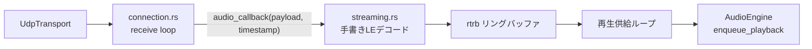
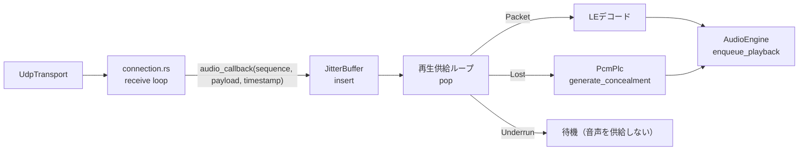

# ADR-020: ジッタバッファの受信経路への配線

## Status

Accepted

## Context

ADR-018 のトレーサビリティ整備により、`JitterBuffer` が製品コードから一度も構築されていないことが判明した。

| 事実 | 証拠 |
|------|------|
| `JitterBufferConfig::` の構築箇所が `src/`・`src-tauri/` に存在しない | ADR-020 起票時点の全文検索結果 |
| `AudioPreset::jitter_buffer_frames()` は GUI への表示値としてのみ使用 | `src-tauri/src/config.rs` の `PresetInfo` |
| 受信音声はシーケンス番号を捨てて到着順にリングバッファへ書かれる | `src/network/connection.rs` の `PacketType::Audio` 分岐 |
| PLC（`PcmPlc`）も未配線 | 構築箇所が存在しない |

現状の受信経路:



この構成では以下が成立しない:

1. **順序整合**: 到着順に再生されるため、順序逆転がそのまま音声の順序逆転になる
2. **ロス検知**: 欠落パケットが検出されず、後続パケットが前詰めで再生される（音声が縮む）
3. **プリセットの遅延契約**: ADR-019 のバジェットはジッタバッファ段数を前提とするが、実際には 0 段で動作している

さらに `docs-spec/api/network.md` §4.2 は当初からシーケンス番号（`PacketStats.sequence`）をコールバックに渡す仕様を定めており、実装が仕様から乖離している。

### ジッタバッファの実効遅延が段数と一致しない問題

`JitterBuffer::pop()` は `depth() >= current_delay_frames` で再生を開始し、直後に1フレームを排出する。結果として定常状態の保持数は `N-1` フレームとなり、

- 遅延: `N-1` フレーム
- late arrival に対する保護: `N-1` フレーム

となる。`N=1`（ultra-low-latency）では保護が 0 フレームとなり、zero-latency と実質同じ耐性しか持たない。ADR-019 のバジェットは遅延 `N` フレームを前提としている。

## Decision

### 1. `pop()` の再生開始条件を修正する

再生開始条件を `depth() > current_delay_frames`（= `N+1` フレーム蓄積後）に変更する。これにより:

| プリセット | 段数 N | 遅延 | late arrival 保護 |
|-----------|-------|------|------------------|
| zero-latency | 0 | 0ms（パススルー特別扱い） | なし（仕様通り、REQ-LAT-111） |
| ultra-low-latency | 1 | 1.33ms | 1フレーム |
| balanced | 4 | 10.67ms | 4フレーム |
| high-quality | 8 | 42.67ms | 8フレーム |

`jitter_buffer_frames` が「遅延フレーム数」と「保護フレーム数」の両方を意味するようになり、ADR-019 のバジェット算出式（`frame_duration * (1 + N + 1)`）と実測が一致する。

実装を修正する側を選ぶ理由:

- ADR-019 のバジェットは ADR-008 の遅延目標から導かれており、目標側を動かせない
- `N=1` で保護 0 フレームは ultra-low-latency の存在意義を失わせる
- `JitterBuffer` は未配線であり、挙動変更による本番影響がない

### 2. ジッタバッファは再生供給ループが pop する

配置は `src-tauri/src/streaming.rs` の再生供給ループとする。



タイマー駆動の pop タスクを別に置く案は採らない。タイマーはオーディオクロックに対してドリフトし、ドリフト分がバッファの過剰蓄積または枯渇として現れるため。再生供給ループは供給先（`AudioEngine`）の消費に律速されるため、オーディオクロックに追従する。

`JitterBuffer` は `Sync` ではないため `Arc<Mutex<_>>` で共有する。受信コールバックはネットワーク側の tokio タスクで動作し、リアルタイムオーディオコールバックではないため、ロックとアロケーションが許容される（既存実装も同位置で `Mutex` を取得している）。

### 3. コールバックにシーケンス番号を渡す

```rust
// 変更前
pub type AudioCallback = Box<dyn Fn(&[u8], u32) + Send + Sync + 'static>;

// 変更後: (sequence, payload, timestamp)
pub type AudioCallback = Box<dyn Fn(u32, Vec<u8>, u32) + Send + Sync + 'static>;
```

ペイロードを所有値で渡す。`JitterBuffer::insert` が `Vec<u8>` を取るため、トランスポートからバッファまでコピーが発生しない。

`docs-spec/api/network.md` §4.2 が定める `participant_id` と `PacketStats`（`had_loss` / `recovered_by_fec`）は本 ADR の範囲外とする。前者はメッシュ構成（REQ-LAT-102）、後者は FEC の受信経路への配線が前提となる。network.md には現行シグネチャと未実装項目の両方を記載する。

### 4. パススルーは経路ごと迂回しない

`jitter_buffer_frames == 0` の場合も `JitterBuffer` を通す。`JitterBufferConfig::passthrough` は `pop()` で即座に排出し遅延 0ms を保証するため、経路を二重化するより単一経路の方が検証しやすい。ただし zero-latency の実測遅延が 2ms を超えないことは `REQ-CORE-001` が継続して検証する。

### 5. 手書きの PCM デコードは維持する

`streaming.rs` は受信ペイロードを再利用バッファへ直接 LE デコードしており、アロケーションが発生しない。`PcmCodec::decode` は `Vec<f32>` を返すためフレームごとにアロケートする。遅延最優先（AGENTS.md）に照らし、再生供給ループではアロケーションを避ける方を採る。

`PcmCodec` との統合は `decode_into(&mut [f32])` のような借用ベース API を `AudioCodec` トレイトに追加してから行う。Plans.md「実装待ち」で管理する。

## Consequences

### メリット

- 順序逆転パケットが正しい順序で再生される
- 欠落パケットが `Lost` として検出され、PLC でフェードアウト処理される（REQ-LAT-114 が実経路で成立）
- プリセットの遅延契約が実装と一致し、ADR-019 のバジェットが実測可能になる
- `AudioPreset::jitter_buffer_frames()` が表示値から実効値になる

### デメリット・トレードオフ

- ultra-low-latency 以上のプリセットで遅延が増える。ただしこれは ADR-019 が既に予算化した値であり、これまで予算未満で動作していたのはジッタ耐性が無かったためである
- 受信コールバックで `Mutex` を取得する。ロック競合時はパケットを落とす（既存実装と同じ挙動）
- `JitterBuffer` の適応モード（`adapt()`）は本 ADR では呼ばない。プリセットの段数を固定値として使う。適応の有効化は REQ-LAT-108 の実経路検証とあわせて別途判断する

### 関連ADR

- ADR-006: FEC 戦略（受信経路への配線は本 ADR の範囲外）
- ADR-008: zero-latency モード（パススルーの遅延 0ms 要件）
- ADR-018: 反復V字モデル（本 ADR の発見元）
- ADR-019: プリセット遅延バジェット（本 ADR で実測と一致させる）
