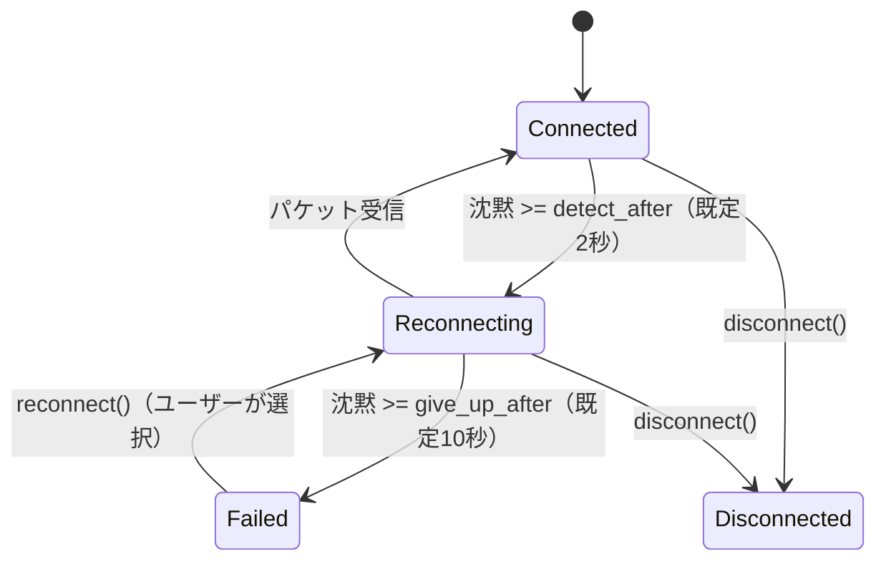

# ADR-022: 再接続の設計と狭帯域回線の対象外化

## Status

Accepted

## Context

ADR-018 のトレーサビリティ整備で残っていたギャップのうち、以下は「テストが無い」のではなく「判断が下されていない」ことが原因だった。

| 要求 | 状態 |
|------|------|
| REQ-CON-109 / REQ-CON-110（再接続） | 再接続ロジックが `src/`・`src-tauri/` に存在しない。`ConnectionState::Reconnecting` は定義済みだが遷移させるコードが無い |
| REQ-AUD-102 / REQ-AUD-103 / REQ-LAT-118 / REQ-LAT-119 / REQ-LAT-120（帯域適応） | ADR-021 でプリセットが全て非圧縮PCMになり、可変ビットレートの前提が崩れた |
| REQ-AUD-117（カスタムプリセット保存） | ADR-019 / ADR-021 が各プリセットに検証済みの遅延バジェットと FEC 構成を与えている。任意設定の保存はこの前提と衝突する |

## Decision

### 1. 再接続は「沈黙の検知」で行う

UDP には切断イベントが無いため、沈黙が唯一の信号である。また再確立すべきハンドシェイクも無い。したがって「再接続」は keep-alive の送出を継続することであり、これは NAT マッピングが切断中に失効した場合の再確立も兼ねる。

| パラメータ | 既定値 | 根拠 |
|-----------|-------|------|
| `keep_alive_interval` | 1秒 | 変更前からの値 |
| `detect_after` | 2秒 | REQ-CON-109 の「3秒間の切断」より内側で検知する |
| `give_up_after` | 10秒 | REQ-CON-110 の「10秒間の切断」でユーザーに委ねる |
| `check_interval` | 250ms | 検知の粒度 |

状態変化は `set_state_change_callback` で通知する。UI はこれを受けて再接続中の表示と、`Failed` 時の「再接続しますか？」を出す。

### 2. 検知閾値は keep-alive 間隔の2倍以上に正規化する

健全な回線も keep-alive の間は沈黙している。`detect_after` が keep-alive 間隔より短いと、**通信できている回線が Connected と Reconnecting を往復する**。実測でも `detect_after = 150ms` / `keep_alive_interval = 1秒` の構成で 4 回の往復が観測された。

`ReconnectConfig::validated()` が `detect_after` を keep-alive 間隔の2倍以上へ、`give_up_after` を `detect_after` 以上へ引き上げる。呼び出し側が誤った組み合わせを設定できない（REQ-CON-022）。

`keep_alive_interval` を `ReconnectConfig` に含める理由は、閾値がこの間隔に対して相対的であり、別々に設定できると必ず不整合が起きるためである。

### 3. 再接続時に受信状態を破棄する

| 対象 | 理由 |
|------|------|
| FEC デコーダのグループ | 切断中のグループは完成しない。残しておくと切断前のデータパケットと切断後の FEC パケットを組み合わせて「復元」し、存在しない音声を生成する |
| ジッタバッファ | シーケンス番号は切断前から連続するため、古いパケットが残っていると再生順序が壊れる。`src-tauri` が状態変化コールバックで再構築する |

### 4. 狭帯域回線は対象外とする

AGENTS.md の最優先要件は次を定めている。

- 帯域効率より遅延削減を優先する
- 音質は非圧縮 PCM（32-bit float）をデフォルトとする
- 日本国内光回線（RTT 10-25ms）での使用を主な対象とする

非圧縮 PCM ステレオの所要帯域は約 3.1 Mbps（ヘッダと FEC を含む）であり、対象とする光回線では問題にならない。一方、`audio-quality.feature` と `latency.feature` が記述する帯域適応（1Mbps 級の回線で Opus のビットレートを段階的に下げる）は次の 3 点と両立しない。

1. ADR-021 のとおり、Opus はどのプリセットのフレームサイズでも符号化できない
2. Opus を使うにはフレームサイズを 120/240 に変更するか再パケット化が必要で、どちらも遅延が増える
3. 遅延を増やして帯域を節約することは「帯域効率より遅延削減を優先する」の逆である

したがって**狭帯域回線への適応は製品要件から外す**。該当シナリオを仕様から削除し、以下に置き換える。

| 旧要求 | 処置 |
|--------|------|
| REQ-AUD-102（Opus を使用する） | 削除。`CodecType::Opus` は実装として残すが、どのプリセットも選択しない |
| REQ-AUD-103（帯域不足でコーデック自動変更） | 削除 |
| REQ-LAT-118 / REQ-LAT-119（帯域低下・回復への自動適応） | 削除 |
| REQ-LAT-120（手動設定時の帯域不足警告） | 警告部分のみを新シナリオとして維持（REQ-LAT-124） |

帯域不足の**検出と警告**は残す。対象回線であっても WiFi や輻輳で帯域が落ちることはあり、そのとき「音が途切れる理由」を利用者に示せることには価値がある。実装は `src/network/bandwidth.rs`（REQ-NET-020〜025）で完了している。

### 5. カスタムプリセットの保存は対象外とする

ADR-019 は各プリセットに遅延バジェットを与え、ADR-021 は FEC グループサイズをジッタバッファ段数に固定した。`REQ-LAT-020` と `REQ-AUD-024` はこれらが整合していることを検証している。

任意の組み合わせを保存できるようにすると、検証されていない遅延特性の設定が生成される。プリセットは「検証済みの構成の集合」であり、利用者が任意に増やせるものではない。

個別設定（バッファサイズ、サンプルレート、デバイス選択）は従来どおり変更可能であり、これで実用上の調整は足りる。REQ-AUD-117 のシナリオは削除する。

## Consequences

### メリット

- 再接続が実装され、REQ-CON-109 / REQ-CON-110 が検証可能になった
- 設定ミスによるフラップが型レベルで防がれる（REQ-CON-022）
- 実現不可能な要求が仕様から消え、ギャップ一覧が「本当に未達のもの」だけになる

### デメリット・トレードオフ

- 狭帯域回線（1Mbps 級）の利用者は対象外になる。将来対象に含める場合は、フレームサイズ戦略の ADR から始める必要がある
- カスタムプリセットを求める利用者には個別設定で対応してもらう
- 再接続は沈黙検知であるため、最短でも `detect_after`（既定2秒）は検知に要する。より速い検知には keep-alive 間隔の短縮が必要で、これは常時のパケット数を増やす

### 関連ADR

- ADR-002: ネットワークプロトコル（UDP に切断イベントが無い前提）
- ADR-006: FEC 戦略（再接続時のデコーダ破棄）
- ADR-019: プリセット遅延バジェット（カスタムプリセット却下の根拠）
- ADR-020: ジッタバッファの配線（再接続時の再構築）
- ADR-021: プリセットのコーデックと FEC（Opus のフレームサイズ非互換）
