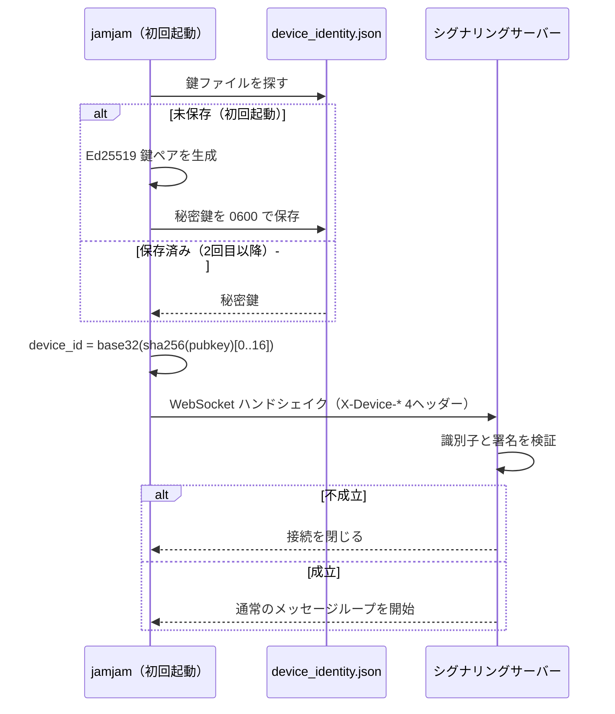

<!-- このドキュメントは実装の正です。変更時は実装も同期すること -->

# ADR-024: 端末アイデンティティによる識別（メールOTPアカウントを上書き）

## Status

Accepted

## Context

以前の設計では、メールアドレス + 6桁コードによる永続アカウントを導入していた。初回起動時にメール認証を必須とし、以降は
端末保存のセッショントークンで自動継続する方式である。

その後、**アプリの機能にアカウント登録が必要な作りにはしない**という製品判断に変わった。理由:

1. `docs-spec/ui/README.md` は「1クリック開始・3ステップ以内でセッション開始」を最優先の設計原則の
   1つに掲げている。メール方式はこの後退を「初回のみ」として明示的に許容したが、初回起動が最も離脱の
   起きる地点である。
2. アカウントを必須にすると、ルーム参加がアカウントを確認する側の可用性に依存する
   （fail-closed）。音声セッションの開始がその死活に縛られる。

必要なのは「登録なしで、端末ごとにグローバルに衝突しない識別子が自動で割り当たること」である。
会員登録がどうしても必要な機能が出てきた時点で、改めて別 ADR で検討する。

## Decision

### 1. 識別子は Ed25519 公開鍵から導出するローカル生成値

初回起動時にアプリが Ed25519 鍵ペアをローカル生成し、公開鍵から識別子を導出する:

```
device_id = BASE32_NOPAD(SHA-256(public_key)[0..16])
```

- 128bit（16バイト）を base32 で表現した **26文字**。独立に生成された2つの鍵ペアが衝突する確率は
  実質ゼロであり、サーバーによる採番・一意性チェックを必要としない。
- 導出の定義は `src/network/device_identity.rs` の `device_id_from_public_key` に1箇所だけ存在する。
  クライアント（自分を名乗る側）とサーバー（主張を検証する側）が同じ関数を通る。

**採用しなかった案**:

| 案 | 却下理由 |
|----|---------|
| UUIDv7 をそのまま送る | 識別子が単なる文字列になり、ID を知られると他人になりすませる |
| サーバー発行 ID + シークレット | 初回起動時にサーバー到達性が必須になり、オフライン起動・自己ホスト構成が壊れる。シークレットがサーバー側にも存在する |

### 2. 所有証明はハンドシェイクの4ヘッダーで行う

`SignalingMessage`（`JoinRoom`/`CreateRoom`）にフィールドを追加せず、WebSocket ハンドシェイクの
HTTP ヘッダーで渡す（これらのメッセージは20箇所以上で構築されている）:

| ヘッダー | 内容 |
|---------|------|
| `X-Device-Id` | 26文字の識別子 |
| `X-Device-PubKey` | Ed25519 公開鍵（32バイト、base64） |
| `X-Device-Signature` | 署名（64バイト、base64） |
| `X-Device-Timestamp` | 署名対象の Unix 秒 |

署名対象は `"jamjam-device-v1:" + <Unix秒>` である。前置のドメイン文字列は、ここで作られた署名が
別用途の署名として流用されることを防ぐ。バージョン接尾は将来の方式変更を wire 上で判別可能にする。



### 3. アカウントのための実装を撤去する

| 撤去するもの | 理由 |
|------------|------|
| `reqwest` 依存（コアと `src-tauri` の両方） | HTTP 呼び出しが消えた（後に、シグナリングの接続先を問い合わせるためにコアへ戻した。ADR-030 Decision 6） |

### 4. 識別子を提示しない接続は拒否する（匿名の接続は無い）

| ヘッダーの状態 | 動作 |
|---------------|------|
| 4つ揃っていて検証成功 | 接続継続 |
| 検証失敗（1つでも欠落・不整合・時刻超過を含む） | 拒否（WebSocket を確立しない） |

保たれる保証は **「すべての接続が、所有を証明した端末識別子を伴う」** である。

当初は 4 つすべて欠けた接続を匿名として受け入れていた。CLI（`src/main.rs`）・結合テスト・E2E テストが
アイデンティティを持たなかったためである。2026-09 に匿名をやめた。CLI はアプリと同じ
`device_identity.json` を読み書きして同じ端末として繋ぎ（永続化は `src/identity_store.rs` に移した）、
テストは自分で生成したアイデンティティを使う。欠けたヘッダーは空として扱い、検証に落とす。

### 5. 識別子の可視範囲

| 経路 | 出るか | 理由 |
|------|-------|------|
| 他の参加者（`PeerJoined` / `RoomJoined` の `PeerInfo`） | **出ない** | 参加者どうしが互いの端末識別子を知る必要はない |
| jamjam 本体の UI | **出ない** | 内部識別子として扱う。Tauri コマンドも追加しない |

### 6. 秘密鍵の保存場所

`config.toml` と同じアプリデータディレクトリに、**別ファイル** `device_identity.json` として保存する:

```json
{ "version": 1, "secret_key": "<base64 32バイト>" }
```

- 別ファイルにする理由: 設定ファイルを手動でコピーしたときに識別子が複製されるのを避ける。
- Unix では作成時に `0600` を設定する。Windows には相当するモードビットがないため、アプリデータ
  ディレクトリの NTFS ACL に委ねる（REQ-IDT-006 を `should` とする根拠）。
- ファイルが壊れている・バージョンが未知・鍵長が不正な場合は、新しい識別子を生成して上書きする。
  起動を拒否する選択肢は取らない（識別子は利用者が手で復元できる資格情報ではなく、起動不能の方が
  害が大きい）。
- アプリデータディレクトリが特定できない／書き込めない場合は、そのセッションに限り揮発的な
  アイデンティティを使う（識別子が起動ごとに変わるが、繋げなくなるよりはよい）。

## 脅威モデル・セキュリティ対策

| リスク | 対策 |
|--------|------|
| 他人の識別子のなりすまし | 識別子は公開鍵から導出され、署名により秘密鍵の所有が要求される。公開鍵をすり替えると識別子が一致せず拒否される |
| ハンドシェイクヘッダーの再利用（リプレイ） | 署名対象に Unix 秒を含め、検証側は自分の時刻に近いものだけを受理する。捕獲したヘッダー集合の再利用可能時間はこの窓に限られる |
| リプレイ窓があること自体 | 本番のシグナリングは TLS（`wss`）であり、ヘッダーの捕獲には TLS の突破が必要である。加えて現時点で識別子に認可判断が乗っていない（識別のみ）。この2点を根拠に窓を許容する |
| 秘密鍵の漏洩 | Unix では 0600。`Debug` 実装は秘密鍵を出力しない（`{:?}` の事故による漏洩を防ぐ） |
| 参加者間での識別子の露出 | 他の参加者へ届く `PeerInfo` に端末識別子を含めない（REQ-IDT-007） |
| 識別子のリセット | **防げない**。`device_identity.json` を削除すれば新しい識別子になる |

## Consequences

### メリット

- 会員登録が完全になくなり、初回起動から「1クリック開始」の原則を満たす。
- ルーム参加がアカウントを確認する側の可用性から独立する。
- メールアドレスを一切収集しなくなり、扱う個人情報が減る。
- 依存が純減する（`reqwest` を撤去し、`ed25519-dalek`・`data-encoding` を追加。
  `ed25519-dalek` は既存の `x25519-dalek 2` と `curve25519-dalek 4` を共有する）。

### デメリット

- 複数端末を1人の利用者として束ねられない。端末ごとに別の識別子になる。
  複数端末での使い分けは主要な利用シーンではないという判断に基づく。
- 端末を買い替えると識別子が変わる。移行手段（鍵のエクスポート／インポート）は本 ADR の対象外。
- 識別子の削除を防げない（上記脅威モデル参照）。

### 制約

- `device_id` を jamjam 本体の UI に表示しない。表示が必要になった場合は別 ADR で判断する。
- 他の参加者へ届く `PeerInfo` に端末識別子を含めない。含めると参加者間で端末識別子が
  配布される。
- 識別子の導出式・署名対象文字列を変更する場合、既存インストールの識別子が変わる。変更時は
  `"jamjam-device-v1:"` のバージョンを上げ、`device_identity.json` の `version` も合わせて上げる。

## 関連ドキュメント

- [device-identity.md](../api/device-identity.md) — ヘッダー・署名の詳細仕様
- [signaling.md](../api/signaling.md) — ハンドシェイクと接続の仕様
- [requirements.md](../requirements.md) — `REQ-IDT-001` 〜 `REQ-IDT-007`
