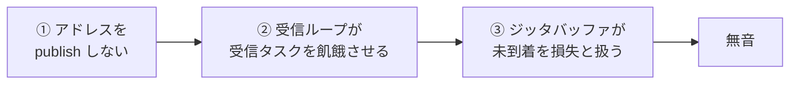
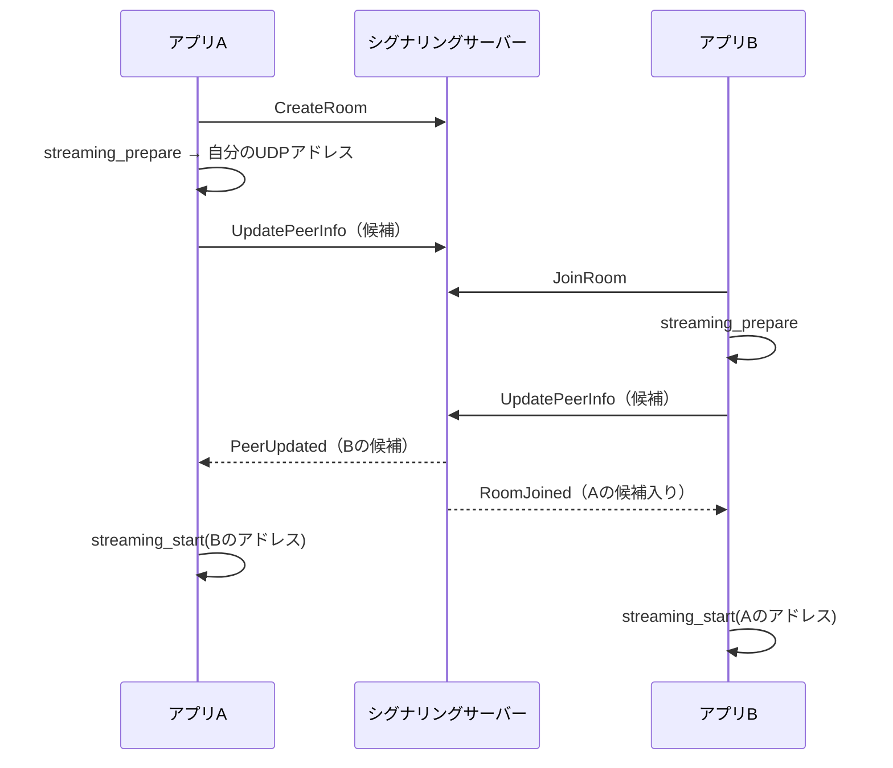

<!-- このドキュメントは実装の正です。変更時は実装も同期すること -->

# ADR-026: GUI 同士の音声経路（アドレス交換・受信ループのペーシング・ジッタバッファの損失判定）

## Status

Accepted

## Context

**Tauri GUI アプリ 2 台の間では、音声が一切流れていなかった。**

[ADR-025](./ADR-025-gui-e2e-control-channel.md) の GUI E2E でループバックオーディオデバイスに
既知のトーンを流し、レベルメーターが反応することを検証しようとして発覚した。原因は 1 つではなく、
**直列に並んだ 3 つの欠陥**だった。どれか 1 つを直しても音は流れない。

### ① GUI は自分の音声アドレスを publish していなかった

`ui/src/screens/MainScreen.tsx` はルーム参加時に「アドレスを持つピア」を探し、見つかったときだけ
`streaming_start` を呼ぶ。しかし `UpdatePeerInfo` の送信は CLI（`src/main.rs`）にしか実装がなく、
GUI には存在しなかった。

| 実装 | `UpdatePeerInfo` の送信 |
|------|------------------------|
| CLI（`src/main.rs`） | あり |
| Tauri GUI（`src-tauri/` + `ui/`） | **なし** |

したがって GUI 同士では双方の `public_addr` / `local_addr` が永久に `None` で、
`streaming_start` は一度も呼ばれない。音声が流れるのは、相手が自分でアドレスを送るときだけだった。

### ② 受信ループが、パケットを受信するタスクを飢餓させていた

`run_audio_streaming` の受信ループはジッタバッファから 1 フレーム取り出し、
データがある間は **await を一切持たない**。オーディオスレッドの Tokio ランタイムは
`new_current_thread()` であり、ソケット受信タスクは同じ 1 スレッドを共有する。

パケット欠落を隠蔽する経路（PLC）も「データがある」側の分岐なので、いったんジッタバッファが
`Lost` を返し始めると、ループは二度と await せず受信タスクは走らない。パケットが来ない →
すべての取り出しが `Lost` → 隠蔽処理でループが回り続ける、という**自己持続する飢餓**に陥る。

実測値（診断ログを一時的に挿入して計測、30秒間、2 台）:

| 指標 | 修正前 | 修正後 |
|------|-------|-------|
| 送信フレーム数 | 45,200 | 45,200 |
| 受信コールバック呼び出し | **2**（接続直後のみ） | 22,158 |
| 再生に渡したフレーム | 66,416（すべて隠蔽・レベル 0） | 22,159（実データ） |

ループが 30 秒で 66,416 回転していたことは、ペーシングが存在しなかったことも意味する。
コメントは「`enqueue_playback` の排出速度がケイデンスを決める」と述べていたが、
`enqueue_playback` はノンブロッキングで、満杯なら書けなかった分を捨てて即座に返る。

### ③ ジッタバッファが「まだ来ていない」を「失われた」と扱っていた

`JitterBuffer::pop()` は、期待するシーケンスが手元に無ければ無条件に `Lost` を返し、
期待値を 1 つ進めていた。取り出しがオーディオクロックで駆動される以上、これは
**送信側より先に進み続ける**ことを意味する。一度でも先に出ると、以降到着するパケットはすべて
「期限後の到着（late arrival）」となり、ストリームは永久に再生されない。

②と③は互いを強化する。②で受信が止まると③が期待値を進め、③が `Lost` を返し続けると
②のループが await しなくなる。

### なぜ既存のテストが緑だったか

Storybook・UI 単体テスト・シグナリングの結合テスト・2 ピアの GUI E2E（参加者一覧・チャット・
ミキサー表示）はすべて通っていた。これらはシグナリング経由で完結し、音声パケットを必要としない。
実アプリ 2 台に実音声を通して初めて露出した。

## Decision

### 1. 参加時に音声ソケットをバインドし、候補を publish する

- `streaming_prepare()`（`src-tauri/src/streaming.rs`）で `0.0.0.0:0` にバインドし、
  `local_addr()` を返す。冪等（再入室・二重呼び出しでポートが動かない）
- `signaling_publish_local_candidates(conn_id, local_port)`（`src-tauri/src/signaling.rs`）が
  `gather_candidates()` の結果を `UpdatePeerInfo` で送る
- UI は作成・参加の直後に上記を呼び、`PeerUpdated` イベントでアドレスを知った時点で
  `streaming_start` する（従来は参加時の一覧にアドレスがある場合しか開始しなかった）

ソケットは `std::net::UdpSocket` として保持し、`Connection::from_std` でオーディオスレッドの
ランタイムに登録する。Tokio のソケットは登録したランタイムでしか wakeup を受け取れないため、
バインドと登録を分離する必要がある（`jamjam::network::bind_std`）。

候補は IPv4 のみを優先度順に使う。`gather_candidates` は IPv6 リンクローカル（`fe80::`）も返すが、
`0.0.0.0` にバインドした IPv4 ソケットからは送信できず `EINVAL` になる。
また候補が空になる環境（ネットワークインターフェースが無い CI コンテナ等）では
ループバック `127.0.0.1:<port>` をフォールバックとして加える。実機には必ず非ループバックの候補が
あるため実運用の挙動は変わらない。

多人数は本 ADR の対象外である。従来どおり「アドレスを持つ最初のピア」に接続する
（メッシュ化は REQ-LAT-102 の範囲）。

### 2. 受信ループは再生バッファの空き容量でペーシングする

`AudioEngine::playback_vacant_samples()` を追加し、受信ループは
**1 フレーム分の空きがあるときだけ**ジッタバッファから取り出す。空きが無ければ 250µs 待つ。

出力コールバックが再生リングバッファをデバイスのレートで排出するので、その空き容量が
オーディオクロックそのものである。タイマーでケイデンスを決めるとクロックに対してドリフトするが、
空き容量はフィードバックなのでドリフトしない。同時に、空きが無い経路が必ず await するため
受信タスクが飢餓しない。

リングバッファは 8 フレーム分（`frame_size * channels * 8`）あるので、OS のタイマー粒度で
待機が 1ms に丸められても補充が追いつく。

### 3. ジッタバッファは後続フレームの到着で初めて損失と判定する

`pop()` の分岐を 3 つにする:

| 手元の状態 | 返す値 | 期待シーケンス |
|-----------|-------|--------------|
| 期待するフレームがある | `Packet` | +1 |
| 期待するフレームは無いが、それより後のフレームがある | `Lost`（隠蔽） | +1 |
| それより後のフレームも無い | `Underrun` | **進めない** |

「後続が届いている」ことだけが欠落の証拠である。証拠が無いうちに進めないので、
バッファが送信側を追い越すことがなくなる。実際の欠落は後続フレームの到着で判定されるため
最大 1 フレーム遅れて隠蔽されるが、隠蔽自体は従来どおり行われる。

### 4. 参加応答に招待コードを含める

`SignalingMessage::RoomJoined` に `invite_code` を追加する。従来は作成者しか招待コードを
受け取れず、参加側の UI はルーム UUID の先頭 6 文字を大文字化して表示していた。
これは招待コードと同じ形をしているが、どのルームにも対応しない文字列である。

- 同室の 2 つのウィンドウが違うルームコードを表示する
- 参加者が「コードをコピー」して渡しても、相手は参加できない

UI 側の UUID フォールバックは削除する。偽のコードを表示するより、表示しないほうがよい。
フィールドは `#[serde(default)]` とし、この変更より前のサーバーが相手でも
join 自体は成立させる（コードは表示できない）。

## Consequences

### 良い影響

- GUI 2 台の間で実際に音声が流れる。2 台のアプリを同じルームに入れる GUI シナリオ
  （このリポジトリの外で回す）が受信側のピアチャンネルのメーターで検証する
- 受信ループの CPU 使用が実測 30 秒で 66,416 回転 → 22,159 回転に下がり、
  隠蔽フレームの生成が消えた（音質の改善であり、同時に消費電力の改善である）
- ジッタバッファが送信側を追い越さなくなったので、パケットロス率（REQ-CON-023）が
  実際のロスを表す
- 参加者全員が同じ招待コードを共有できる

### 悪い影響・残る制約

- 実際の欠落の隠蔽が最大 1 フレーム遅れる（zero-latency プリセットで 0.67ms）。
  後続の到着を待つ以上避けられない
- ピアがシーケンス番号を振り直した場合（再接続ではなく、同一接続内での番号飛び）、
  ジッタバッファは `Underrun` を返し続ける。再接続では `ConnectionState::Connected` で
  バッファをリセットしているため実害は無いが、RFC 3550 のような再同期ヒューリスティックは
  実装していない。実ストリームで検証する手段が無いまま推測で入れるのを避けた
- `RoomJoined` にフィールドを追加したため、新しいクライアントと古いサーバーの組み合わせでは
  招待コードが空になる

### 検証

| 要求 | 検証 |
|------|------|
| REQ-CON-024 / REQ-CON-025 | 2 台のアプリの間で音声が流れる GUI シナリオ（シグナリングサーバーを立てて回すため、このリポジトリの外で回す） |
| REQ-CON-026 | 招待コードでルームに参加するシグナリングの結合テスト（同上） |
| REQ-AUD-030 | `src/audio/engine.rs::test_playback_vacancy_tracks_what_is_queued` |
| REQ-LAT-029 | `src/network/jitter_buffer.rs` の 2 テスト（starve / 後続到着で損失） |
| REQ-GUI-012 | `tests/e2e/tests/gui.rs::the_loopback_device_returns_what_is_played_into_it` |
| REQ-GUI-013〜014 | 2 台のアプリの実音声シナリオ（同上） |
| REQ-GUI-015 | 2 台のアプリが同じルームコードを表示する GUI シナリオ（同上） |

ループバックデバイス（BlackHole）は書き込みを加算し、誰も書かなくなった後もその内容を返し続ける。
ゼロを書いても待っても無音に戻らないため、シナリオは「無音であること」ではなく
「トーンで**レベルが上がること**」を検証し、シナリオごとに周波数を変える。測定値は
`tests/e2e/src/pom/loopback_audio.rs` に記録した。

## 関連

- [ADR-008: ゼロレイテンシモード](./ADR-008-zero-latency-mode.md) - 遅延要件
- [ADR-020: ジッタバッファの配線](./ADR-020-jitter-buffer-wiring.md) - 段数と定常遅延
- [ADR-025: GUI E2E 制御チャネル](./ADR-025-gui-e2e-control-channel.md) - この欠陥を検出した層
- [signaling.md](../api/signaling.md) - `RoomJoined` と接続ライフサイクル
