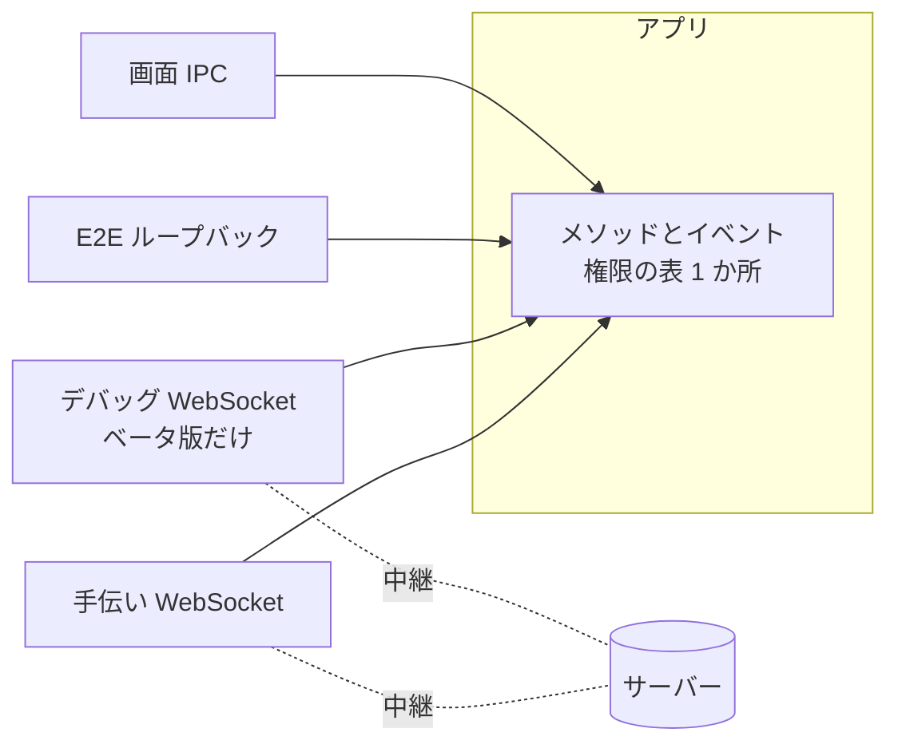
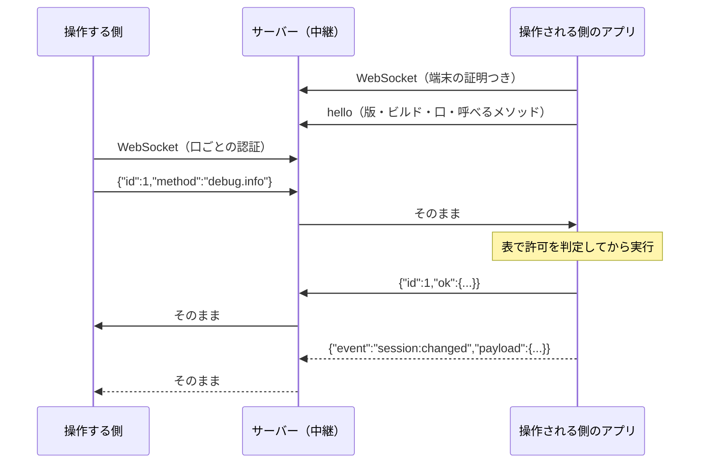

# ADR-044: アプリの操作は「口」ごとに呼べる範囲を 1 つの表で決める。遠隔の口は WebSocket の中継に載せ、権限は 2 段にする

## Status

Accepted

[ADR-043](./ADR-043-remote-operation-rpc.md) の 1 節（呼び出し口の表）・3 節（設定の手伝い）・4 節（相手とのやり取りの中継）を置き換える。
2 節（音声の設定は `settings_change` の 1 か所）と 5 節（知らない種類のシグナリングメッセージは読み飛ばす）はそのまま有効。
置き換えはすべて実装済み（下記「実装の順序」の 1〜5）。

## Context

これから Mac や Windows を別回線の遠隔地に置きっぱなしにして、jamjam の動作を確かめる。端末ごとに SSH の入り方もビルドの
仕方も違うので、**アプリを一度入れたら、そのアプリを遠隔から直接自由に操作できる**状態にしたい。ベータ版を 1 台の Mac に
入れて確かめようとしたとき、Mac に SSH で入れず、相手の設定を手伝う機能が見せる範囲（音声設定だけ）でしか確かめられなかった。

もう 1 つの要望は、[ADR-043](./ADR-043-remote-operation-rpc.md) の「相手の設定の手伝い」を、この遠隔操作の上に載せ直すこと。
変更 1 件ごとに許可を求める作りは、手伝う人と手伝われる人の両方の手数を増やす。

ADR-043 の作りには、これを阻むものが 3 つあった。

1. **画面が、接続・入室・ストリーミングの開始・再接続の状態機械を持っている。** バックエンドには「いまルームに入っているか」を
   答えるコマンドすら無い（`MainScreen.tsx` が state と ref に持つ）。そのため、画面以外の口から「ルームに入る」ができず、
   相手のアプリの画面を手元に同じ形で描くこともできない（画面が自分のバックエンドで状態機械を回してしまう）
2. **遠隔の口が 2 つのコマンド（`settings_get` / `settings_change`）だけで、経路がシグナリングの中継（`PeerMessage`）。**
   サーバーは 1 接続あたり 10 秒に 30 通で切り、本文は 16 KiB まで。メーターの値やフェーダーの往復には足りない
3. **権限の置き場所が口ごとに別。** E2E は「全部」、手伝いは「型で受けるので 2 つだけ」と、それぞれの実装が暗黙に決めていた。
   口を増やすたびに、どこで何が許されているのかが分からなくなる

## Decision

### 1. 操作は「メソッドとイベント」、それを運ぶ入口が「口」

- **メソッド**: 名前付きのコマンド。バックエンドの `generate_handler!` に並ぶアプリのコマンド（ADR-043 のとおり）に加えて、
  デバッグ用の `debug.*`・画面を直接操作する `ui.*` を持つ
- **イベント**: 状態が変わったときにバックエンドが流す通知（`audio:config-changed`、`session:changed` など）
- **口（portal）**: メソッドの呼び出しとイベントの受け取りを運ぶ入口。**口ごとに、呼べるメソッドと受け取れるイベントの範囲が違う**

| 口 | 経路 | 誰が | 存在するビルド |
|----|------|------|----------------|
| 画面（`screen`） | webview の IPC | アプリ自身の UI | すべて |
| E2E（`loopback`） | ループバックの HTTP（[ADR-025](./ADR-025-gui-e2e-control-channel.md)） | テスト | `e2e-control` のビルドだけ |
| デバッグ（`debug`） | WebSocket（サーバーの中継） | 検証をする人（と、その道具） | **ベータ版だけ**（`debug-remote`） |
| 手伝い（`help`） | WebSocket（サーバーの中継） | 同じルームで、許可された相手 | すべて |

**どの口から来ても、同じ表で許可を判定し、同じ処理を通る。** 口ごとに別の判定・別の実装を持たない。E2E の制御チャネルも、
この層の口の 1 つ（`loopback`）としてまとめる（HTTP のエンドポイントはそのまま残し、中身が同じ層を呼ぶ）。

### 2. 呼べる範囲は 1 つの表で決める

権限の表はバックエンドの 1 か所（`src-tauri/src/rpc/spec.rs`）に持つ。行は**メソッド**、列は**口**。
表に無いメソッドは、どの口からも呼べない（許可は列挙して足す）。`generate_handler!` の一覧もこの表から作るので、
コマンドを足して表に書き忘れることが起きない。

- 許可の判定は**受け取る側（操作される側のアプリ）**で行う。操作する側のアプリが取り決めを守るとは仮定しない
- 許可の無いメソッドは実行せず、`denied` を返す。呼び出しの名前が表に無いものは `unknown_method`
- 表から 2 つの文書を作り、食い違いをテストで落とす。公開する文書 `docs-spec/api/remote-permissions.md` は
  **手伝いの口で相手に何をされうるか**だけを載せる。デバッグの口を含む全体の比較表は、運営側の文書に置く

### 3. 権限は 2 段。デバッグモードと一般ユーザーモード（手伝い）

| | デバッグモード（`debug`） | 一般ユーザーモード（`help`） |
|---|---|---|
| 目的 | 品質の検証 | 相手の設定を手伝う |
| ビルド | **ベータ版にだけ存在する**。正式リリースには実装ごと入れない | すべて |
| 有効にする人 | **サーバーに端末を登録するだけ**。端末の画面では何もしない（置きっぱなしで人がいない） | 手伝われる人が、申請に**初回だけ**許可する |
| 呼べる範囲 | アプリの全操作、`ui.*`、`debug.*`（下記） | アプリの操作のうち、下記「手伝いで除くもの」以外 |
| 止め方 | サーバーから登録を外す | どちらからでも、いつでも |

#### デバッグの口で呼べる `debug.*` と `ui.*`

| メソッド | 内容 |
|----------|------|
| `app.invoke` | アプリの任意のコマンドを、画面と同じ IPC で呼ぶ |
| `ui.dom` / `ui.query` / `ui.click` / `ui.input` / `ui.windows` | 画面の観測と操作（E2E の制御チャネルと同じもの） |
| `debug.info` | バージョン・ビルド・OS・音声デバイスの一覧（デバイス ID を含む）・設定・セッションの状態 |
| `debug.logs` | 診断ログ（`jamjam.log`）の末尾または続き。1 回の返事は 256 KiB まで（`next_offset` から続きを読む） |
| `debug.crashes` | 直近のクラッシュ記録（panic の場所）。ログにある panic の行も `debug.logs` で読める |
| `debug.restart` / `debug.update_apply` | アプリの再起動・更新の適用（セッション中でも待たずに行う）。再起動後は自動で繋ぎ直す |
| `debug.screenshot` | 画面の PNG（`window` でウィンドウを選べる。手伝う人の窓も撮れる） |
| `debug.audio_record` | 入力・出力・送信直前のいずれかを指定時間だけ録音し、解析結果（最大値・RMS・支配的な周波数・途切れ）と、必要なら WAV を返す |
| `debug.audio_tone` | 送信経路または出力に、指定の周波数・振幅・時間の正弦波を入れる（相手の端末で録音して品質を測る） |
| `debug.perf` | 指定の秒数のあいだ、アプリの CPU・メモリ、入力・出力の音声コールバックと受信ループの所要時間（平均・最大）、xrun の数を測る（端末が必要とする性能を実測で決めるため） |
| `debug.audio_timing` | 受信した音の欠けを種類ごとに数え、直近の欠けの時刻（マイクロ秒）付きで返す。読み出しと書き込みの数も返す（[ADR-046](./ADR-046-audio-gaps-are-measured-not-guessed.md)） |

今後の遠隔デバッグの機能は、このメソッドの一覧に足していく。足すときは表の 1 行と実装 1 つで済む。

#### 手伝いで除くもの

手伝いの口は、画面のコマンドのうち次の 5 種類だけを除いて許す（ミュート・音量・パン・音声の設定・診断・状態の取得は許す）。

1. **チャットの送信とリアクション**（本人の発言になる）
2. **退室と、ルームの移動**（退室・切断・ストリーミングの停止・別のルームへの参加と作成）。手伝いは、相手がいまいるルームの中で行う
3. **接続先と情報の提供の範囲を変えるもの**（サーバーの接続先の変更、利用状況の送信のオンオフ）。相手の同意の範囲を超える
4. **相手の個人情報を読むもの**（過去に入ったルームの履歴）
5. **`debug.*` / `ui.*` と、手伝いの開始・停止そのもの**

5 種類のうち 1・2 は利用者が決めたもの、3〜5 は同意の範囲に収めるために設計で足したもの。範囲は表の行で決まり、変えるときは表の 1 行と
公開の文書を直す。

### 4. 遠隔の口は WebSocket の中継に載せる

遠隔地の端末は NAT の内側にいるので、**操作される側のアプリが、サーバーへ外向きの WebSocket を張る**。サーバーは、
操作する側の接続と対にして、フレームをそのまま中継する。サーバーはフレームの中身を解釈しない。

シグナリングの接続とは別の経路にする。シグナリングは 1 接続 10 秒に 30 通という上限を持つ（ルームの参加者への
送りつけで落とされないため）。メーターやフェーダーのように往復の多い操作は、この上限に収まらない。

#### 線のプロトコル（`jamjam-rpc/1`）

JSON のテキストフレーム。1 フレームは 1 MiB まで。

| フレーム | 向き | 形 |
|---------|------|-----|
| hello | 操作される側 → 操作する側 | `{"hello":{"protocol":"jamjam-rpc/1","app_version":"…","build":"beta","portal":"debug","methods":["…"]}}` |
| 要求 | 操作する側 → 操作される側 | `{"id":7,"method":"debug.info","params":{…}}` |
| 成功 | 操作される側 → 操作する側 | `{"id":7,"ok":<値>}` |
| 失敗 | 操作される側 → 操作する側 | `{"id":7,"error":{"code":"denied\|unknown_method\|invalid_params\|failed\|timeout","message":"…"}}` |
| イベント | 操作される側 → 操作する側 | `{"event":"session:changed","payload":<値>}` |

- 要求は同時に何本でも送れる。返事は `id` で対応させ、順序は保証しない
- 操作する側は、返事が 30 秒来なければ諦める。操作される側は、1 つのメソッドを 25 秒で切って `timeout` を返す
- 1 MiB を超えうる結果は、メソッドが自分で分ける（ログは「続きの位置」を返す、録音は時間に上限を付ける、画面は縮小する）
- イベントは、口ごとに許した名前のものだけを、選ばせずに流す（表 `EVENTS`）。いまは `audio:config-changed` と `i18n:language-changed`

#### 端末の登録の確かめ方（デバッグの口）

ベータ版のアプリは、起動時と 30 分ごとに、サーバーへ**この端末が登録されているか**を問い合わせる（端末の証明だけを付けた
GET。ほかの情報は送らない）。登録されていれば、中継へ WebSocket を張る。切れたら 5 秒から 60 秒まで間隔を広げて繋ぎ直す。
登録されていない端末は何も張らない。この問い合わせをすることは、利用者向けの説明（[privacy](../../docs-site/docs/getting-started/privacy.md)）に載せる。

登録の方法・操作する側の認証・サーバー側の上限は、公開しない（サーバー側の設計に置く）。

### 5. 一般ユーザーモード（手伝い）

手伝う人が申し出て、手伝われる人が**1 回だけ**許可する。許可のあとの操作ごとには聞かない。どちらからでもいつでも止められる。

- 申し出と許可は、これまでどおりシグナリングの中継（`PeerMessage`）で交わす。許可のとき、手伝われる側は**推測できない手伝いの番号**を
  決めて返す。手伝われる側は、その番号でサーバーの中継に WebSocket を張り、手伝う側も同じ番号で張る。サーバーは、番号ごとに
  手伝われる側 1 本・手伝う側 1 本だけを対にする
- 手伝う側の手元に、**相手のアプリと同じ画面が別のウィンドウとして開き、相手のアプリと同期する**。このウィンドウは、
  自分のアプリの画面と**同じ画面のコード**を、**自分のバックエンドではなく相手のバックエンドに繋いだ口の上で**描く
  （画面を二重に書かない）。手元で操作すると、相手のアプリに反映され、メーターなども相手と同じ動きが見える
- 相手のアプリが、手伝いの口の許可の表で 1 件ずつ判定する。手伝う側のアプリが取り決めを守るとは仮定しない
- 許可は**この手伝いの間だけ**。止める・どちらかが退室する・シグナリングが切れる・ルームが閉じる、のいずれかで終わり、
  相手の状態は手元から消える。アプリを起動し直すと残らない
- 手伝われる側の画面には、手伝いのあいだ**手伝っている人の名前と「止める」**を出し続ける（[ADR-043](./ADR-043-remote-operation-rpc.md) の
  バーと同じ）
- ルームのチャットには、手伝いの開始・終了と、**音声の設定の変更**が記録される（文は受け取ったアプリが自分の言語で組み立てる。
  ADR-043 と同じ）。ミュートや音量は、相手が自分の画面で同じ動きを見るので、チャットには記録しない
- デバイス ID は手伝う側に渡さない（ADR-043 の仮の名前の取り決めをそのまま使う）

### 6. 画面は「メソッドを呼び、イベントを受ける」以外の方法でバックエンドに触れない

手伝いの画面が成り立つ前提として、**接続・入室・ストリーミングの状態機械をバックエンドに移す**。

- バックエンドが持つ: 接続の段階、いまのルーム、参加者、ストリーミングの相手、再接続の状態、テストルーム
- 画面は、スナップショットを返す `session_get` と、変わったときの `session:changed` イベントで表示し、操作は
  `session_create` / `session_join` / `session_leave` のような 1 操作 1 コマンドで行う
- 画面が持つのは、ダイアログの開閉のような**画面だけの状態**に限る

これにより、E2E とデバッグの口からも「ルームに入る」を 1 コマンドで呼べ、手伝いの画面も相手の状態をそのまま描ける。

### 7. 「ベータ版にだけ存在する」の切り分け

- `debug-remote`（cargo feature）: デバッグの口・登録の問い合わせ・`debug.*` / `ui.*` の実装。`default` に入れない
- `e2e-control` も同じ実装（`debug.*` / `ui.*`）を使うので、実装は内部の feature `debug-tools` に置き、両方が有効にする
- ベータのタグ（`v*-beta.*` のように `-` を含むタグ）のときだけ、リリースのワークフローが `--features debug-remote` を付けて組む。
  正式リリースのタグ・手動の予行演習では付けない
- 検査は 2 段:
  1. `cargo test` が、`default` の feature に `e2e-control` / `debug-remote` / `debug-tools` が無いことを常に確かめる
     （[ADR-025](./ADR-025-gui-e2e-control-channel.md) の検査を広げる）
  2. リリースのワークフローが、**正式リリースのバイナリに、デバッグの口の目印（`jamjam-debug-remote`）が無い**ことを確かめてから公開する。
     ベータのバイナリには目印がある、も同じ検査で確かめる（検査が空振りしないため）

### 8. 操作する側の道具

操作する側の道具（`jamjam-remote`）は、この取り決めを話す CLI として作る。認証の情報を持つので、公開のリポジトリには置かない。
CLI が 1 人で回せる範囲: 起動の確認 → ルームに入る → 設定 → 録音して品質を測る → ログと画面を取る。

## 却下した案

- **シグナリングの `PeerMessage` の上に遠隔操作を載せる**: 1 接続 10 秒に 30 通の上限に、メーターやフェーダーの往復が収まらない。
  上限を上げると、送りつけでルームから落とす攻撃の余地が広がる
- **手伝いの画面を、相手の DOM の転送で作る**: 相手の画面の中身（チャットなど）を丸ごと送る。相手のバックエンドを呼んで
  自分の画面のコードで描く作りなら、許可の表が画面の操作を 1 件ずつ判定でき、同じ画面のコードを 1 つだけ持てばよい
- **デバッグの口をベータ以外にも入れて、実行時のスイッチで切る**: スイッチの判定を誤ると正式リリースで開く。コードが無ければ開きようがない
- **デバッグの有効化を端末の画面の操作にする**: 置きっぱなしの端末には人がいない
- **手伝いの許可を、変更 1 件ごとにする（ADR-043）**: 相手のアプリと同じ画面を操作する形では、操作の数が多く、1 件ずつの許可が成り立たない。
  誤操作は、いつでも止められることと、除く範囲で守る

## Consequences

### メリット

- 遠隔地の端末を、SSH もビルドの手順も要らずに操作できる。アプリを入れれば、OS の違いは口の向こうに隠れる
- 口を増やしても、許可の判定・処理は 1 か所。どこから何ができるのかを表 1 枚で言える
- 手伝う人は、相手の設定ウィンドウを見るだけでなく、相手のアプリの画面をそのまま操作できる
- E2E・デバッグ・手伝いが同じ層を通るので、E2E が手伝いの許可の表も検証できる

### デメリット

- 接続・入室の状態機械をバックエンドに移す作業が要る（画面の大きな変更）
- 中継のサーバーが、シグナリングとは別に、常時つながる接続を持つ（ベータ版の登録端末と、手伝いの間だけ）
- 手伝いの画面のために、手伝われる側の状態を絶えず送る（メーターは手伝いの画面が見えているあいだだけ、1 秒に 10 回まで）

## 実装の順序

1. **この ADR**
2. **口と権限の表**（`rpc`）・E2E の制御チャネルの統合・`debug-remote` の機能とビルドの切り分け・検査
3. **デバッグの口**: 中継への接続、`debug.*`、サーバー側の中継と登録、操作する側の道具、2 台での E2E
4. **接続・入室の状態機械をバックエンドへ**（`session_*`。実装済み: `src-tauri/src/session/`）
5. **手伝いの作り直し**（実装済み）: 中継の上の口、相手の画面の同期表示、変更ごとの許可の廃止
6. **ミキサーのフェーダーをバックエンドへ**（実装済み: `src-tauri/src/mixer.rs`）: 手伝う人の窓のフェーダーを相手のアプリと同期する

### 実装順序 4 で決めたこと

- 状態は `session_get`（`Snapshot`）で読み、変わるたびに `session:changed` が同じ形で流れる。`revision` は変更ごとに増え、古い通知が新しいものより後に届いても読み手が見分けられる
- 操作は `session_connect`（最初から繋ぎ直す）・`session_create`・`session_join`・`session_leave`・`session_reconnect`（繋ぎ直しに尽きたあとの再試行）。呼びは操作が終わるまで待ち、失敗は `error` の段階とコマンドの失敗の両方で伝える
- 生のシグナリング・音声のコマンド（`signaling_connect` / `_join_room` / `_leave_room` / `_create_room` / `_poll_events`、`streaming_prepare` / `_start` / `_stop` など）は、状態機械から外れた操作を許さないためコマンドから外し、バックエンドの内側の関数にした。ルームのチャット・手伝い・音量などの操作は接続の番号（スナップショットの `connection_id`）を使うコマンドのまま
- 権限: `session_get` と `session:changed` は手伝いの口にも開く（相手のルームはその人の画面に描くもの）。スナップショットは接続先の URL・ルーム一覧・参加者のアドレスを含まない。ほかの `session_*` は手伝いで除く（ルームの移動・作成・退室）
- 画面に残るのは、ダイアログの開閉・入力中のコード・招待リンクが読めなかったときの表示のような、画面だけの状態（ミキサーのフェーダーは実装順序 6 でバックエンドに移した）
- 参加者と音声の判断（誰に音声を流すか、相手が抜けたとき何をするか）は入出力を持たない `session/roster.rs` に置き、ネットワークも音声機器も無しでテストする

### 実装順序 5 で決めたこと

- **手伝いの口の許可の判定は、デバッグの口と同じ層（`rpc::dispatch`）を通る。** 手伝いの口だけ、その前後に `HelpGuard`（`rpc/help.rs`）が入り、3 つを守る:
  (1) デバイス ID を仮の名前に置き換える（読んだ設定・設定が変わった知らせ・変更の指定のすべてで）。(2) 失敗したときの文面を渡さない（設定を適用できなかった
  ときは `device_gone` / `invalid_value` / `unavailable` だけ）。(3) 音声の設定の変更が適用されたら、ルームのチャットに記録する。
  ほかの参加者のアドレス（音声の状態にある）も渡さない
- **手伝いの口の許可の表は、テストで固定する。** `spec.rs` の `a_helper_may_call_exactly_these_methods` が、手伝いの口が呼べるメソッドの一覧そのものを持つ。
  表に足した行が手伝いの口に開いていれば、この一覧との食い違いで落ちる。手伝いの申し出への答えと停止、手伝いの画面のための呼び出し（`help_call`）は、
  手伝いの口からは呼べない（手伝われる側のアプリが、さらに手伝いを始められない）
- **中継の上の手伝いの番号**: 手伝われる側が `jamjam::network::new_help_session()`（128 ビットの乱数を 16 進 32 桁）で決め、中継に host として繋いでから、番号を
  シグナリングの `accepted { session }` で返す（host のいない番号に guest は繋げないため）。手伝う側は同じ番号で guest として繋ぐ。中継の URL は、
  シグナリングの接続先と同じホストの `/v1/remote/help/<番号>?role=host|guest`。手伝われる側が中継に繋げなかったときは、許可しても始めず断りを返す
- **手伝う側の窓**は Tauri のウィンドウ `help-<通し番号>`（URL のハッシュ `#/help`。ラベルに手伝いの番号は入れない）。窓を閉じると手伝いを止める。窓の画面は、
  自分のアプリの画面と同じコード（`MainScreen`）で、`ui/src/lib/backend.ts` の入口を `helperBackend`（呼びを `help_call` で相手のアプリへ送り、
  相手のイベントを `help-remote:event` で受ける）に差し替えて描く。窓の言語・ログ・大きさ（`config_get_language`・`log_frontend`・`window_*`）は窓自身のもの
- **窓に出さないもの**: 退室・チャットの送信欄・参加者への手伝いの申し出。相手の履歴・接続先は読みに行かない。相手のアプリはこれらを断るが、
  出さないことで、押して断られる操作を手伝う人に見せない。手伝う人が設定を開くと、相手の音声の設定（Devices タブ）だけが窓の脇に開く
  （設定ウィンドウのほかのタブの操作は、手伝いの口に開けていない）
- **メーターの上限**: 手伝う人の窓は、見えているあいだだけ、100 ms ごとに相手の音声の状態を読む。相手のアプリは、メーターを読む 2 つのメソッドを、
  100 ms 未満の間隔では新しく読まず、直前の値を返す
- **中継が終わる・シグナリングが切れる・ルームが閉じる・相手が退出する**のいずれでも、手伝いが終わって窓が閉じ、中継の接続が切れる（状態機械が知らせて、
  `help_link::end` が両端を片づける）。アプリを起動し直しても残るものは無い（手伝いの状態は持たない）
- 変更ごとの許可を求めていた `settings_help_propose` / `settings_help_decide` と、シグナリングの `propose` / `answered` / `settings` は廃止した。
  古いアプリが送ってくるこれらのメッセージは、知らない種類として読み飛ばされる。古いアプリに手伝いを申し出られた新しいアプリは、番号つきの
  `accepted` を返すが、古いアプリはそれを読めず、手伝いは始まらないまま中継が 2 分で切る（ベータ版の間の互換で、対処はしない）
- 中継は Worker にだけある（Rust 版のシグナリングサーバーには無い）ので、2 台のアプリの通しシナリオは Worker を立てて回す（`gui_remote.rs`）

### 実装順序 6 で決めたこと

実装順序 5 では、フェーダー（音量・パン・相手ごとのミュート）を画面の状態のまま残したため、手伝う人の窓は初期値から始まり、
手伝う人が動かしても相手の画面のフェーダーは追従しなかった。§6 の「画面は状態を持たない」を、フェーダーにも当てはめる。

- **状態はバックエンドの `mixer` が持つ。** 自分のマイクの音量・パンと、ルームにいる参加者ごとの音量・パン・ミュート。`mixer_get`（`Snapshot`）で読み、
  変わるたびに `mixer:changed` が同じ形で流れる（`revision` は変更ごとに増える。位置が変わらない操作は流さない）。手伝いの口にもこのイベントを開ける
- **操作は 1 操作 1 コマンド**: `mixer_set_local_volume` / `mixer_set_local_pan` / `mixer_set_peer_volume` / `mixer_set_peer_pan` / `mixer_set_peer_muted`。
  どれも手伝いの口に開ける（ミュート・音量・パンは手伝いが最初から許していた範囲）。音声エンジンを直接動かす `streaming_set_*_volume` / `_pan` と
  その読み取りはコマンドから外し、バックエンドの内側の関数にした（動かす経路が 2 つあると、フェーダーの位置と実際の音が食い違うため）
- **参加者ごとの状態は、ルームにいる参加者の分だけ持つ。** セッションが変わるたびに、入った人には既定の位置（音量 80・パン 0・ミュートなし）の
  ストリップを用意し、出た人の分は残さない。ルームにいない参加者への操作は断る。ルームを出ても自分のマイクの位置は残る
  （画面が持っていたときと同じ）。アプリを起動し直すと既定に戻る（保存しない。これまでと同じ）
- **音は、フェーダーの位置に従う。** 音量 80 が 0 dB（変えずに再生）で、音量は `音量 / 80` 倍（100 で約 +2 dB）。これまでは画面が
  `音量 × 2` %をエンジンに渡しており、目盛りの「80 = 0 dB」と食い違って（80 で +4 dB）、動かさないうちは 0 dB のままだった。
  聞こえる音量とパンは、自分のマイクと**音声の相手（`streaming_peer_id`）のストリップ**が決める。相手のストリップは、動かしたとき
  （その人が音声の相手のとき）と、セッションの音声が始まるときに音声エンジンへ渡す。3 人以上のルームで、音声の相手でない人のフェーダーを
  動かしても聞こえる音は変わらない（これまでは誰のフェーダーでも全員の音に効いていた）
- ミュートのうち、自分のマイクのミュートとモニターは、これまでどおり音声エンジンの状態（`streaming_status`）で、同期も
  その読み取りで行う

## 関連ドキュメント

- [ADR-043: 遠隔操作の RPC](./ADR-043-remote-operation-rpc.md) — 置き換える範囲は冒頭のとおり
- [ADR-025: GUI E2E 制御チャネル](./ADR-025-gui-e2e-control-channel.md) — `loopback` の口になる
- [ADR-024: 端末の識別](./ADR-024-device-identity-instead-of-accounts.md) — 中継への接続で端末を証明する
- [ADR-041: 自動更新](./ADR-041-self-update.md) — `debug.update_apply` が使う
- [ADR-036: 診断ログ](./ADR-036-diagnostic-log-file.md) — `debug.logs` が読む
