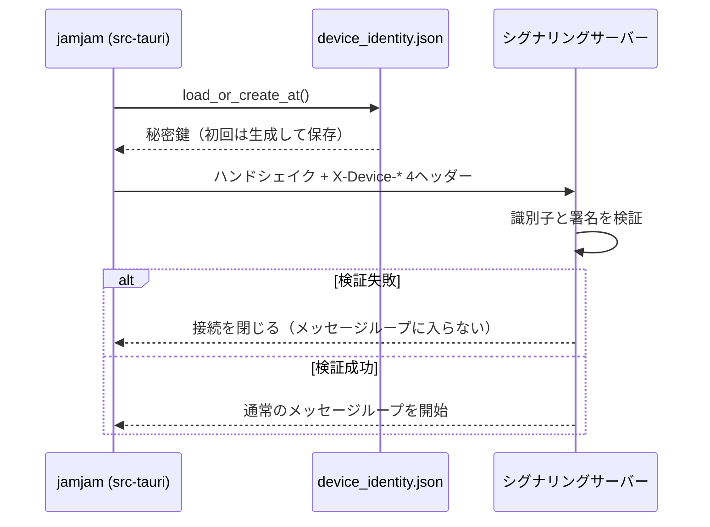

<!-- このドキュメントは実装の正です。変更時は実装も同期すること -->

# Device Identity Specification（端末アイデンティティ）

## Overview

jamjam は会員登録を持たない。インストールごとに Ed25519 鍵ペアをローカル生成し、その公開鍵から
導出したグローバル一意な識別子で端末を識別する。識別子はシグナリングの WebSocket ハンドシェイクで
提示され、サーバーが所有証明を検証する。

導入判断は [ADR-024](../adr/ADR-024-device-identity-instead-of-accounts.md)。実装は
`src/network/device_identity.rs`（導出・署名）と `src-tauri/src/device_identity.rs`（永続化）。

## Use Case



## Identifier Derivation

```
device_id = BASE32_NOPAD(SHA-256(public_key)[0..16])
```

| 項目 | 値 |
|------|-----|
| 署名方式 | Ed25519（`ed25519-dalek`） |
| 公開鍵長 | 32 バイト |
| ハッシュ | SHA-256 |
| 使用するハッシュ先頭バイト数 | 16（128 bit） |
| エンコード | RFC 4648 base32、パディングなし |
| 識別子の長さ | 26 文字（`ceil(128 / 5)`）、`A`-`Z` と `2`-`7` |

例: `7K2MQ4XJ9VBTN3RHDW8FCL5PZY`

128 bit を採用した理由: 独立に生成された2つの鍵ペアが同じ識別子になる確率が実質ゼロであり、
サーバーによる採番・一意性チェックを不要にできる（ADR-024 Decision 1）。

## Handshake Headers

WebSocket ハンドシェイク（`Upgrade` リクエスト）の HTTP ヘッダーとして送る。
`SignalingMessage`（`JoinRoom`/`CreateRoom`）のフィールドではない。

| Header | 内容 | エンコード |
|--------|------|-----------|
| `X-Device-Id` | 識別子 | base32（26文字） |
| `X-Device-PubKey` | Ed25519 公開鍵（32バイト） | base64 |
| `X-Device-Signature` | 署名（64バイト） | base64 |
| `X-Device-Timestamp` | 署名対象の Unix 秒 | 10進文字列 |

### 署名対象

```
"jamjam-device-v1:" + <X-Device-Timestamp と同じ値の10進文字列>
```

- 前置のドメイン文字列は、ここで生成された署名が別用途の署名として流用されることを防ぐ。
- `v1` はスキーム版。導出式または署名対象を変更する場合はここを上げる。
- `X-Device-Timestamp` には送信時点の Unix 秒を入れる。

## Verification

サーバーは識別子と署名を検証し、合わない接続を拒否する。

### ヘッダー集合の状態と動作

| 状態 | 動作 |
|------|------|
| 4つ揃っていて検証成功 | 接続継続 |
| 検証失敗（1つでも欠落・不整合・時刻超過を含む） | 拒否（WebSocket を確立しない） |

時刻の超過による拒否は、サーバーの応答の `Date` と端末の時計の差を測って「時計のずれ」として報告する
（`NetworkError::ClockSkew`。REQ-IDT-009）。ずれで断られた接続は、差が縮まったのを確かめて自動でやり直す（REQ-IDT-010）。

匿名の接続は無い。アプリも CLI も、同じマシンでは同じアイデンティティ（`src/identity_store.rs`）を
使って必ず証明を付ける（ADR-024 Decision 4）。

## Replay Window

署名対象に Unix 秒を含むため、捕獲したヘッダー集合が再利用可能な時間は、サーバーが受理する時刻の窓に限られる。
窓を許容する根拠（ADR-024 脅威モデル）:

1. 本番のシグナリングは TLS（`wss`）であり、ヘッダーの捕獲には TLS の突破が必要である。
2. 現時点で識別子に認可判断が乗っていない（識別のみで、参加可否を左右しない）。

## Local Storage

| 項目 | 値 |
|------|-----|
| 場所 | アプリデータディレクトリ（`config.toml` と同じ。macOS: `~/Library/Application Support/jamjam/`） |
| ファイル名 | `device_identity.json` |
| パーミッション | Unix: `0600`。Windows: 設定しない（NTFS ACL に委ねる） |

```json
{
  "version": 1,
  "secret_key": "<base64 32バイト>"
}
```

`config.toml` と別ファイルにするのは、設定ファイルを手動でコピーしたときに識別子が複製されるのを
避けるためである。

### 復旧動作

| 状態 | 動作 |
|------|------|
| ファイルが存在しない | 生成して保存する（初回起動） |
| JSON として壊れている | 新しい識別子を生成して上書きする |
| `version` が 1 以外 | 新しい識別子を生成して上書きする |
| `secret_key` が base64 でない／32バイトでない | 新しい識別子を生成して上書きする |
| アプリデータディレクトリが特定できない／書き込めない | そのセッションに限り揮発的な識別子を使う（永続化しない） |

いずれの異常系でも起動は拒否しない。識別子は利用者が手で復元できる資格情報ではなく、
起動不能の方が害が大きいためである。

## Visibility

| 経路 | `device_id` が出るか |
|------|---------------------|
| 他の参加者（`PeerJoined` / `RoomJoined` の `PeerInfo`） | **出ない** |
| jamjam 本体の UI | **出ない**（Tauri コマンドを持たない） |

## Configuration

設定は不要である。端末側に設定項目・環境変数を持たない。

## Rust API

`jamjam::network` から公開する。

```rust
// src/network/device_identity.rs
pub const DEVICE_ID_LEN: usize = 26;

pub struct DeviceIdentity { /* Ed25519 SigningKey + 導出済み device_id */ }

impl DeviceIdentity {
    pub fn generate() -> Self;
    pub fn from_secret_bytes(secret: &[u8; 32]) -> Self;
    pub fn secret_bytes(&self) -> [u8; 32];
    pub fn device_id(&self) -> &str;
    pub fn public_key_b64(&self) -> String;
    pub fn sign_timestamp(&self, unix_secs: i64) -> String;
}

pub fn device_id_from_public_key(public_key: &VerifyingKey) -> String;

/// 端末が署名する正確な文字列（`"jamjam-device-v1:" + unix_secs`）を返す。
pub fn signed_payload(unix_secs: i64) -> String;

// src/network/signaling.rs
pub const DEVICE_ID_HEADER: &str = "x-device-id";
pub const DEVICE_PUBKEY_HEADER: &str = "x-device-pubkey";
pub const DEVICE_SIGNATURE_HEADER: &str = "x-device-signature";
pub const DEVICE_TIMESTAMP_HEADER: &str = "x-device-timestamp";
```

`DeviceIdentity` の `Debug` 実装は `device_id` のみを出力し、秘密鍵を含めない。

### クライアント側の使用

```rust
// アイデンティティは必須。接続のたびに4ヘッダーが送られる。
let identity = Arc::new(jamjam::identity_store::load_installation_identity());
let client = SignalingClient::new(server_url, identity);
```

## Limitations

- 複数端末を1人の利用者として束ねられない（端末ごとに別の識別子）。
- 端末を買い替えると識別子が変わる。鍵のエクスポート／インポートは対象外。
- `device_identity.json` を削除すれば新しい識別子になる。

## 関連ドキュメント

- [ADR-024: 端末アイデンティティによる識別](../adr/ADR-024-device-identity-instead-of-accounts.md)
- [signaling.md](./signaling.md) — シグナリングの接続・メッセージ仕様
- [requirements.md](../requirements.md) — `REQ-IDT-001` 〜 `REQ-IDT-007`
