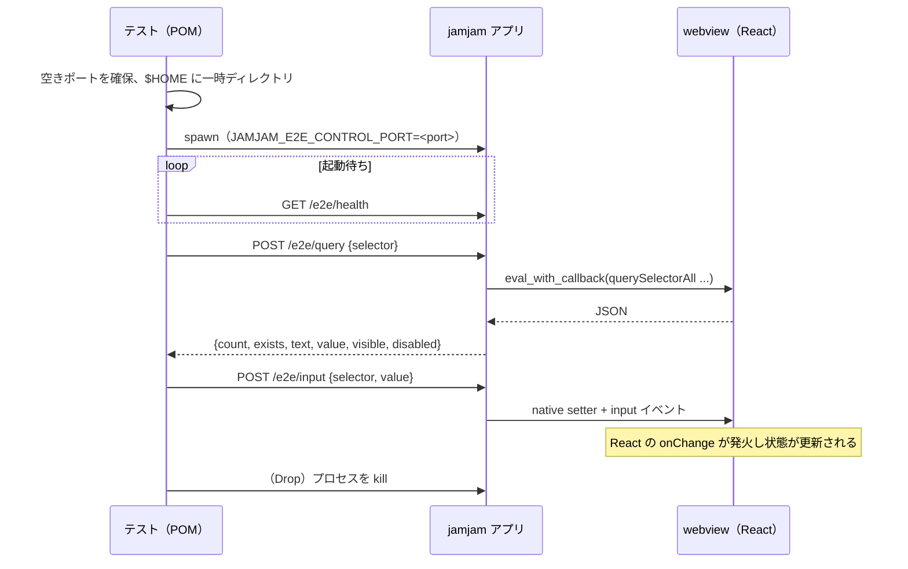

<!-- このドキュメントは実装の正です。変更時は実装も同期すること -->

# E2E Control Channel Specification（GUI E2E 制御チャネル）

## Overview

`tests/e2e/` が実行中の jamjam アプリを操作・観測するためのループバック HTTP API。
レンダリング済み DOM の取得、要素のクエリ、クリック、入力と、アプリの任意のコマンドの呼び出し（`/e2e/invoke`）を提供する。
導入判断は [ADR-025](../adr/ADR-025-gui-e2e-control-channel.md)、コマンドの呼び出しは [ADR-043](../adr/ADR-043-remote-operation-rpc.md)。実装は
`src-tauri/src/e2e_control.rs`、利用側は `tests/e2e/src/pom/`。

チャネルは、ほかの口（遠隔デバッグ・手伝い）と同じ層（`src-tauri/src/rpc/`）の口の 1 つ（`loopback`）である。HTTP のエンドポイントは
その層のメソッド（`ui.*` と、アプリのコマンドそのもの）を呼ぶ入口で、呼べるメソッドは許可の表で決まる（[ADR-044](../adr/ADR-044-portals-and-permissions.md)）。

**このチャネルは製品機能ではない。** リリースビルドには存在しない（下記「有効化条件」）。

## Use Case



## 有効化条件

**両方を満たしたときだけ**待ち受けを開始する。

| 条件 | 満たさない場合 |
|------|--------------|
| cargo feature `e2e-control` が有効 | コードがバイナリに存在しない |
| 環境変数 `JAMJAM_E2E_CONTROL_PORT` が有効なポート番号 | 待ち受けを開始しない |

`JAMJAM_E2E_CONTROL_PORT` が空・`0`・数値でない・範囲外の場合は既定値へフォールバックせず、
待ち受けを開始しない。ハーネスが要求していないポートを開かないためである。

バインド先は常に `127.0.0.1` である。このチャネルは表示中のルームコード・チャット・参加者名を
読めるため、ループバック以外へバインドしてはならない。

```bash
cargo build --manifest-path src-tauri/Cargo.toml --features e2e-control
JAMJAM_E2E_CONTROL_PORT=39420 ./src-tauri/target/debug/jamjam-app
```

### 公開ビルドに対して走らせる

公開ビルド（`--release`）は `src-tauri/capabilities/` に書かれた権限だけを画面に許す。デバッグビルドは
権限が無くてもプラグインのコマンドを通すため、権限の不足は公開ビルドでしか出ない
（ログに `Command plugin:... not allowed by ACL`）。この検査は公開ビルドを要するので既定では走らず、
`--ignored` で明示的に走らせる（REQ-GUI-021）。

```bash
JAMJAM_SERVER_URL=https://jamjam.example.com cargo build --release --manifest-path src-tauri/Cargo.toml --features e2e-control
cd tests/e2e
cargo test --features gui --test gui -- --ignored --test-threads=1 the_release_build
```

公開ビルドはビルド時に渡したシグナリング先（無ければビルドが失敗する。[ADR-030](../adr/ADR-030-signaling-url-by-build-profile.md)）に繋ぐので、ハーネスは設定ファイルでローカルのサーバーに向ける。渡す値は繋がらない例示用のホストでよい。
画面が使うプラグインのコマンドを増やしたら、`src-tauri/capabilities/default.json` に権限を足す。

## Endpoints

すべて JSON over HTTP。認証はない（有効化条件が実質的な保護である）。

| Method | Path | Body | Response |
|--------|------|------|----------|
| GET | `/e2e/health` | — | `ok`（text/plain） |
| GET | `/e2e/windows` | — | `["main", "settings"]` |
| POST | `/e2e/dom` | `{window?}` | outerHTML（text/plain） |
| POST | `/e2e/query` | `{selector, window?}` | `QueryResult` |
| POST | `/e2e/click` | `{selector, window?}` | `{performed}` |
| POST | `/e2e/input` | `{selector, value, window?}` | `{performed}` |
| POST | `/e2e/invoke` | `{command, args?, window?}` | `InvokeResult` |

`<select>` にも `input` を使う。提供されていない値・無効化された項目の値を渡すと `performed: false` を返す（利用者が選べない項目は、テストも選べない）。
`<select>` は持たない値を代入しても選択が変わらないため、成功として返すと「存在しない
デバイスへの切り替え」が通ってしまう。`query` は `<select>` に対して `options` も返す。

`window` は Tauri のウィンドウラベル（`src-tauri/src/windows.rs` の `labels`）。省略時は `main`。
設定は別ウィンドウなので、操作には明示的に指定する。セッション中のミキサーとチャットは
メインウィンドウ内に描画されるため、指定は不要である。

### QueryResult

```json
{
  "count": 1,
  "exists": true,
  "text": "Create Room",
  "value": null,
  "visible": true,
  "disabled": false
}
```

`querySelectorAll` の件数と、**先頭の要素**についての情報を返す。

| フィールド | 意味 |
|-----------|------|
| `count` | 一致した要素数 |
| `exists` | `count > 0` |
| `text` | `innerText`（先頭 2000 文字）。要素がなければ `null` |
| `value` | `value` プロパティを持つ場合のみ文字列。それ以外は `null` |
| `visible` | `offsetWidth`/`offsetHeight`/`getClientRects()` のいずれかが非ゼロ |
| `disabled` | `disabled` プロパティ |
| `options` | `<select>` の選択肢（`{value, label, disabled}` の配列）。それ以外の要素では空。`disabled` は「デバイスを選択」のような見せるだけの項目 |

`visible` と `disabled` を返すのは、「利用者がその要素を操作できるか」を判定するためである。
`exists` だけでは `display: none` の要素や無効化されたボタンを操作可能と誤判定する。

### click / input

`{"performed": false}` は「セレクタに一致しなかった、または無効化されていた」を意味する。
HTTP としては 200 であり、呼び出し側が失敗として扱う。無効な要素へのクリックを成功として返すと、
利用者が押せないボタンを押したテストが通ってしまう。

`input` は React が変更を観測できる形で値を設定する。`value` への直接代入では React が
「変化なし」と判断して `onChange` を発火しないため、プロトタイプのネイティブ setter を経由し、
`input` と `change` イベントをバブリング付きで dispatch する。

### invoke

アプリが登録しているコマンド（`src-tauri/src/lib.rs` の `generate_handler!`）を、画面と同じ経路
（webview の `__TAURI_INTERNALS__.invoke`）で呼ぶ。**画面の部品を経由せずに、アプリの全機能に届く。**
コマンドを足せば、このチャネルを直さずにそのまま呼べる。

```json
{ "command": "settings_change", "args": { "change": { "setting": "buffer_size", "samples": 128 } } }
```

- `args` は webview が渡す形で書く。**引数名は camelCase**（`conn_id` は `connId`）。構造体の中身は Rust の
  フィールド名のまま（上の `samples`）。省略すると引数なし
- 結果は 200 で、どちらかが返る。コマンドのエラーはこのチャネルの失敗ではなく、シナリオが確かめる「答え」である

```json
{ "outcome": "ok", "value": { "buffer_size": 128, "...": "..." } }
{ "outcome": "err", "error": "Invalid buffer size: 8. Valid values are [32, 64, 128, 256]" }
```

- 登録されていないコマンドは `err` になる
- `eval_with_callback` は Promise を待てないため、1 回目の評価で呼び出しを始め、結果が出るまで 20ms ごとに読み直す。
  コマンドの実行時間として 60 秒まで待つ（完全診断は回線を測るため数秒かかる）。超えたら 500
- webview を経由するのは、IPC の検査（引数名・公開ビルドの権限）まで含めて、画面と同じ道を通すためである

ページオブジェクトは `App::invoke(command, args)` と、音声の設定用の `App::audio_settings()` /
`App::change_audio_setting(change)` を持つ。利用者の操作と見えるものは、これまでどおり画面のページオブジェクトで書く。
`invoke` は状態を素早く整える・まだページオブジェクトの無い機能に届くために使う。

画面が組み立てている操作（ルームへの参加のように、画面が複数のコマンドを順に呼んで状態を持つもの）は、
個々のコマンドを呼んでも画面の状態が追従しない。そうした操作は画面のページオブジェクトで行う。
操作をバックエンドの 1 コマンドに寄せていけば、そのまま呼べるようになる（音声の設定は `settings_change` に寄せた。ADR-043）。

## Errors

| Status | 条件 |
|--------|------|
| 503 | 指定されたウィンドウが存在しない |
| 504 | webview が 5 秒以内に応答しない |
| 500 | 評価したスクリプトが例外を投げた、結果が想定形でない、または `invoke` のコマンドが 60 秒以内に終わらない |

Tauri は Windows で `eval_with_callback` の例外が無視されると文書化している。評価式を
try/catch で包み例外を戻り値として返すため、スクリプトの誤りは 504 ではなく 500 として現れる。

## Security

| リスク | 対策 |
|--------|------|
| リリースビルドへの混入 | cargo feature が既定で無効。`tests/release_build_guard_test.rs` が常時検証（REQ-GUI-003） |
| 外部からの到達 | `127.0.0.1` のみにバインド。加えて環境変数未設定では待ち受けない（REQ-GUI-004） |
| セレクタ経由のスクリプト注入 | セレクタ・入力値・コマンド名・引数を `serde_json` で JS のリテラルへエンコード |
| 同じ端末の別のプロセスがアプリを操作する | `/e2e/invoke` はアプリの全コマンド（接続先の変更・ストリーミングの開始を含む）に届く。認証は無いので、`e2e-control` 付きのビルドを動かす端末では、ループバックに届く全プロセスがアプリを操作できる。そのためこのビルドは配らず、テストの間だけ起動する |

## Limitations

- スクリーンショットは提供しない（ADR-025 Decision 3）。DOM で判定できない見た目の崩れは対象外。
- キーボードイベント・ドラッグ・スクロールは提供しない。現状のシナリオが必要としていない。
- 実オーディオ信号を要する状態は、このチャネル単体では検証できない。ループバックオーディオ
  ドライバ（macOS: BlackHole 等）を入力デバイスに指定し、既知のトーンを流したうえで
  メーターの `data-peak` を読む（REQ-GUI-012〜014、`tests/e2e/src/pom/loopback_audio.rs`）。
  ドライバは開発者が一度導入する。波形そのものの品質測定（歪み・SNR）は対象外である。

複数ピアのシナリオは、アプリを複数起動して作る。アプリはシングルインスタンス化していないため
同時起動でき、各インスタンスは独自の制御ポートと `$HOME` を持つ。2 台のアプリを同じルームに入れる
シナリオはシグナリングサーバーを立てて回すテストであり、このリポジトリの外で回す。サーバーは
`17890` で待ち受ける。この port は開発ビルドのアプリが接続する既定値であり（[ADR-030](../adr/ADR-030-signaling-url-by-build-profile.md)）、変更できない。

## 関連ドキュメント

- [ADR-025: GUI E2E 制御チャネルの導入](../adr/ADR-025-gui-e2e-control-channel.md)
- [requirements.md](../requirements.md) — `REQ-GUI-001` 〜 `REQ-GUI-015`、`REQ-GUI-025`
- [ADR-043: 遠隔操作の RPC と、相手の設定を手伝う機能](../adr/ADR-043-remote-operation-rpc.md)
- [ADR-026: GUI 同士の音声経路](../adr/ADR-026-gui-audio-path.md) — この層が検出した欠陥
- [ADR-024: 端末アイデンティティによる識別](../adr/ADR-024-device-identity-instead-of-accounts.md)
