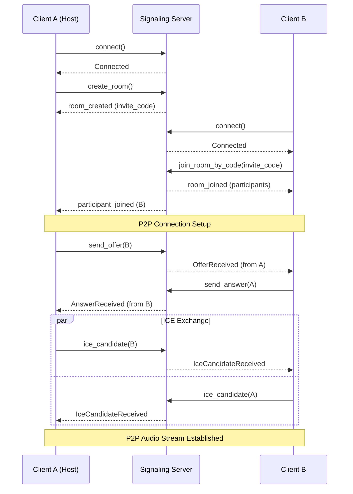
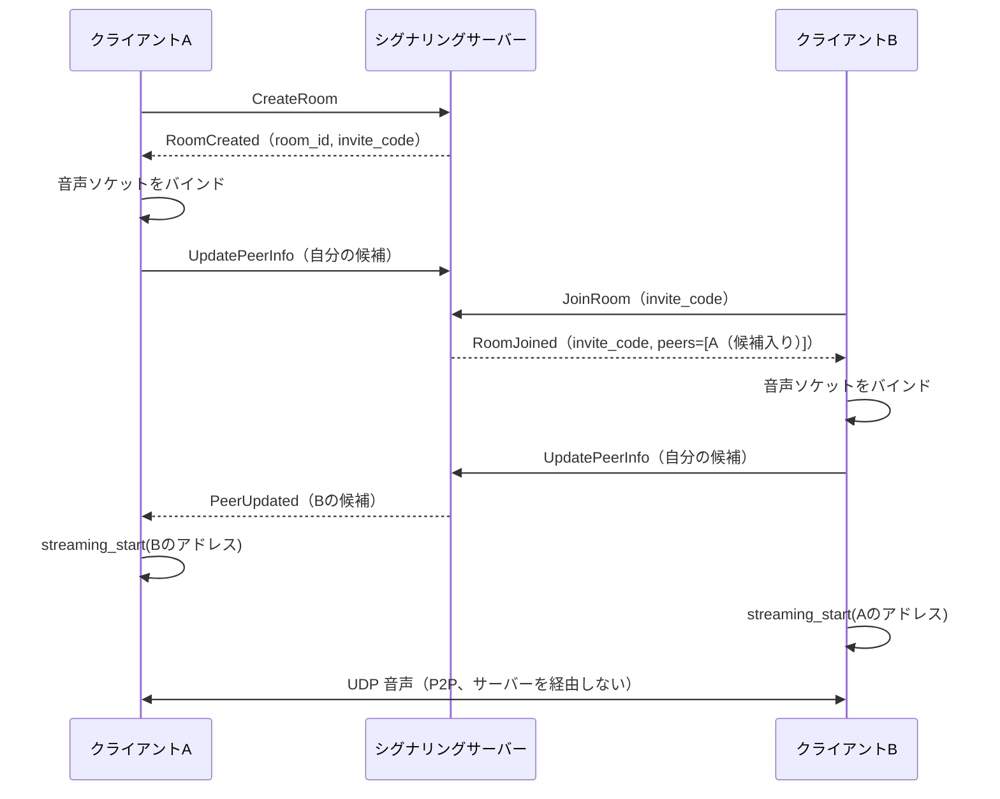
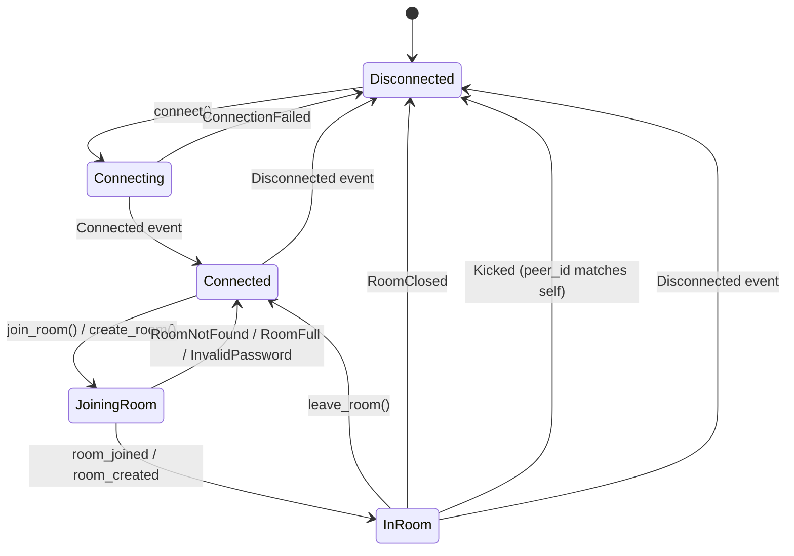

<!-- このドキュメントは実装の正です。変更時は実装も同期すること -->

# Signaling API

シグナリングサーバーとの通信API定義。

---

## 1. 概要

Signalingモジュールは以下の責務を持つ:

- ルームの作成・参加・退出
- ICE候補の交換
- セッション情報の交換
- 参加者リストの管理

シグナリングはP2P接続確立のための補助であり、音声データは経由しない。

### 1.1 通信フロー



---

## 2. プロトコル

| 項目 | 仕様 |
|------|------|
| トランスポート | WebSocket over TLS |
| フォーマット | JSON |
| エンドポイント | サーバーに問い合わせて決める（下記）。パスは `/v1/signaling` |
| 端末の証明 | 必須（[device-identity.md](./device-identity.md)）。匿名の接続は無い |

### 2.1 接続先の問い合わせ

アプリはシグナリングの接続先を持たない。持つのはサーバーの URL だけで、ビルド時に渡す（ソースに書かない。[ADR-030](../adr/ADR-030-signaling-url-by-build-profile.md)）。繋ぐたびにサーバーへ問い合わせ、返ってきた URL に WebSocket で繋ぐ。

```http
GET /api/v1/signaling HTTP/1.1

HTTP/1.1 200 OK
Content-Type: application/json
Cache-Control: no-store

{"url": "wss://signaling.example.com/v1/signaling"}
```

`url` が `ws://` / `wss://` でなければ繋がない。`https://` で問い合わせたのに `ws://` が返ったときも繋がない（REQ-CON-029）。

---

## 3. クライアント API

> **実装状況**: 基本的なシグナリング機能（`SignalingClient`, `SignalingConnection`）は実装済み。
> 高レベルAPI（`create_room()`, `join_room_by_code()`等）は `SignalingMessage` enum 経由で提供。

### 3.1 接続

```rust
/// シグナリングサーバーに接続
///
/// スレッド: 非リアルタイムスレッドから呼び出すこと
/// ブロッキング: No（非同期）
async fn connect(server_url: &str) -> Result<SignalingClient, SignalingError>;
```

**端末アイデンティティ（ADR-024）**: `SignalingClient::new(server_url, identity).connect()` は、
接続先を問い合わせたうえで、WebSocketハンドシェイク時に `X-Device-Id` / `X-Device-PubKey` /
`X-Device-Signature` / `X-Device-Timestamp` の4ヘッダーを必ず送る。サーバーは署名を検証し、
ヘッダーが欠けている・識別子と公開鍵が整合しない接続を拒否する（匿名の接続は無い）。
アイデンティティはアプリと CLI が同じもの（`jamjam::identity_store`）を使う。設定は不要で、
CLI 引数・環境変数を持たない。
詳細は [device-identity.md](./device-identity.md) を参照。

### 3.2 ルーム作成

> **実装状況**: `SignalingMessage::CreateRoom` で実装済み。
> 招待コード生成も実装済み。招待URLは将来の拡張として計画中。

```rust
/// ルームを作成（現在の実装）
///
/// SignalingMessage::CreateRoom を使用:
/// - room_name: ルーム名
/// - password: パスワード（オプション）
/// - peer_name: 参加者名
/// - features: 受け付ける追加の機能（空なら送らない。5 章）
///
/// 戻り値: SignalingMessage::RoomCreated { room_id, peer_id, invite_code }

// --- 将来の拡張（計画中）---

/// 高レベルAPI（計画中）
async fn create_room(&self, options: CreateRoomOptions) -> Result<CreateRoomResult, SignalingError>;

struct CreateRoomOptions {
    /// ルーム名（オプション）
    name: Option<String>,
    /// パスワード（オプション、設定するとパスワード保護）
    password: Option<String>,
    /// 最大参加者数
    max_participants: u32,
    /// パブリックルームとして公開するか
    is_public: bool,
}

struct CreateRoomResult {
    /// ルームID
    room_id: String,
    /// 招待コード（実装済み）
    invite_code: String,
    /// 招待URL（計画中）
    invite_url: String,
}
```

### 3.3 ルーム参加

> **実装状況**: `SignalingMessage::JoinRoom` で実装済み。
> 招待コードでの参加（`JoinRoomByCode`）も実装済み。

```rust
/// ルームに参加（現在の実装）
///
/// SignalingMessage::JoinRoom を使用:
/// - room_id: ルームID
/// - password: パスワード（オプション）
/// - peer_name: 参加者名
/// - features: 受け付ける追加の機能（空なら送らない。5 章）
///
/// 戻り値: SignalingMessage::RoomJoined { room_id, peer_id, invite_code, peers: Vec<PeerInfo> }

// --- 高レベルAPI（計画中）---

/// ルームに参加（招待コードで、SignalingMessage::JoinRoomByCode で実装済み）
async fn join_room_by_code(
    &self,
    invite_code: &str,
    options: JoinRoomOptions,
) -> Result<JoinRoomResult, SignalingError>;

/// ルームに参加（ルームIDで、高レベルAPI計画中）
async fn join_room_by_id(
    &self,
    room_id: &str,
    options: JoinRoomOptions,
) -> Result<JoinRoomResult, SignalingError>;

struct JoinRoomOptions {
    /// 表示名
    display_name: String,
    /// パスワード（パスワード保護されたルームの場合）
    password: Option<String>,
}

/// 参加結果（計画中の拡張版）
struct JoinRoomResult {
    /// 自分のセッションID
    session_id: String,
    /// 自分の参加者ID（UUID）
    peer_id: Uuid,
    /// ルーム情報
    room: RoomDetails,
    /// 既存の参加者一覧
    peers: Vec<PeerInfo>,
}

/// ルーム詳細（計画中の拡張版）
struct RoomDetails {
    room_id: String,
    name: Option<String>,
    /// ルームを作成した参加者のID（特権は持たない。ADR-016参照）
    creator_id: Uuid,
    created_at: u64,
}
```

**Note**: 現在の実装では `PeerInfo` を参加者情報として使用。詳細は Section 5 を参照。

### 3.4 ルーム退出

```rust
/// ルームから退出
async fn leave_room(&self) -> Result<(), SignalingError>;
```

作成者を含め、誰が退出してもルーム自体は存続し、残りの参加者のセッションは継続される
（[ADR-016](../adr/ADR-016-remove-host-privilege-concept.md)）。参加者自身による「ルーム終了」
操作は存在しない。サーバーがルームを閉じた場合は `RoomClosed` が届く（Section 5）。

---

## 4. ICE候補交換 API

> **実装状況**: 計画中。現在の実装ではICE候補交換はシグナリングサーバー経由ではなく、
> 直接接続（`UpdatePeerInfo`でアドレス情報を交換）で対応。
> WebRTC互換のICE/SDP交換は将来の拡張として計画中。

### 4.1 ICE候補送信

```rust
/// ICE候補を送信
///
/// # 引数
/// - target: 送信先参加者ID
/// - candidate: ICE候補
async fn send_ice_candidate(
    &self,
    target: ParticipantId,
    candidate: IceCandidate,
) -> Result<(), SignalingError>;

struct IceCandidate {
    /// 候補文字列
    candidate: String,
    /// SDPミッドライン
    sdp_mid: String,
    /// SDPミッドラインインデックス
    sdp_mline_index: u32,
}
```

### 4.2 SDP交換

```rust
/// SDPオファーを送信
async fn send_offer(
    &self,
    target: ParticipantId,
    offer: SessionDescription,
) -> Result<(), SignalingError>;

/// SDPアンサーを送信
async fn send_answer(
    &self,
    target: ParticipantId,
    answer: SessionDescription,
) -> Result<(), SignalingError>;

struct SessionDescription {
    /// SDP種別（offer / answer）
    sdp_type: String,
    /// SDP文字列
    sdp: String,
}
```

### 4.3 接続ライフサイクル（実装済み）

クライアントは自身の音声アドレスを `UpdatePeerInfo` で publish し、相手のアドレスを
`RoomJoined`（既にいた参加者の分）または `PeerUpdated`（後から入ってきた参加者の分）で受け取る。
**publish と `PeerUpdated` の処理は両方必要である**。片方だけでは、双方が相手のアドレスを
待ち続けて音声が流れない（[ADR-026](../adr/ADR-026-gui-audio-path.md)）。



候補は IPv4 のみを優先度順に使う（IPv6 リンクローカルは IPv4 ソケットから送信できない）。
候補が空になる環境ではループバックをフォールバックとして加える。

---

## 5. メッセージ型

> **実装状況**: 実装済み。`src/network/signaling.rs` で定義。

シグナリングプロトコルで使用されるメッセージ型。
クライアント↔サーバー間の双方向通信で使用される。

**相手あてのメッセージの中身（`PeerMessage.body`）。** トピックの名前 1 つをキーにしたオブジェクトで、いまあるのは
`settings_help`（設定の手伝い。[ADR-044](../adr/ADR-044-portals-and-permissions.md) §5）だけ。中身は `kind` で区別する:
`request`（手伝わせて）・`accepted`（いいよ。`session` は手伝われる側が中継に繋いで待っている手伝いの番号。128 ビットの乱数の
16 進 32 桁で、手伝う側は同じ番号で中継に繋ぐ）・`declined`（断る。`busy` なら別の人に手伝われている）・
`stop`（手伝いをやめる。`role` は送り手の側 `helper` / `helped`。`session` は終わった手伝いの番号で、許可の前の申し出には付かない。番号があるときは、その番号の手伝いだけを終える。同じ相手と手伝いをやり直したあとに前の手伝いの `stop` が遅れて届いても、やり直した手伝いを終えないため。番号が無いときは、送り手との手伝いを終える）・
`notice`（ルーム全員へ。チャットの記録用。`event` は `started` / `changed` / `ended`、`changed` には変わった設定の名前 `setting` が付く。
手伝う人は `helper` の参加者 ID で、名前は受け取った側が引く）。
手伝いの中身（手伝う人の操作と相手の状態）はシグナリングを通らず、サーバーの中継（WebSocket）を通る。
以前にあった `propose` / `answered` / `settings`（変更を 1 件ずつ申請する形）は無くなり、届いても知らない種類として読み飛ばす。
知らないトピックは読まずに捨てる（新しいアプリからのもの）。数値は整数の ID と設定値だけで、±(2^53−1) に収まる。

**知らない種類は読み飛ばす（REQ-CON-030）。** `SignalingConnection::recv()` は、`type` がこの列挙に無いメッセージを
捨てて次のメッセージを待つ。サーバーにメッセージの種類を足しても、配布済みのアプリはルームから落ちない。
`type` は知っているのに中身が読めないメッセージ（中に知らない値がある場合を含む）は、非互換として従来どおりエラーを返す。
判定は `type` だけを取り出して行う。メッセージ全体の読み取りエラーでは、奥の知らない値と知らない `type` が同じ文言になるためである。

```rust
/// シグナリングメッセージ
///
/// WebSocket JSON形式で送受信される。
/// serde: adjacently tagged format - `#[serde(tag = "type", content = "data")]`
enum SignalingMessage {
    // --- Client → Server ---
    /// ルーム一覧を取得。アプリは接続を試すためのルーム（テストルーム）を探すのに使う。
    /// 何を返すかはサーバーが決める（開いているルームの一覧ではない）
    ListRooms,
    /// ルームを作成
    CreateRoom {
        room_name: String,
        password: Option<String>,
        peer_name: String,
        /// このアプリが受け付ける追加の機能（`"peer_message"` = 相手あてのメッセージを受け取れる）。
        /// 空なら送らない（機能を知らない頃のアプリと同じ形）。他の参加者には `PeerInfo::features` で伝わる
        features: Vec<String>,
    },
    /// ルームに参加
    JoinRoom {
        room_id: String,
        password: Option<String>,
        peer_name: String,
        /// `CreateRoom` と同じ
        features: Vec<String>,
    },
    /// ルームから退出
    LeaveRoom,
    /// ピア情報を更新（アドレス候補付き）
    UpdatePeerInfo {
        /// アドレス候補リスト（優先度順）
        candidates: Vec<AddressCandidate>,
        /// 後方互換用のパブリックアドレス
        public_addr: Option<SocketAddr>,
        /// 後方互換用のローカルアドレス
        local_addr: Option<SocketAddr>,
    },

    // --- Server → Client ---
    /// ルーム一覧
    RoomList { rooms: Vec<RoomInfo> },
    /// ルーム作成完了
    RoomCreated {
        room_id: String,
        peer_id: Uuid,
        /// 招待コード（ルーム参加に使用）
        invite_code: String,
    },
    /// ルーム参加完了
    RoomJoined {
        room_id: String,
        peer_id: Uuid,
        /// ルームの招待コード。作成者以外も他者を招待できるようにするため
        /// 参加応答にも含める（ADR-026）。この項目より前のサーバーと
        /// 通信した場合は空文字列になる（`#[serde(default)]`）
        invite_code: String,
        peers: Vec<PeerInfo>,
    },
    /// ピアが参加
    PeerJoined { peer: PeerInfo },
    /// ピアが退出
    PeerLeft { peer_id: Uuid },
    /// ピア情報が更新された
    PeerUpdated { peer: PeerInfo },
    /// エラー
    Error { message: String },
    /// サーバーがルームを閉じた。
    /// ルーム内の全ピアへブロードキャストされ、受信したクライアントは即座に切断する。
    /// クライアント発の「ルーム終了」メッセージは存在しない（作成者含め参加者に
    /// ルーム終了の特権はない。[ADR-016](../adr/ADR-016-remove-host-privilege-concept.md)）。
    RoomClosed { reason: String },
    /// サーバーがこの参加者（`peer_id`）をルームから外した。ルーム内の全ピアへブロードキャスト
    /// されるが、`peer_id` が自分自身と一致するクライアントのみ切断すべき。
    Kicked { peer_id: Uuid, reason: String },
    /// チャットメッセージをルーム内の全ピアへブロードキャストする（送信者本人にも返る）。
    /// 送信者（`sender_id` / `sender_name`）は、サーバーが送ってきた接続の参加者の ID と名前に置き換えて配る。
    /// クライアントが書いた値は使われない
    ChatMessage {
        sender_id: String,
        sender_name: String,
        content: String,
        /// Unixタイムスタンプ（秒）
        timestamp: u64,
    },
    /// 同じルームの参加者あてのメッセージ（両方向。[ADR-043](../adr/ADR-043-remote-operation-rpc.md)）。
    /// 送るときは `to`（無ければルームの全員。送った本人も、自分が `peer_message` を知らせていれば含む）と
    /// `body` だけを書く。サーバーは `peer_message` を知らせて入った参加者にだけ届け、`from` / `from_name` に
    /// 送った接続の参加者を付ける（書かれた値は使わない）。受け取った側は、`from` の無いものを捨てる。
    /// `body` は JSON のオブジェクトで、中身はアプリどうしの取り決め（サーバーは解釈しない）。
    /// 宛先がいない・別のルーム・`peer_message` を知らせていないときは、エラーも返さずに捨てられる
    /// （返事を待つやり取りは、待ち続けない作りにする）
    PeerMessage {
        to: Option<Uuid>,
        from: Option<Uuid>,
        from_name: Option<String>,
        body: serde_json::Map<String, serde_json::Value>,
    },
}

/// ピア情報（複数アドレス候補対応）
struct PeerInfo {
    id: Uuid,
    name: String,
    /// アドレス候補リスト（優先度順、IPv4/IPv6デュアルスタック対応）
    candidates: Vec<AddressCandidate>,
    /// 後方互換用のパブリックアドレス
    public_addr: Option<SocketAddr>,
    /// 後方互換用のローカルアドレス
    local_addr: Option<SocketAddr>,
    /// このピアがルームに参加したUnixタイムスタンプ（秒）。
    /// `#[serde(default)]` のため、この項目を含まない旧クライアントとの互換性を維持（値は0）。
    joined_at: u64,
    /// このピアのアプリが知らせた追加の機能のうち、サーバーが知っているもの。
    /// `#[serde(default)]` のため、無い（機能を知らない頃のサーバー・アプリ）ときは空で、
    /// 相手あてのメッセージは受け取れないものとして扱う（`PeerInfo::takes_peer_messages`）
    features: Vec<String>,
}

/// アドレス候補
struct AddressCandidate {
    /// ソケットアドレス
    address: SocketAddr,
    /// 候補タイプ（Host = ローカル, ServerReflexive = STUN経由）
    candidate_type: CandidateType,
    /// RFC 5245準拠の優先度（大きいほど優先）
    priority: u32,
}

enum CandidateType {
    /// ローカルネットワークアドレス
    Host,
    /// STUN経由で取得したパブリックアドレス
    ServerReflexive,
}

/// ルーム情報
struct RoomInfo {
    id: String,
    name: String,
    peer_count: usize,
    max_peers: usize,
    has_password: bool,
    /// 招待コード（ルーム参加に使用）
    invite_code: String,
    /// サーバーが接続を試すためのルーム（テストルーム）として示すものなら true。
    /// アプリはこの印の付いたルームがあるときだけ、その招待コードで入る入口を出す。
    /// どのルームに付けるか・一覧に載せるかはサーバーが決める。
    /// 欠けていれば false（この欄を送らない古いサーバー）
    #[serde(default)]
    test_room: bool,
}

/// メッセージリスナーを設定
fn set_message_listener<F>(&self, listener: F)
where
    F: Fn(SignalingMessage) + Send + 'static;
```

### 5.1 接続状態遷移



---

## 6. エラー

```rust
enum SignalingError {
    /// 接続失敗
    ConnectionFailed(String),
    /// ルームが見つからない
    RoomNotFound,
    /// ルームが満員
    RoomFull,
    /// パスワードが違う
    InvalidPassword,
    /// 権限がない
    Unauthorized,
    /// タイムアウト
    Timeout,
    /// サーバーエラー
    ServerError(String),
    /// 内部エラー
    Internal(String),
}
```

---

## 7. 使用例

```rust
// シグナリングサーバーに接続
let client = SignalingClient::new("https://jamjam.example.com", identity);
let mut conn = client.connect().await?;

// ルーム作成
conn.send(SignalingMessage::CreateRoom {
    room_name: "Guitar Session".into(),
    password: None,
    peer_name: "Host".into(),
    features: vec![], // 受け付ける追加の機能が無ければ空（送られない）
}).await?;

match conn.recv().await? {
    SignalingMessage::RoomCreated { room_id, peer_id, invite_code } => {
        println!("Room created: {} (peer: {}, invite: {})", room_id, peer_id, invite_code);
    }
    SignalingMessage::Error { message } => {
        return Err(anyhow::anyhow!("Failed: {}", message));
    }
    _ => {}
}

// または、ルーム参加
conn.send(SignalingMessage::JoinRoom {
    room_id: "ABC123".into(),
    password: None,
    peer_name: "Player1".into(),
    features: vec![],
}).await?;

match conn.recv().await? {
    SignalingMessage::RoomJoined { room_id, peer_id, invite_code, peers } => {
        println!("Joined room: {} ({}) as {}", room_id, invite_code, peer_id);
        for peer in &peers {
            println!("  Peer: {} ({})", peer.name, peer.id);
        }
    }
    SignalingMessage::Error { message } => {
        return Err(anyhow::anyhow!("Failed: {}", message));
    }
    _ => {}
}

// 退出
conn.send(SignalingMessage::LeaveRoom).await?;
```
