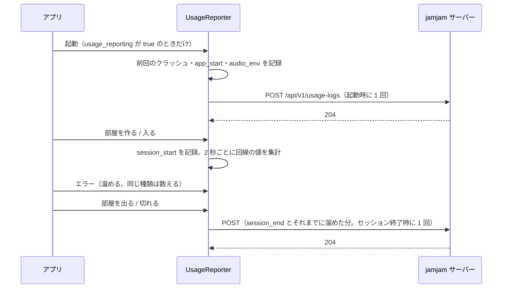
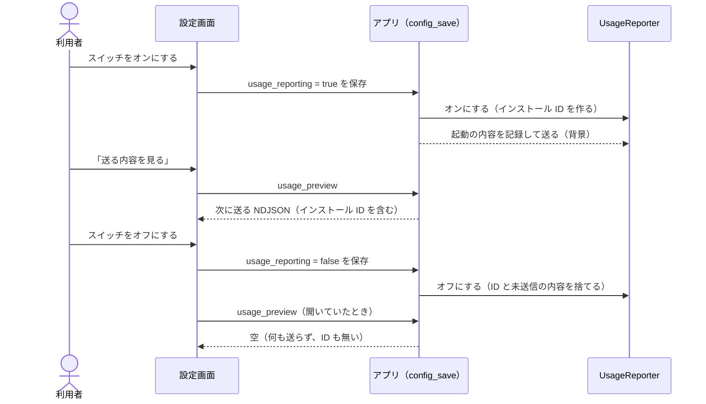

<!-- このドキュメントは実装の正です。変更時は実装も同期すること -->

# Usage Reporting Specification（利用状況の送信）

## Overview

アプリが動いた様子を jamjam サーバーへ送る仕組み。**利用者が設定 `usage_reporting` をオンにしたときだけ**動く。既定はオフで、オフの間は何も収集せず、何も送らず、インストール ID も作らない（REQ-TEL-001）。

実装は `src/telemetry/`（コアライブラリ）と `src-tauri/src/usage.rs`（アプリへの接続）。要求は [REQ-TEL](../requirements.md#req-tel-利用状況の送信設計要求)。

## 何を送るか

`src/telemetry/schema.json`（JSON Schema）が正本である。1 行 1 イベントの NDJSON で、全行が次の外枠を持つ。

| 項目 | 内容 |
|------|------|
| `v` | スキーマの版（1） |
| `ts` | UTC、ISO 8601、秒まで |
| `seq` | 起動内の通し番号 |
| `event` | 下の 6 つのどれか |
| `install_id` | オンにしたときに作る 16 バイトの乱数（hex） |
| `launch_id` | 起動ごとの 16 バイトの乱数 |
| `session_id` | セッションごとの乱数。セッション外は `null` |
| `app_version` / `os` / `arch` | `0.1.2` / `macos` / `aarch64` など |

| `event` | いつ | 内容 |
|---------|------|------|
| `app_start` | 起動時と、設定が変わったとき | `cpu_cores` `language` `server_is_default`（接続先がアプリの既定のサーバーか）、取得できた `os_version` `ram_gb` `webview_version` `audio_host`、`settings`（下記） |
| `audio_env` | 起動時と、使うデバイスを選び直したとき | 使っている入出力デバイス（`name` `kind` `channels` `sample_rates` `min_buffer_frames` `is_default`）。無ければ `null`。選んだデバイスの ID を `input_id` `output_id` に付ける（既定のままの側は無い） |
| `session_start` | 部屋を作った・入ったとき | `mode`（`create` / `join`） |
| `session_end` | 部屋を出たとき | `duration_s` `end_reason` `reconnect_count` `peers_max` `xrun_count`、測れたものだけ `rtt_ms_p50` `rtt_ms_p95` `loss_pct_mean` `loss_pct_max` `fec_active_pct`、経路（`route` `route_confirmed` `connect_ms` `first_audio_ms`）、自分のアドレス（`local_ips` `public_ip`）。下の「経路とアドレス」 |
| `error` | エラーが起きたとき | `component` `code`（どちらも固定の列挙）`count`。メッセージ本文は送らない。`code` には、相手が黙って接続を諦めた `no_packets`、シグナリングサーバーに繋がらなかった理由の `http_4xx` `http_5xx` `tls` `dns` `timeout`、サーバー側から閉じられた `ws_closed` がある（REQ-TEL-017） |
| `crash` | クラッシュした次の起動時 | `file` `line` `function`。パニックのメッセージ本文は送らない |

- `event` / `code` / `end_reason` / `kind` は列挙で閉じている。定義に無い項目・値の行は `schema.json` に適合しない
- 自由な文字列を持つ項目は、デバイスの `name`（OS が返す名前のまま。REQ-TEL-005）と `settings` の値だけ
- 取れなかった値は `0` や空文字にせず、行から外す（`audio_env` の `min_buffer_frames` だけは `null`）
- 音声・チャット本文・部屋のパスワードと招待コード・部屋の名前・相手の情報（相手の IP アドレスを含む）・表示名・端末識別子・ホスト名・ユーザー名・ファイルパス・位置情報は送らない。調査に役立つ自分の情報（自分の IP アドレス・接続先サーバーのホストとポート・選んだデバイスの ID）は、利用者がオンにしているので送る（[ADR-042](../adr/ADR-042-usage-reporting-includes-investigation-data.md)）

### 経路とアドレス（`session_end`）

- `route` は、最後に繋がった接続で音声が向かった先のアドレスの種類。`lan`（プライベート・リンクローカル・ユニークローカル）/ `public`（それ以外）/ `loopback`（この端末自身）。相手のアドレスそのものは送らない（REQ-TEL-015）
- `route_confirmed` は、そのアドレスが探査に応答したから選ばれたか。`false` は、応答が無いまま先頭の候補で繋いだ（候補が 1 つだけ、または時間切れ）ことを表す
- `connect_ms` は接続を始めてから繋がるまで、`first_audio_ms` は繋がってから最初の音声パケットが届くまで（ミリ秒）。音声が 1 つも届かなかった接続では `first_audio_ms` が行に無い
- `local_ips` は、自分が相手に伝えたアドレスのうち自分のネットワーク上のもの（IP アドレスだけ。最大 16 件）、`public_ip` は STUN が見た自分の公開アドレス。ポートは送らない。相手のアドレスは、相手が利用状況の送信をオンにしているとは限らないので、行のどこにも入れない（REQ-TEL-016）

### 設定（`settings`）

設定ファイルの項目を**丸ごと**入れる。送る項目の一覧は持たないので、項目が増えれば勝手に送られる。外すのは次の 4 項目だけ（REQ-TEL-004）。

| 外す項目 | 理由 |
|----------|------|
| `peer_name` | 表示名 |
| `connection_history` | 入った部屋の履歴 |
| `input_device_id` / `output_device_id` | 送らないのではなく、`audio_env` の `input_id` / `output_id` で送る。デバイスの選び直しが、設定の変更と `audio_env` の 2 行に割れないようにするため |

`server_url`（自前サーバーの URL）は、スキーム・ホスト・ポートだけにして送る。ユーザー名・パスワード（認証情報）・パス・クエリ・フラグメントは、秘密が入りうるので落とす。ホストが読み取れない値は送らない。選んだデバイスの ID は `audio_env` にそのまま入れる（REQ-TEL-005）。

設定に人の名前や部屋を特定できるものを足すときは、外す側（`src/telemetry/settings.rs` の `LEFT_OUT`）に入れる（[ADR-037](../adr/ADR-037-usage-reporting-opt-in.md)、[ADR-042](../adr/ADR-042-usage-reporting-includes-investigation-data.md)）。値が文字列で 128 文字を超えるもの、リストや表になっているものは、行を不適合にしないために送らない。

## いつ・どう送るか

- 起動のあとに設定を保存して `settings` などの中身が変わったとき、使うデバイスを選び直して `audio_env` の中身が変わったときは、変わった側だけを送り直す（REQ-TEL-014）。続けて変えたときは、2 秒変化が無くなるのを待って最後の状態の 1 行にまとめる。最後に送った内容と同じなら送らない。`audio_env` の `input` / `output` は、選んだデバイス（選んでいなければ OS の既定）で、見つからなければ `null`
- `fec_active_pct` は、回線の読み取り（2 秒ごと）のうち、その間に FEC が欠けたパケットを 1 つ以上復元したものの割合（0〜100）。FEC を送らない回線では行から外す
- 1 回の送信は **64 KB・200 行まで**。収まらなかった分と、届かなかった分は捨てる（REQ-TEL-006）。再送で溜め込まず、失敗は利用者に見せない
- `POST /api/v1/usage-logs`、`Content-Type: application/x-ndjson`。**匿名**（`X-Device-*` ヘッダを付けない）。204 だけを成功とみなす。リダイレクトは辿らない（REQ-TEL-007）
- 宛先は、ビルドが持つ既定の接続先（`GET /api/v1/signaling` を問い合わせるのと同じサーバー）。設定 `server_url` の自前サーバーには送らない。ソースに宛先は書かない
- アプリを閉じるときは、開いているセッションを `app_quit` で閉じ、最大 2 秒だけ送信を待つ

## 止め方

- 設定 `usage_reporting` をオフにすると、未送信のイベント・開いているセッション・インストール ID・送っていないクラッシュの記録を捨てる。オンにし直すと別のインストール ID になる（REQ-TEL-002）
- インストール ID は設定ファイル（`config.toml`）とも端末識別子（`device_identity.json`）とも別の、専用のディレクトリ（`state_dir()`）に置く。設定は丸ごと送るので、同じファイルに置かない

## クラッシュ

パニックのフックが、オンの間だけ発生位置（ファイル名・行・関数名）を専用ディレクトリの `crash.json` に書く。落ちる瞬間はネットワークを使わないので、次の起動が読んで `crash` として送り、ファイルを消す（REQ-TEL-008）。`crash` 行の `launch_id` と `app_version` は落ちた起動のもの。パニックのメッセージ本文は、保存も送信もしない。ファイル名は、絶対パスなら名前だけにする（利用者のホームディレクトリの名前を含むため）。

## 送る内容を見る

`UsageReporter::preview_ndjson()`（アプリでは Tauri コマンド `usage_preview`）が、次の送信の本文をそのまま返す（REQ-TEL-009）。待っているイベントが無いときは、最後に送った本文を返す。オフのときは空文字。

## 設定画面（Diagnostics タブ）

設定の Diagnostics タブに「利用状況の送信」の節がある（REQ-TEL-011〜013。部品の仕様は [settings-panel.md](../ui/components/settings-panel.md)）。

- **既定はオフ。初回起動でも、既存の利用者にも、ダイアログは出さない**。オンにする経路はこのスイッチだけ
- 説明文に、何のために送るか・送るもの・送らないもの・デバイス名に利用者自身の名前が入りうること・オフにすると ID と未送信の内容を捨てることを書く（英語・日本語）。オンにする動機は、この説明文にしか無い
- 「送る内容を見る」は `usage_preview` の返す文字列をそのまま表示する。オフの間は空なので、「何も集めず、何も送らず、インストール ID も無い」と表示する。オンにしたまま内容を開いていて、スイッチをオフにすると、表示は読み直されて空になる
- 保存に失敗したときはスイッチを元に戻し、理由を表示する

## 診断ログとの関係

`jamjam.log`（[ADR-036](../adr/ADR-036-diagnostic-log-file.md)）は端末の中に留まる。この仕組みとは別経路で、そのマスク処理も使わない。外に出てよいものは `schema.json` と `LEFT_OUT` だけで決まる。

## Public API（`jamjam::telemetry`）

| 項目 | 内容 |
|------|------|
| `UsageReporter::new(dir, app_version, transport, enabled)` | 収集器。`enabled` は設定 `usage_reporting` |
| `set_enabled(bool)` | 設定の変更に従う |
| `record(EventBody)` / `record_error(component, code)` | イベントを記録する（オフなら何もしない） |
| `begin_session(mode)` / `with_session(..)` / `end_session(reason)` | セッションとその集計 |
| `report_previous_crash()` / `install_panic_hook()` | クラッシュの保存と、次の起動での送信 |
| `flush().await` | 待っている分を 1 回送る |
| `preview_ndjson()` | 送る予定の本文 |
| `Transport` / `HttpTransport` | 送り先。テストでは差し替える |
| `snapshot::app_start(config)` / `snapshot::audio_env()` | 環境の取得 |
| `settings::settings_for_report(config)` / `settings::LEFT_OUT` | 設定から外す項目 |
| `SCHEMA_JSON` | `schema.json` の中身 |
