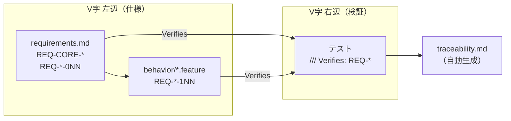

# 要求仕様（Requirements）

本ファイルは V 字モデル左辺の最上位成果物である。振る舞いシナリオ（`behavior/*.feature`）に落ちない製品要求・設計要求をここで定義する。

運用ルールは [ADR-018](./adr/ADR-018-iterative-v-model-traceability.md)、遅延バジェットの根拠は [ADR-019](./adr/ADR-019-preset-latency-budget.md) を参照。

## 要求 ID とトレーサビリティ

| 範囲 | 定義場所 | 意味 |
|------|---------|------|
| `REQ-<領域>-001` 〜 `-099` | 本ファイル | 製品要求・設計要求（振る舞いシナリオにならないもの） |
| `REQ-<領域>-101` 〜 | `behavior/*.feature` の `@REQ-...` タグ | 振る舞い要求（1 Scenario = 1 ID） |

領域コード: `CORE`（製品全体） / `LAT`（遅延） / `AUD`（音声品質） / `CON`（接続） / `IDT`（端末識別） / `GUI`（GUI の操作と状態） / `DIST`（配布設定） / `I18N`（国際化） / `TEL`（利用状況の送信）

## criticality

| タグ | 定義 | 未検証時の扱い |
|------|------|---------------|
| `must` | 検証が必須。アサーションを持つテストが 1 つ以上必要 | `cargo test` が失敗する |
| `should` | 検証が望ましい。未検証を許容する | `traceability.md` にギャップとして列挙される |

`must` を満たすテストは、テスト関数の doc comment に `Verifies: REQ-XXX-NNN` を記述する。検証は `tests/traceability_test.rs` が実行する。

## 検証層（V字 右辺）

| 層 | 実体 | 実行タイミング |
|----|------|--------------|
| 単体 | `src/**` `src-tauri/src/**` の `#[cfg(test)]` | 全コミット（`cargo test`） |
| 結合 | `tests/*.rs` | 全コミット（`cargo test`） |
| UI 単体 | `ui/src/**/*.test.ts(x)` | 全コミット（`npm run test:run`） |
| システム E2E（ループバック） | `tests/e2e` + `--features loopback` | PR（`e2e-pr.yml`） |
| システム E2E（マルチノード） | `tests/e2e` + `--features network-local,remote` | 夜間（`e2e-nightly.yml`） |
| 接続（シグナリングサーバーを立てる） | サーバーと一緒に管理している接続テスト（このリポジトリの外） | サーバー側の変更・このリポジトリの更新の取り込み時 |

シグナリングサーバーはこのリポジトリに含まれない。サーバーを立ててクライアント同士を繋がないと確かめられない要求は、末尾の「[シグナリングサーバーを立てて検証する要求](#シグナリングサーバーを立てて検証する要求)」に列挙し、そちらの接続テストで検証する。

## REQ-CORE: 製品要求

AGENTS.md「最優先要件」を ID 化したもの。これらは他の設計判断より優先される。

| ID | 要求 | criticality | 由来 |
|----|------|------------|------|
| REQ-CORE-001 | `zero-latency` プリセットのアプリ起因片道遅延が 2.0ms 以下である | must | ADR-008 |
| REQ-CORE-002 | 既定コーデックは非圧縮 PCM 32-bit float であり、コーデック起因の遅延が 0ms である | must | ADR-003 |
| REQ-CORE-003 | 音声処理（AEC / NS / AGC）を一切適用せず、入力サンプルをビット単位で保存する | must | ADR-005 |
| REQ-CORE-004 | 日本国内光回線（RTT 20ms）で総片道遅延が 12ms 以下になる | should | ADR-008 |

REQ-CORE-004 は実回線での測定を要するため `should` とする。設計上の内訳は REQ-LAT-115 が検証する。

## REQ-LAT: 遅延バジェット設計要求

プリセット定義（`src/audio/preset.rs`）とジッタバッファに対する要求。数値の根拠は [ADR-019](./adr/ADR-019-preset-latency-budget.md)、受信経路への配線は [ADR-020](./adr/ADR-020-jitter-buffer-wiring.md)。

| ID | 要求 | criticality |
|----|------|------------|
| REQ-LAT-020 | 全プリセットの設計上のアプリ起因片道遅延が、自身のバジェット以下である | must |
| REQ-LAT-021 | プリセットは遅延の昇順（zero-latency < ultra-low-latency < balanced < high-quality）に並ぶ | must |
| REQ-LAT-022 | プリセット識別子は文字列と列挙値の間で往復変換できる | must |
| REQ-LAT-023 | フレーム長はフレームサイズとサンプルレートから算出され、サンプルレート 0 でパニックしない | must |
| REQ-LAT-024 | `zero-latency` プリセットのジッタバッファ遅延が 0ms である | must |
| REQ-LAT-025 | ジッタバッファの定常状態の遅延と保護フレーム数が、設定した段数と一致する | must |
| REQ-LAT-026 | パススルーモードのジッタバッファは1フレーム目を即座に排出し、何も保持しない | must |
| REQ-LAT-027 | ループバック実測のアプリ起因遅延が、ADR-019 の算出値と 0.1ms 以内で一致する | must |
| REQ-LAT-028 | zero-latency を推奨できるのは接続品質が「良好」のときのみである | must |
| REQ-LAT-029 | ジッタバッファは未到着のフレームを損失と扱わない。後続フレームの到着で初めて損失と判定する | must |

## REQ-AUD: 音声品質設計要求

| ID | 要求 | criticality |
|----|------|------------|
| REQ-AUD-020 | PCM コーデックの符号化→復号がビット単位で元のサンプルと一致する | must |
| REQ-AUD-021 | 音声パケットの直列化→逆直列化でペイロードが変化しない | must |
| REQ-AUD-022 | 各プリセットのフレームサイズとジッタバッファ段数が ADR-019 の表と一致する | must |
| REQ-AUD-023 | `decode_into` は `decode` と同一の結果を返し、バッファ不足時は切り捨てずエラーを返す | must |
| REQ-AUD-024 | FEC グループサイズがジッタバッファ段数を超えない（復元が再生に間に合う） | must |
| REQ-AUD-025 | 全プリセットが利用可能かつフレームサイズ互換のコーデック（非圧縮PCM）を使用する | must |
| REQ-AUD-026 | FEC 有効時、グループごとに FEC パケットが送出され、受信側で欠落シーケンスとして復元される | must |
| REQ-AUD-027 | Opus は圧縮するが、プリセットのフレームサイズ（2の冪）は受け付けない | must |
| REQ-AUD-028 | ステレオのリサンプリングが両チャンネルを独立に変換し、インターリーブを保つ | must |
| REQ-AUD-029 | 入力・出力レベルメーターの値が信号の振幅に追従する（定数ではない）。無音で 0、フルスケールで 100 にクランプされ、非有限サンプルで破綻しない | must |
| REQ-AUD-031 | 出力コールバックは、デバイスが直前のフレームを使い切ったときにだけ再生バッファへ次のフレームを求める（先読みしない）。デバイスの要求量がフレーム長と違っても余りを次の要求へ繰り越し、欠落・重複させない。供給元が空なら無音を出す | must |
| REQ-AUD-032 | ローカルモニタリングの遅延は、キャプチャ 1 フレーム + 余裕 1 フレーム + 再生 1 フレームで、ネットワークにもジッタバッファ段数にも依存しない。入力と出力のクロックがずれても、溜まる量は余裕の 1 フレーム内に収まり、増え続けない（[ADR-033](./adr/ADR-033-local-monitoring.md)） | must |

REQ-AUD-030（受信側は再生リングバッファの空き容量に従ってフレームを取り出す）は撤回した。[ADR-028](./adr/ADR-028-single-stage-playout.md) が再生リングバッファと空き容量で刻むループを廃止し、出力コールバックが再生バッファから直接引く設計にしたため、要求の前提が無い。要求の意図（再生の刻みをオーディオクロックに従わせ、ネットワーク受信タスクを飢餓させない）は、新しい設計の性質として REQ-AUD-031 が検証する。既存 ID の意味は変えないので、番号は再利用せず REQ-AUD-031 を新設した。

## REQ-NET: 帯域設計要求

帯域推定と要求量算出（`src/network/bandwidth.rs`）、および指標が定数化していないことに対する要求。ビットレート適応は可変ビットレートコーデックを前提とし、全プリセットが PCM のため実現できない（[ADR-021](./adr/ADR-021-preset-codec-and-fec.md)）。本節は「不足の検出と警告」に限る。

| ID | 要求 | criticality |
|----|------|------------|
| REQ-NET-020 | PCM の必要帯域がサンプルレートとビット幅から算出され、1ch あたり約1.5Mbpsを下回らない | must |
| REQ-NET-021 | FEC の帯域コストがプリセットの冗長度と一致する | must |
| REQ-NET-022 | フレームが小さいほどヘッダ overhead により必要帯域が増える | must |
| REQ-NET-023 | 帯域の余裕が 20% 未満なら marginal、不足なら insufficient と判定される | must |
| REQ-NET-024 | 帯域測定は区間レートを返し、短すぎる区間では値を返さず、カウンタ巻き戻しで負値を返さない | must |
| REQ-NET-025 | 測定前は帯域判定を返さない（未観測の回線について警告しない） | must |
| REQ-NET-026 | `ConnectionStats` の各指標が実際のトラフィックに反応する（定数ではない） | must |
| REQ-NET-027 | 遅延内訳にジッタバッファの寄与が含まれる | must |
| REQ-NET-028 | 帯域推定値と判定がスループットの変化に追従する | must |

## REQ-CON: 接続設計要求

| ID | 要求 | criticality |
|----|------|------------|
| REQ-CON-020 | 1 ルームあたりの最大参加者数が 10 名である | must |
| REQ-CON-021 | 招待コードは 6 文字の英数字であり、生成値が形式判定を通る | must |
| REQ-CON-022 | 再接続の検知閾値は keep-alive 間隔の2倍以上に正規化され、健全な回線でフラップしない | must |
| REQ-CON-023 | パケットロス率は受信シーケンスの欠落から算出される（定数ではない）。再接続時にリセットされる | must |
| REQ-CON-024 | クライアントはルームに入った直後に自身の音声アドレス候補を publish する | must |
| REQ-CON-025 | ピアのアドレスが参加後に届いた場合も、その時点で音声ストリーミングを開始する | must |
| REQ-CON-026 | 参加応答にルームの招待コードが含まれる（作成者以外も他者を招待できる） | must |
| REQ-CON-027 | 公開するグローバルアドレスは音声ソケット自身から STUN に問い合わせた結果（IP とポート）であり、ポートを付け替える NAT の内側でも相手のパケットが音声ソケットに届く | must |
| REQ-CON-028 | シグナリングの接続先をアプリは持たない。接続するたびにサーバーへ問い合わせ（`GET /api/v1/signaling`）、返された URL に繋ぐ | must |
| REQ-CON-029 | 問い合わせの答えが `ws://` / `wss://` の URL でなければ繋がない。`https://` で問い合わせたのに暗号化されない `ws://` が返ったときも繋がない | must |

REQ-CON-024〜026 は [ADR-026](./adr/ADR-026-gui-audio-path.md) の欠陥に対応する。GUI 同士では双方がアドレスを publish していなかったため音声が流れず、参加側は招待コードを受け取れないためルーム UUID の先頭6文字を表示していた。

REQ-CON-028・029 の決定は [ADR-030](./adr/ADR-030-signaling-url-by-build-profile.md)。シグナリングを別の場所へ移しても、アプリを出し直さずに済む。

REQ-CON-027 は [ADR-035](./adr/ADR-035-stun-through-the-audio-socket.md) の欠陥に対応する。STUN の問い合わせを音声とは別のソケットから行い、返ったポートを捨てて音声ソケットのポートを公開していたため、ポートを付け替えるルーターの内側では相手が存在しないポートへ送っていた。

## REQ-IDT: 端末識別設計要求

会員登録を持たず、インストールごとにローカル生成した Ed25519 鍵ペアで端末を識別することに対する要求（[ADR-024](./adr/ADR-024-device-identity-instead-of-accounts.md)）。実装は `src/network/device_identity.rs`（導出と署名）と `src/identity_store.rs`（永続化）。同じ設定ディレクトリを使うので、同じマシンのアプリと CLI は同じ端末として繋ぐ（[ADR-027](./adr/ADR-027-cli-scope.md)）。

| ID | 要求 | criticality |
|----|------|------------|
| REQ-IDT-001 | 初回起動時に端末識別子を生成して保存し、2回目以降の起動で同一の識別子を返す。別インストールは別の識別子を得る | must |
| REQ-IDT-002 | 識別子は公開鍵の SHA-256 先頭 128bit の base32 表現（26文字）であり、公開鍵のみから導出される | must |
| REQ-IDT-003 | 会員登録・メールアドレス入力を行わずに接続が完了する | must |
| REQ-IDT-004 | 識別子・公開鍵・署名が整合しない接続を拒否する（他人の識別子を名乗れない） | must |
| REQ-IDT-006 | 秘密鍵はアプリデータディレクトリの `device_identity.json` に保存され、Unix では 0600 で作成される | should |
| REQ-IDT-007 | 参加者の端末識別子は他の参加者へ配布されない | must |
| REQ-IDT-008 | 端末の証明を付けない接続は拒否される（匿名の接続は無い）。アプリも CLI も必ず証明を付けて繋ぐ | must |

REQ-IDT-006 を `should` とするのは、Windows に 0600 相当のモードビットがなく、NTFS ACL による保護に委ねるためである。

## REQ-TEL: 利用状況の送信設計要求

アプリが動いた様子（環境・設定・エラー・セッションの集計）を、利用者が設定でオンにしたときだけ jamjam サーバーへ送る仕組みに対する要求。何を・いつ・どう止めるかの仕様は [api/telemetry.md](./api/telemetry.md)、送る項目の定義は `src/telemetry/schema.json`。実装は `src/telemetry/`（収集・送信）と `src-tauri/src/usage.rs`（アプリへの接続）。`jamjam.log`（ADR-036）は端末の中に留まる別経路で、ここでは使わない。

| ID | 要求 | criticality |
|----|------|------------|
| REQ-TEL-001 | 設定 `usage_reporting` の既定はオフである。オフの間は何も収集せず、何も送らず、インストール ID も作らない | must |
| REQ-TEL-002 | オンにすると 16 バイトの乱数のインストール ID を作り、設定ファイルとは別の場所に保存する。オフにすると未送信のイベントとインストール ID を捨て、オンにし直すと別の ID になる | must |
| REQ-TEL-003 | 送る行はすべて `schema.json` に適合する。`event` / `code` / `end_reason` / `kind` は列挙で閉じ、定義に無い項目や値の行は適合しない。全行が同じ外枠（`v` `ts` `seq` `event` `install_id` `launch_id` `session_id` `app_version` `os` `arch`）を持つ | must |
| REQ-TEL-004 | 設定は設定ファイルの項目を丸ごと送り、外すのは `peer_name` / `connection_history` / `server_url` / `input_device_id` / `output_device_id` の 5 項目だけである。5 項目の名前も値も行に現れない | must |
| REQ-TEL-005 | 音声デバイスの名前は OS が返す名前のまま送る。デバイス ID は送らない | must |
| REQ-TEL-006 | 1 回の送信は 64 KB・200 行までである。届かなかった分と収まらなかった分は捨て、溜めて再送しない。エラーは溜めて次の送信に相乗りし、同じセッション内の同じエラーは 1 行にまとめて数える | must |
| REQ-TEL-007 | 送信は `POST /api/v1/usage-logs`（`Content-Type: application/x-ndjson`）で、端末の署名ヘッダを付けない匿名の要求である。204 だけを成功とみなし、リダイレクトは辿らない | must |
| REQ-TEL-008 | パニックは発生位置（ファイル名・行・関数名）だけを保存し、次の起動で送る。メッセージ本文は保存も送信もしない。オフの間は保存しない | must |
| REQ-TEL-009 | 送る予定の NDJSON を、実際に送る本文と同じ文字列で取り出せる | must |
| REQ-TEL-010 | セッションの終わりに集計値（継続時間・終了理由・再接続回数・最大人数・RTT の p50 / p95・パケットロス率の平均と最大・xrun 回数）を 1 行で送る。測っていない値は 0 にせず行から外す | must |
| REQ-TEL-011 | 設定の Diagnostics タブに「利用状況を送る」のスイッチがあり、既定はオフである。初回起動でも、既存の利用者にも、確認のダイアログは出ない。オンにするのは利用者が自分でスイッチを操作したときだけである | must |
| REQ-TEL-012 | スイッチの説明文が、何のために送るか・送るもの・送らないもの・デバイス名に利用者自身の名前が入りうること・オフにすると ID と未送信の内容を捨てることを、英語と日本語で書く | must |
| REQ-TEL-013 | 「送る内容を見る」が、次に送る NDJSON（インストール ID を含む）を送る本文のまま表示する。オフのときは、何も集めず何も送らずインストール ID が無いことを表示する。オフにすると、表示していた内容は消える | must |

REQ-TEL-010 の FEC 作動率（`fec_active_pct`）は、接続が FEC で復元したパケット数を数えていないため、今は行に出ない（スキーマには定義済み）。

## REQ-GUI: GUI 振る舞い要求

利用者が実際に操作できる機能と、観測できる状態に対する要求。検証は実アプリを起動して DOM を読む GUI E2E（`tests/e2e/tests/gui.rs`、[ADR-025](./adr/ADR-025-gui-e2e-control-channel.md)）が行う。Storybook と UI 単体テストは Pure コンポーネントまでしか到達できないため、この層でしか検証できない。

| ID | 要求 | criticality |
|----|------|------------|
| REQ-GUI-001 | 起動すると接続画面が表示され、会員登録・サインインの UI が存在しない | must |
| REQ-GUI-002 | 端末識別子が利用者の見える場所に表示されない | must |
| REQ-GUI-003 | E2E 制御チャネルの `e2e-control` feature が既定で無効である | must |
| REQ-GUI-004 | 制御チャネルは `JAMJAM_E2E_CONTROL_PORT` 未設定・不正時にポートを開かない | must |
| REQ-GUI-005 | 招待コードを入力でき、コードが揃うまで参加ボタンが操作できない | must |
| REQ-GUI-006 | 存在しないルームへの参加は、その旨が画面に表示される | must |
| REQ-GUI-007 | 設定ボタンで設定ウィンドウが開き、全タブを選択できる | must |
| REQ-GUI-008 | 2人が同室にいるとき、双方の参加者一覧に相手が現れ、退出すると消える | must |
| REQ-GUI-009 | 参加者ごとにミキサーのチャンネルが現れ、ミュートを切り替えられる | must |
| REQ-GUI-010 | チャットのメッセージが双方向に相手へ届く | must |
| REQ-GUI-011 | 設定の Devices タブに実機のオーディオデバイスが列挙され、選択が反映される。提供されていないデバイスの選択は拒否される | must |
| REQ-GUI-012 | ループバックオーディオデバイスに流した信号が、その入力に現れる（音声検証の前提） | must |
| REQ-GUI-013 | レベルメーターが実入力信号に追従し、ミュートで無音（0）を示す | must |
| REQ-GUI-014 | GUI 2 台の間で音声が流れ、受信側のピアチャンネルのメーターが反応する | must |
| REQ-GUI-015 | 同室の参加者全員が同一のルームコードを表示する | must |
| REQ-GUI-016 | 起動すると、公開ビルドでも OS のログ置き場に `jamjam.log` が作られ、バージョン・OS・設定の要約が書かれる | must |
| REQ-GUI-017 | 画面側の `console` 出力と、失敗した Tauri コマンドの名前とエラーが、同じ `jamjam.log` に書かれる | must |
| REQ-GUI-018 | 部屋のパスワードは `jamjam.log` に書かれない（画面側の出力にも、設定の要約にも） | must |
| REQ-GUI-019 | 環境変数 `JAMJAM_LOG` で出力レベルを上書きできる。既定は自分のクレートが debug、依存クレートが info | must |
| REQ-GUI-020 | 設定の Diagnostics タブにログのフォルダを開くボタンがあり、開けないときはフォルダの場所を示す | must |
| REQ-GUI-021 | 公開ビルドでも、画面が呼ぶプラグインのコマンド（起動時の URL の取得・イベントの購読）が拒否されず、招待リンクが画面に届く | must |
| REQ-GUI-022 | `jamjam.log` に書かれる IP アドレス（STUN で分かる公開アドレス・候補アドレス）とオーディオデバイス ID は既定でマスクされる。環境変数 `JAMJAM_LOG_REDACT=off` で無効化できる | must |

REQ-GUI-008〜010、014、015 はシグナリングサーバーと 2 つのアプリインスタンスを立てて検証する（末尾の「シグナリングサーバーを立てて検証する要求」）。アプリはシングルインスタンス化していないため複数起動でき、各インスタンスは独自の制御ポートと `$HOME` を持つ。

REQ-GUI-012〜014 はループバックオーディオドライバ（macOS: BlackHole、Windows: VB-Cable、Linux: PipeWire null-sink）を開発者が導入していることを前提とする。ドライバが無い環境ではシナリオは導入コマンドを示して失敗する（無条件に成功する検証を置かないため）。`should` に落とさず `must` とするのは、ドライバがハードウェアではなく一度導入すれば済むソフトウェアであり、実際に検証できているためである。

このドライバには次の性質がある: 書き込みをリングバッファに加算し、誰も書き込まなくなった後もその内容を返し続ける。ゼロを書いても待っても無音には戻らない。したがってシナリオは「無音であること」ではなく「トーンを流したときにレベルが上がること」を検証し、シナリオごとに異なる周波数を使う（同一周波数だと残留音と打ち消し合う）。測定値は `tests/e2e/src/pom/loopback_audio.rs` に記録してある。

以下の状態は本要求に含めていない。検証できない要求を `must` として立てると `traceability.md` のギャップが実態を表さなくなるためである（`.claude/rules/traceability.md`）。

| 未収載の状態 | 必要なもの | 現状の検証範囲 |
|-------------|-----------|--------------|
| 音量・パンの操作結果が実際の音声波形に反映されること | ループバックドライバ + 音声品質測定 | 操作の UI 反映は REQ-GUI-009、実音声が流れること自体は REQ-GUI-014 |

## REQ-DIST: 配布設定要求

配布した後では直せない、または開発中には症状が出ないアプリ設定に対する要求。決定の背景は [ADR-029](./adr/ADR-029-distribution-app-settings.md)。検証は `tests/distribution_config_test.rs` が `src-tauri/tauri.conf.json`・`src-tauri/Info.plist`・`src-tauri/capabilities/` を読んで行う（バンドラが読むのと同じファイル）。

| ID | 要求 | criticality |
|----|------|------------|
| REQ-DIST-001 | macOS 向けの成果物が、マイクを使う理由（`NSMicrophoneUsageDescription`）を空でない文字列で宣言している | must |
| REQ-DIST-002 | アプリ識別子が `me.koeda.jamjam` である | must |
| REQ-DIST-003 | webview の CSP が有効で、スクリプトは同梱の資産だけ、接続先は Tauri の IPC だけに限られ、リモートのオリジンを 1 つも許可しない | must |
| REQ-DIST-004 | webview に Tauri API のグローバル（`window.__TAURI__`）を公開しない | must |
| REQ-DIST-005 | リリースビルドは本番のサーバー（`https://`、ループバックでないホスト）を使い、開発ビルドはローカルのサーバー（`http://localhost:17890`）を使う。使うサーバーはコアライブラリの 1 か所で決まり、UI と Tauri コマンドはサーバーの URL を持たない。本番のサーバーはソースに書かず、リリースのビルド時に渡す（渡さなければビルドが失敗する）。シグナリングの接続先はそのサーバーに問い合わせる（REQ-CON-028） | must |
| REQ-DIST-006 | webview に渡す Tauri の権限は、UI が実際に呼ぶプラグインのコマンド（イベントの購読と解除、起動時の招待リンクの取得）だけに限る。リモートのページには IPC を開かない | must |

REQ-DIST-005 の決定は [ADR-030](./adr/ADR-030-signaling-url-by-build-profile.md)。`cargo test` は開発側の選択と、ソースに本番の接続先が無いことを検証する。リリース側の接続先の検査はアプリのビルドスクリプト（`src-tauri/build.rs`）が行い、配布物そのもの（バイナリと `ui/dist`）は `build.yml` / `release.yml` が `scripts/check-release-server-url.sh` で検査する。

REQ-DIST-001 の宣言が実行時に効くこと（マイク許可ダイアログに説明が出て、プロセスが終了しないこと）は macOS 実機でしか確かめられない。本要求は宣言の存在までを検証範囲とする。

## REQ-CLI: CLI 振る舞い要求

CLI（`jamjam` バイナリ）は**デバッグ効率のために存在する**。GUI E2E（[ADR-025](./adr/ADR-025-gui-e2e-control-channel.md)）の代替ではなく、GUI を立ち上げずにセッションを再現・観察するための手段である（[ADR-027](./adr/ADR-027-cli-scope.md)）。GUI と同じ設定ファイルを読み書きするため、CLI で選んだデバイス・プリセットで GUI が起動する。

CLI にあって GUI に無い機能（シグナリングサーバーを介さない `host` / `join` の IP 直指定）は許容する。同等性は GUI → CLI の一方向のみを対象とする。

| ID | 要求 | criticality |
|----|------|------------|
| REQ-CLI-001 | CLI でルームを作成でき、招待コードが表示される。他の参加者はそのコードで参加し、チャットが双方に届く | must |
| REQ-CLI-002 | セッション中のコマンド（`/mute` `/unmute` `/stats` `/help` `/quit`）が解釈され、ミュート状態が切り替わる。コマンド以外はチャットとして送られる | must |
| REQ-CLI-003 | プリセットの選択を保存でき、GUI と同じ設定ファイルに書かれる。未知のプリセット名は拒否される | must |
| REQ-CLI-004 | 提供されていないオーディオデバイスの選択は拒否され、設定に書かれない | must |
| REQ-CLI-005 | CLI 同士（`host` / `join`）で音声が双方向に届く。受信した音声は GUI と同じ再生経路（プレイアウトバッファ・PLC・FEC、[ADR-028](./adr/ADR-028-single-stage-playout.md)）を通り、送られた音高・音量のまま再生される | must |
| REQ-CLI-006 | ローカルモニタリングを CLI から操作できる。`--monitor` で開始時から ON、セッション中の `/monitor` `/unmonitor` で切り替わる。ミュートとは独立である（[ADR-033](./adr/ADR-033-local-monitoring.md)） | must |
| REQ-CLI-007 | `host` / `join` は接続してから `--duration` の秒数で自分で終わり、`--input-bursts` で送ったバーストが再生されるまでの往復時間（相手が音を保持して返すなら `--echo-delay-ms` を引いたもの）を測り、`--report-json` で往復・ネットワーク・プレイアウトの値を JSON に書く（[ADR-039](./adr/ADR-039-cli-round-trip-measurement.md)） | must |

REQ-CLI-001 の検証はチャットのみで行う（`--chat-only`）。オーディオデバイスの無い環境でも `cargo test` が通る必要があるためである。REQ-CLI-005 は同じ理由で、デバイスの代わりに `--input-tone`（正弦波を送る）と `--output-file`（再生するはずの音をファイルに書く）を使って検証する。REQ-CLI-007 も同じで、音を保持して返す UDP の相手を立てて検証する。実デバイスでの CLI 同士の接続は手動で確認する。

## シグナリングサーバーを立てて検証する要求

次の要求は、シグナリングサーバーを立ててクライアント（CLI・GUI）を繋がないと確かめられない。シグナリングサーバーはこのリポジトリに含まれないため、サーバーと一緒に管理している接続テストで検証する。`tests/traceability_test.rs` はここに挙げた要求をこのリポジトリのテストが無くても未検証とせず、`traceability.md` に別枠で示す。ここに挙げる要求を増減するときは、接続テストの側も合わせて直す。

ルームの作成・参加・退出（シグナリングの往復そのもの）:

- `REQ-CON-026` 参加応答にルームの招待コードが含まれる
- `REQ-CON-101` ルームを作成する
- `REQ-CON-102` パスワード付きルームを作成する
- `REQ-CON-104` 招待コードでルームに参加する
- `REQ-CON-105` パスワード付きルームに参加する
- `REQ-CON-106` 誤ったパスワードでルームに参加しようとする
- `REQ-CON-108` セッションから退出する
- `REQ-CON-111` 新しい参加者がセッションに参加する
- `REQ-CON-112` 最大参加者数に達している場合
- `REQ-IDT-004` 識別子・公開鍵・署名が整合しない接続を拒否する
- `REQ-IDT-007` 参加者の端末識別子は他の参加者へ配布されない
- `REQ-IDT-008` 端末の証明を付けない接続は拒否される

接続先の問い合わせ:

- `REQ-CON-028` 接続するたびにサーバーへ問い合わせ、返された URL に繋ぐ

同じルームに入った 2 台の間の音声アドレスの受け渡し:

- `REQ-CON-024` ルームに入った直後に自身の音声アドレス候補を publish する
- `REQ-CON-025` ピアのアドレスが参加後に届いた場合も音声ストリーミングを開始する

CLI と GUI をサーバーに繋いだ状態の振る舞い:

- `REQ-CLI-001` CLI でルームを作成し、他の参加者がそのコードで参加してチャットが届く
- `REQ-GUI-006` 存在しないルームへの参加は、その旨が画面に表示される
- `REQ-GUI-008` 双方の参加者一覧に相手が現れ、退出すると消える
- `REQ-GUI-009` 参加者ごとにミキサーのチャンネルが現れ、ミュートを切り替えられる
- `REQ-GUI-010` チャットのメッセージが双方向に相手へ届く
- `REQ-GUI-013` レベルメーターが実入力信号に追従し、ミュートで無音を示す
- `REQ-GUI-014` GUI 2 台の間で音声が流れる
- `REQ-GUI-015` 同室の参加者全員が同一のルームコードを表示する
- `REQ-GUI-021` 公開ビルドでも招待リンクが画面に届く（リリースビルドで手動実行）

## 参照

- [ADR-018: 反復V字モデルとトレーサビリティ](./adr/ADR-018-iterative-v-model-traceability.md)
- [ADR-019: プリセット遅延バジェット](./adr/ADR-019-preset-latency-budget.md)
- [traceability.md](./traceability.md) - 要求と検証の対応表（自動生成）
- `docs-spec/behavior/*.feature` - 振る舞い要求（Gherkin。ドキュメントサイトには公開されない）
