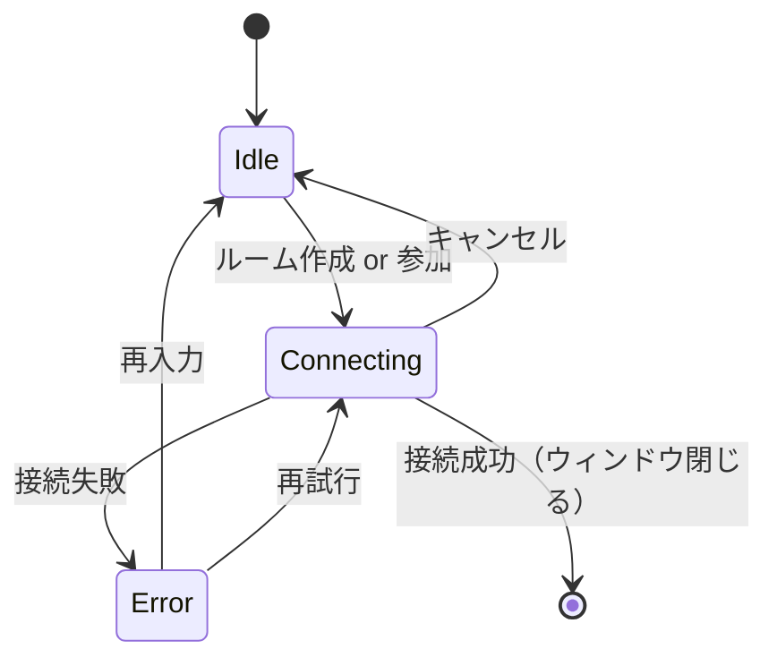

# ConnectionPanel - 接続画面

セッション参加/作成のための接続画面コンポーネント。ルーム作成・招待コード入力の2アクションのみで、入力欄は招待コード1つに限定する（最小限のステップでセッション開始、下記「目的」参照）。

---

## 概要

### 目的

- セッション作成またはコード入力による参加
- 最小限のステップでセッション開始

### 使用場面

- アプリ起動時（未接続状態）
- セッション退室後

### デザイン

jamjam ブランドガイド準拠（ui.pen Screens/JoinRoom、2026-07-18 刷新）:
- 背景は黒3階調（`bg-page` < `bg-card` < 逆に `bg-row` が最暗）、アクセントは `accent-blue`
- 見出し・本文は Inter、コード表示は Roboto Mono
- 1px ボーダー、`--radius-control`（8px）角丸
- Primary ボタンは `--shadow-button` 程度の控えめな浮き上がりのみ（過剰なシャドウ禁止）
- コード表示・入力は3文字区切りの見た目（例: `ABC-123`）で表示するが、実際の招待コードの値
  自体はハイフンを含まない6文字英数字のまま（表示専用の `letter-spacing`/グルーピング）

---

## ビジュアル仕様

### レイアウト

```
┌──────────────────────────────────────┐
│ jamjam                          [⚙]  │  ← ヘッダー（ロゴ+設定、画面幅いっぱい）
├──────────────────────────────────────┤
│                                       │
│         jamjam へようこそ            │  ← ウェルカムタイトル
│   低遅延で高品質な音声セッションを    │  ← ウェルカムサブタイトル
│         始めましょう                 │
│                                       │
│    ┌────────────────────────────┐    │
│    │      [ ルームを作成 ]      │    │  ← プライマリボタン（accent-blue塗り）
│    └────────────────────────────┘    │
│                                       │
│    ─────────── または ───────────    │  ← 区切り線
│                                       │
│    招待コードで参加                  │  ← ラベル（太字）
│    ┌──────────────────┐┌─────────┐   │
│    │  ABC-123          ││ [ 参加 ]│   │  ← コード入力 + 参加ボタン（横並び）
│    └──────────────────┘└─────────┘   │
│                                       │
│    ┌────────────────────────────┐    │
│    │ ⚡ テストルーム (ABC234)   │    │  ← テストルームカード
│    │   動作確認用のテストルーム │    │     （緑ボーダー、アイコン+説明文）
│    │   に接続します             │    │
│    └────────────────────────────┘    │
└──────────────────────────────────────┘
```

### 接続中状態

```
┌────────────────────────────────┐
│          jamjam               │
├────────────────────────────────┤
│                                │
│                                │
│         ◯ 接続中...            │  ← スピナー + テキスト
│                                │
│        [ キャンセル ]          │
│                                │
│                                │
└────────────────────────────────┘
```

### エラー状態

```
┌──────────────────────────────────────┐
│ jamjam                          [⚙]  │
├──────────────────────────────────────┤
│         jamjam へようこそ            │
│   低遅延で高品質な音声セッションを    │
│         始めましょう                 │
│    ┌────────────────────────────┐    │
│    │      [ ルームを作成 ]      │    │
│    └────────────────────────────┘    │
│    ─────────── または ───────────    │
│    招待コードで参加                  │
│    ┌──────────────────┐┌─────────┐   │
│    │  ABC-123          ││ [ 参加 ]│   │  ← エラー時 入力ボーダー赤・参加ボタン薄く
│    └──────────────────┘└─────────┘   │
│    ⚠ 無効なルームコードです          │  ← エラーメッセージ（入力行の下）
│    ┌────────────────────────────┐    │
│    │ ⚡ テストルーム (ABC234)   │    │
│    │   動作確認用のテストルーム │    │
│    │   に接続します             │    │
│    └────────────────────────────┘    │
└──────────────────────────────────────┘
```

---

## コンポーネント構成

### ConnectionPanel（ルート）

```typescript
interface ConnectionPanelProps {
  /** 現在の状態 */
  state: "idle" | "connecting" | "error";
  /** 入力されたコード */
  code: string;
  /** エラーメッセージ */
  errorMessage?: string;
  /** ルーム作成ボタンクリック */
  onCreateRoom?: () => void;
  /** 参加ボタンクリック */
  onJoinRoom?: (code: string) => void;
  /** コード入力変更 */
  onCodeChange?: (code: string) => void;
  /** キャンセルボタンクリック */
  onCancel?: () => void;
  /** 設定ボタンクリック */
  onOpenSettings?: () => void;
}
```

上記はコア Props のみ（履歴・テストルーム・i18n カスタマイズ Props は後述の「追加機能」
節で個別に導入する）。実装と1対1対応する完全な Props 一覧は
[拡張 Props インターフェース](#拡張-props-インターフェース)を参照。

### サブコンポーネント

| コンポーネント | 役割 |
|--------------|------|
| `ConnectionHeader` | ロゴ/タイトル表示（画面幅いっぱい） |
| `WelcomeSection` | ウェルカムタイトル/サブタイトル表示 |
| `CreateRoomButton` | ルーム作成ボタン（プライマリ、accent-blue塗り） |
| `CodeInput` | 招待コード入力フィールド（参加ボタンと横並び） |
| `JoinButton` | 参加ボタン（プライマリ、accent-blue塗り、固定幅100px） |
| `TestRoomCard` | テストルームへのワンクリック接続カード（緑ボーダー+アイコン+説明文） |
| `SettingsButton` | 設定画面を開くボタン |
| `LoadingSpinner` | 接続中のスピナー |
| `ErrorMessage` | エラーメッセージ表示 |

---

## サイズ仕様

| 項目 | 値 |
|------|-----|
| 画面サイズ（参照） | 600 x 700 px（ui.pen Screens/JoinRoom） |
| ヘッダー高さ | 48px、画面幅いっぱい |
| フォーム幅 | 400px（中央寄せ、画面内で可変） |
| コード入力+参加ボタンの行高さ | 48px（入力は可変幅、参加ボタンは固定100px） |
| ボタン高さ | 48px |
| セクション間スペース | 32px (--space-xl) |
| ラベル〜入力欄間スペース | 16px (--space-md) |

---

## 状態遷移



---

## スタイル仕様

### ヘッダー

画面幅いっぱい、ロゴは見出しフォント+アクセントカラー。

```css
.connection-header {
  height: 48px;
  display: flex;
  align-items: center;
  justify-content: space-between;
  padding: 0 var(--space-md);
  background: var(--color-bg-secondary);
  border-bottom: 1px solid var(--color-border);
}

.connection-header__logo {
  font-family: var(--font-family-heading);
  font-size: var(--font-size-h2);
  font-weight: 700;
  color: var(--color-accent);
}
```

### ウェルカムセクション

```css
.welcome-title {
  font-family: var(--font-family-heading);
  font-size: var(--font-size-h1);
  font-weight: 700;
  color: var(--color-text-primary);
  text-align: center;
}

.welcome-subtitle {
  font-size: var(--font-size-body);
  color: var(--color-text-secondary);
  text-align: center;
}
```

### プライマリボタン（ルーム作成 / 参加）

ルーム作成ボタンと参加ボタンは同一のプライマリ（アクセントカラー塗り）スタイルを使う。
参加ボタンのみ幅100pxに固定し、コード入力の右側に並べる。

```css
.button-primary {
  width: 100%;
  height: 48px;
  background: var(--color-accent);
  color: var(--color-text-inverse);
  border: 1px solid var(--color-accent);
  font-weight: 700;
}

.button-primary:hover {
  background: var(--color-accent-hover);
  border-color: var(--color-accent-hover);
}

.button-primary:active {
  background: var(--color-accent-active);
  border-color: var(--color-accent-active);
}

.button-primary:focus-visible {
  box-shadow: var(--shadow-focus);
}

.join-button {
  width: 100px;
  flex-shrink: 0;
}
```

### セカンダリボタン（接続中のキャンセル）

```css
.button-secondary {
  width: 100%;
  height: 48px;
  background: transparent;
  color: var(--color-text-primary);
  border: 1px solid var(--color-border);
}

.button-secondary:hover {
  border-color: var(--color-text-primary);
}

.button-secondary:disabled {
  opacity: 0.5;
  cursor: not-allowed;
}
```

### コード入力+参加ボタンの行

入力欄と参加ボタンは1行に横並び（`display: flex`、高さ48px）。

```css
.input-row {
  display: flex;
  gap: var(--space-sm);
  height: 48px;
}

.code-input {
  flex: 1;
  height: 100%;
  padding: 0 var(--space-md);
  background: var(--color-bg-tertiary);
  border: 1px solid var(--color-border);
  color: var(--color-text-primary);
  font-family: var(--font-family-mono);
  font-size: var(--font-size-body);
  text-align: center;
  text-transform: uppercase;
  letter-spacing: 0.1em;
}

.code-input:focus {
  border-color: var(--color-border-focus);
  outline: none;
}

.code-input--error {
  border-color: var(--color-danger);
}

.code-input::placeholder {
  color: var(--color-text-tertiary);
  text-transform: none;
  letter-spacing: normal;
}
```

### テストルームカード

アイコン+タイトル+説明文を持つカード全体がクリック可能。緑（`--color-success`）ボーダーで強調する。

```css
.test-room-card {
  display: flex;
  align-items: center;
  gap: var(--space-sm);
  width: 100%;
  padding: var(--space-sm) var(--space-md);
  background: var(--color-bg-secondary);
  border: 1px solid var(--color-success);
  color: var(--color-success);
}

.test-room-card:hover {
  background: var(--color-bg-elevated);
}

.test-room-title {
  font-size: var(--font-size-caption);
  font-weight: 700;
}

.test-room-desc {
  font-size: var(--font-size-small);
  color: var(--color-text-secondary);
}
```

### 区切り線

```css
.divider {
  display: flex;
  align-items: center;
  gap: var(--space-sm);
  color: var(--color-text-secondary);
  font-size: var(--font-size-caption);
}

.divider::before,
.divider::after {
  content: "";
  flex: 1;
  height: 1px;
  background: var(--color-border);
}
```

### エラーメッセージ

```css
.error-message {
  color: var(--color-danger);
  font-size: var(--font-size-caption);
  margin-top: var(--space-xs);
}
```

### 設定ボタン

```css
.settings-button {
  position: absolute;
  bottom: var(--space-md);
  right: var(--space-md);
  width: 32px;
  height: 32px;
  background: transparent;
  border: 1px solid var(--color-border);
  color: var(--color-text-secondary);
  display: flex;
  align-items: center;
  justify-content: center;
}

.settings-button:hover {
  color: var(--color-text-primary);
  border-color: var(--color-text-primary);
}
```

---

## アクセシビリティ

### ARIA属性

```tsx
// コード入力
<input
  type="text"
  role="textbox"
  aria-label={t("connection.codeInput", "Invitation code")}
  aria-invalid={hasError}
  aria-describedby={hasError ? "error-message" : undefined}
/>

// エラーメッセージ
<p id="error-message" role="alert" aria-live="polite">
  {errorMessage}
</p>

// ローディング
<div role="status" aria-label={t("connection.connecting", "Connecting...")}>
  <LoadingSpinner />
</div>
```

### キーボード操作

| キー | 動作 |
|------|------|
| Tab | フォーカス移動 |
| Enter | フォーカス中のボタン押下 / コード入力時に参加 |
| Escape | 接続中の場合キャンセル |

### フォーカス順序

1. ルーム作成ボタン
2. コード入力フィールド
3. 参加ボタン
4. 設定ボタン

---

## i18n キー

```json
{
  "connection.title": "jamjam",
  "connection.createRoom": "ルームを作成",
  "connection.or": "または",
  "connection.codeLabel": "招待コード",
  "connection.codePlaceholder": "コードを入力",
  "connection.join": "参加",
  "connection.connecting": "接続中...",
  "connection.cancel": "キャンセル",
  "connection.settings": "設定",
  "connection.error.invalidCode": "無効なコードです",
  "connection.error.connectionFailed": "接続に失敗しました",
  "connection.error.roomNotFound": "ルームが見つかりません",
  "connection.error.roomFull": "ルームが満員です"
}
```

---

## バリデーション

### 招待コード

| ルール | 説明 |
|--------|------|
| 長さ | 6文字 |
| 文字種 | 英数字（大文字小文字を区別しない） |
| 自動変換 | 入力は自動で大文字に変換 |

```typescript
function validateCode(code: string): boolean {
  return /^[A-Z0-9]{6}$/i.test(code);
}
```

---

## 使用例

```tsx
import { useState } from "react";
import { ConnectionPanel } from "./ConnectionPanel";

function App() {
  const [state, setState] = useState<"idle" | "connecting" | "error">("idle");
  const [code, setCode] = useState("");
  const [error, setError] = useState<string>();

  const handleCreateRoom = async () => {
    setState("connecting");
    try {
      const roomId = await createRoom();
      // MixerWindow, ChatWindow を開く
    } catch (e) {
      setState("error");
      setError("接続に失敗しました");
    }
  };

  const handleJoinRoom = async (code: string) => {
    setState("connecting");
    try {
      await joinRoom(code);
      // MixerWindow, ChatWindow を開く
    } catch (e) {
      setState("error");
      setError("無効なコードです");
    }
  };

  return (
    <ConnectionPanel
      state={state}
      code={code}
      errorMessage={error}
      onCreateRoom={handleCreateRoom}
      onJoinRoom={handleJoinRoom}
      onCodeChange={setCode}
      onCancel={() => setState("idle")}
      onOpenSettings={openSettingsWindow}
    />
  );
}
```

---

---

## 追加機能

### 接続履歴（ConnectionHistory）

過去に接続したルームの履歴を表示・管理。

```typescript
interface ConnectionHistoryEntry {
  room_code: string;
  label?: string;
  connected_at: string; // ISO 8601 format
}

interface ConnectionPanelProps {
  // ... 既存のProps
  /** 接続履歴 */
  connectionHistory?: ConnectionHistoryEntry[];
  /** 履歴選択時のコールバック */
  onHistorySelect?: (roomCode: string) => void;
  /** 履歴削除時のコールバック */
  onHistoryRemove?: (roomCode: string) => void;
  /** 履歴タイトル */
  historyTitle?: string;
}
```

#### 日付表示フォーマット

| 条件 | 表示形式 |
|------|---------|
| 今日 | `HH:MM` |
| 昨日 | `Yesterday` |
| 7日以内 | `N days ago` |
| 7日以上 | `MMM D` (例: Jan 15) |

#### ビジュアル

```
┌────────────────────────────────┐
│         履歴                   │
├────────────────────────────────┤
│ ABC-123          14:30    [✕]   │
│ XYZ789          Yesterday [✕]  │
│ DEF456          Jan 15    [✕]  │
└────────────────────────────────┘
```

---

### テストルーム機能

サーバーが示す、接続を試すためのルームへのクイックアクセス。アプリはコードを持たない。サーバーのルーム一覧で `test_room` の印が付いたルームがあれば、そのコードを `MainScreen` が渡す（[api/signaling.md](../../api/signaling.md)）。

```typescript
interface ConnectionPanelProps {
  // ... 既存のProps
  /** テストルームの招待コード。渡したときだけカードを表示 */
  testRoomCode?: string;
  /** テストルームタイトル（コードと併記） */
  testRoomTitle?: string;
  /** テストルームの説明文 */
  testRoomDescription?: string;
}
```

#### 動作

- `testRoomCode` と `onJoinRoom` が設定されている場合に表示
- カード全体がクリック可能。クリック時に `onJoinRoom(testRoomCode)` を呼び出し
- 招待コード欄の下に配置

#### ビジュアル

```
┌────────────────────────────────┐
│    │      [ 参加 ]        │    │
│                                │
│ ┌────────────────────────────┐ │
│ │ ⚡ テストルーム (ABC234)   │ │  ← 緑ボーダーのカード
│ │   動作確認用のテストルーム │ │
│ │   に接続します             │ │
│ └────────────────────────────┘ │
└────────────────────────────────┘
```

---

## 拡張 Props インターフェース

```typescript
export interface ConnectionPanelProps {
  /** 現在の状態 */
  state?: "idle" | "connecting" | "error";
  /** 入力されたコード */
  code?: string;
  /** エラーメッセージ */
  errorMessage?: string;

  // コールバック
  onCreateRoom?: () => void;
  onJoinRoom?: (code: string) => void;
  onCodeChange?: (code: string) => void;
  onCancel?: () => void;
  onOpenSettings?: () => void;

  // 履歴機能
  connectionHistory?: ConnectionHistoryEntry[];
  onHistorySelect?: (roomCode: string) => void;
  onHistoryRemove?: (roomCode: string) => void;

  // テストルーム機能
  testRoomCode?: string;
  testRoomTitle?: string;
  testRoomDescription?: string;

  // i18n カスタマイズ
  title?: string;
  welcomeTitle?: string;
  welcomeSubtitle?: string;
  createRoomText?: string;
  orText?: string;
  codeLabel?: string;
  codePlaceholder?: string;
  joinText?: string;
  connectingText?: string;
  cancelText?: string;
  historyTitle?: string;
}
```

---

## 追加 i18n キー

実装（`ui/locales/{ja,en}.json`）は `session.*` 名前空間を使用する。

```json
{
  "session.welcome.title": "jamjam へようこそ",
  "session.welcome.subtitle": "低遅延で高品質な音声セッションを始めましょう",
  "session.testRoom.title": "テストルーム",
  "session.testRoom.description": "動作確認用のテストルームに接続します",
  "connectionHistory.title": "履歴",
  "connectionHistory.remove": "削除"
}
```

---

## 関連ドキュメント

- [multi-window-architecture.md](../multi-window-architecture.md) - マルチウィンドウ構成
- [design-guide.md](../design-guide.md) - デザインガイド
- [screens/README.md](../screens/README.md) - 画面遷移
