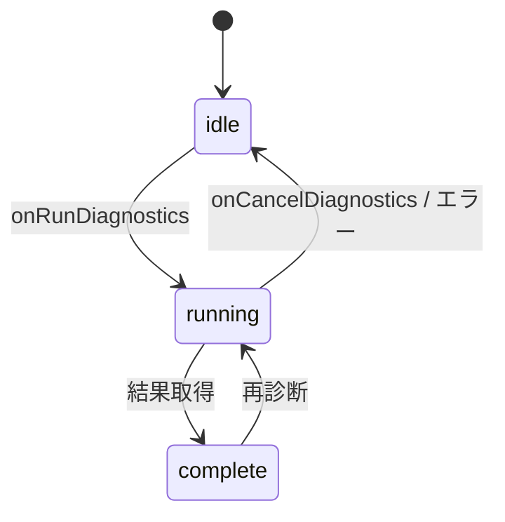

# SettingsPanel - 設定パネル

アプリケーション設定を管理するコンポーネント。
デバイス設定・一般設定・プロフィール・診断機能を提供する。

デザインは `ui.pen`（Pencil schema 2.14）の `Screens/Settings` 系を正とする。
配色・タイポグラフィは `ui/src/styles/tokens.css` のトークンのみを使用する（ハードコード禁止）。

---

## 概要

### 目的
- アプリ全体の設定を1箇所で管理
- デバイス選択と音声設定の調整
- 診断機能によるネットワーク/デバイス/CPU環境チェックと、診断結果に基づく推奨プリセット（バッファサイズ）の適用

### 使用場面
- 初回起動時（デバイス選択）
- セッション前の設定確認
- トラブルシューティング時（診断）

---

## ビジュアル仕様

上部にヘッダー、その下に「左サイドバー（アイコン付き垂直タブ）＋右コンテンツ」を配置する。

```
┌──────────────────────────────────────────────────────────┐
│ 設定                                    ← Header (h56)     │  bg: --color-bg-secondary
├──────────┬───────────────────────────────────────────────┤
│ ≡ 一般    │  オーディオデバイス          ← 見出し(Inter, bold) │
│ ◈ デバイス │  入力デバイス                                    │
│ ⏘ プロ...  │  ┌───────────────────────────────┐            │
│ ∿ 診断    │  │ Built-in Microphone        ▼ │            │  Select(block)
│          │  └───────────────────────────────┘            │
│          │  ...                                            │
└──────────┴───────────────────────────────────────────────┘
   Sidebar(w200)          Content(flex, overflow-y:auto)
   bg:--color-bg-secondary
```

### 配色・寸法（tokens.css）

| 要素 | 値 |
|------|-----|
| パネル背景 | `--color-bg-primary` (#1C1C1E、`bg-page`) |
| ヘッダー / サイドバー背景 | `--color-bg-secondary` (#2C2C2E、`bg-card`。パネル背景より明るい) |
| 入力欄 / 選択欄 / タブ選択時の背景 | `--color-bg-tertiary` (#141414、`bg-row`。最も暗い recessed 面) |
| 罫線 | `--color-border` (#38383A), 1px |
| アクセント（選択タブのアイコン、値ハイライト、送信ステレオ、合計遅延、実行ボタン） | `--color-accent` (#0A84FF、`accent-blue`) |
| 見出しフォント | `--font-family-heading` (Inter) |
| 本文フォント | `--font-family-sans` (Inter) |
| 数値フォント | `--font-family-mono` (Roboto Mono) |
| 角丸 | ボタン/入力/バッジは `--radius-control`（8px）、カード/パネルは `--radius-card`（14px） |
| シャドウ | フォーカスリング（`--shadow-focus`）、ボタンは `--shadow-button` 程度の控えめな浮き上がり |
| ヘッダー高 | 56px |
| サイドバー幅 | 200px |
| タブ項目高 | 36px |

---

## コンポーネント構成

### SettingsPanel（コンテナ）

Pure コンポーネント（Tauri 非依存）。全データを Props で受け取る。

```typescript
type SettingsTabId = "devices" | "general" | "profile" | "diagnostics";

interface SettingsPanelProps {
  initialTab?: SettingsTabId;          // 既定 "devices"
  title?: string;                      // ヘッダー題字（既定 i18n settings.title）
  language: Language;
  displayName: string;
  displayNameError?: string;
  inputDevices: DeviceInfo[];
  outputDevices: DeviceInfo[];
  selectedInputId: string | null;
  selectedOutputId: string | null;
  inputChannelOptions?: SelectOption[];
  outputChannelOptions?: SelectOption[];
  selectedInputChannelL?: string;
  selectedInputChannelR?: string | null;   // null/"" = モノラル
  selectedOutputChannelL?: string;
  selectedOutputChannelR?: string | null;
  sampleRateOptions?: SelectOption[];
  selectedSampleRate?: string;
  bufferSizeOptions?: SelectOption[];
  selectedBufferSize?: string;
  transmitChannelOptions?: SelectOption[];
  selectedTransmitChannels?: string;
  isLoading?: boolean;
  diagnosticsState?: "idle" | "running" | "complete";
  diagnosticsProgress?: number;             // 0-100
  diagnosticsProgressMessage?: string;
  diagnosticsResult?: CompleteDiagnosticsResult;
  onLanguageChange: (language: Language) => void;
  onDisplayNameChange: (name: string) => void;
  onInputDeviceChange: (id: string) => void;
  onOutputDeviceChange: (id: string) => void;
  onInputChannelLChange?: (value: string) => void;
  onInputChannelRChange?: (value: string) => void;
  onOutputChannelLChange?: (value: string) => void;
  onOutputChannelRChange?: (value: string) => void;
  onSampleRateChange?: (value: string) => void;
  onBufferSizeChange?: (value: string) => void;
  onTransmitChannelsChange?: (value: string) => void;
  onRunDiagnostics?: () => void;
  onCancelDiagnostics?: () => void;         // 指定時のみ実行中にキャンセルボタン表示
  onApplyPreset?: (preset: RecommendedPreset) => void;
  onOpenLogFolder?: () => void;             // 指定時のみ診断タブにログファイルの節を表示
  logFolder?: string | null;                // 開いたフォルダ（ボタンの下に表示）
  logFolderError?: string | null;           // 開けなかった理由（フォルダの場所を含む）
  usageReporting?: boolean;                 // 利用状況を送る設定（既定オフ）
  onUsageReportingChange?: (enabled: boolean) => void; // 指定時のみ診断タブに利用状況の節を表示
  usagePreview?: string | null;             // 次に送る NDJSON（null = まだ見ていない）
  onShowUsagePreview?: () => void;          // 「送る内容を見る」
  usagePreviewError?: string | null;        // 保存や読み出しに失敗した理由
}

type Language = "ja" | "en";
```

**テーマ選択は廃止した。** jamjam は現状ダーク専用ブランドであり（`tokens.css` の light は dark を複製）、`ui.pen` の一般タブも言語のみを持つ。このため `theme` / `onThemeChange` は SettingsPanel から削除した。

タブ順は `ui.pen` に合わせて **一般 → デバイス → プロフィール → 診断**。各タブにアイコンを表示する。
初期表示タブは一覧の並び順とは独立に `デバイス`（`initialTab` のデフォルト値）。

| タブ | lucide アイコン |
|------|----------------|
| 一般 | `sliders-horizontal` |
| デバイス | `mic` |
| プロフィール | `user` |
| 診断 | `activity` |

アイコンはライブラリ非依存の手書き SVG（`SettingsPanel/icons.tsx`）で、`currentColor` で色を制御する。

### VerticalTabs（垂直タブ）

```typescript
interface Tab { id: string; label: string; icon?: ReactNode; }
interface VerticalTabsProps {
  tabs: Tab[];
  selectedId: string;
  onSelect: (id: string) => void;
}
```

- 選択タブ: 背景 `--color-bg-tertiary` ＋ アイコン `--color-accent` ＋ ラベル `--color-text-primary`
- 非選択タブ: 背景透明 ＋ アイコン/ラベル `--color-text-secondary`（hover でラベルは primary）
- キーボード: ↑/↓ で移動（ラップ）、Home/End で先頭/末尾

### FormField

2種のレイアウトを持つ。

```typescript
interface FormFieldProps {
  label: string;
  htmlFor?: string;
  description?: string;   // row 時、ラベル下の補足
  hint?: string;          // stacked 時、コントロール下の補足
  error?: string;
  orientation?: "stacked" | "row";   // 既定 "stacked"
  children: ReactNode;
}
```

- `stacked`: ラベル（`--font-size-small` / secondary）を上、コントロールを下、hint をさらに下。デバイス／チャンネル／言語／表示名で使用。
- `row`: 左にタイトル（`--font-size-caption` / primary）＋ description、右にコントロール（`space-between`）。送信チャンネル／サンプルレート／バッファで使用。

### Select

ネイティブ `<select>` を透明（opacity 0）でフィールド全面に重ね、表示値とシェブロンを自前描画する。ネイティブのキーボード／スクリーンリーダー挙動を保ちつつ、フラットな見た目とアクセントの値表現を実現する。フォーカスは `:focus-within` で `--shadow-focus`。

```typescript
type SelectVariant = "block" | "inline" | "channel";
interface SelectProps {
  options: SelectOption[];
  value?: string;
  placeholder?: string;
  onChange?: (value: string) => void;
  disabled?: boolean;
  variant?: SelectVariant;   // 既定 "block"
  prefixLabel?: string;      // channel 用の内側ラベル
}
interface SelectOption { value: string; label: string; disabled?: boolean; }
```

| variant | 用途 | 高さ | 値の色/フォント |
|---------|------|------|----------------|
| `block` | 入力/出力デバイス・言語 | 40px | primary / sans |
| `inline` | サンプルレート・バッファ | 32px | accent / mono |
| `channel` | L/R チャンネル（内側に prefix ラベル） | 36px | primary / mono |

### Input

表示名入力。高さ40px、背景 `--color-bg-tertiary`、1px 罫線、フォーカスで `--shadow-focus`、error 時 `--color-danger` 罫線。

---

## タブ構成

### デバイスタブ（DevicesTab）

1. 見出し「オーディオデバイス」
2. 入力デバイス / 出力デバイス（`stacked` + `block` Select）
3. 入力チャンネル / 出力チャンネル（`stacked` + `channel` Select × 2。R に "なし"=モノラル）
4. 区切り線
5. 見出し「オーディオ設定」
6. 送信チャンネル（`row` + セグメントトグル モノラル/ステレオ。選択側は `--color-accent` 罫線＋文字）
7. サンプルレート / バッファサイズ（`row` + `inline` Select）
8. 遅延サマリーカード（下記）

#### 遅延サマリーカード

現在のバッファサイズ・サンプルレートからアプリ起因の片道遅延を算出して表示する。

- 片道遅延[ms] = `bufferSize / sampleRate * 1000`
- 入力遅延・出力遅延 = 片道遅延（各々小数第1位に丸め）
- 合計遅延 = 丸め後の入力＋出力（表示の整合を保つ）
- 色: 片道 ≤3ms は `--color-success`、≤6ms は `--color-warning`、それ以上は `--color-danger`。合計は常に `--color-accent`

（アプリ起因の片道遅延目標 `<2ms` は ADR-008 準拠。バッファ64/48kHz で約1.3ms。）

### 一般タブ（GeneralTab）

- 見出し「一般設定」
- 言語（`stacked` + `block` Select: 日本語 / English）

### プロフィールタブ（ProfileTab）

- 見出し「プロフィール」
- 表示名（`stacked` + Input、hint「他の参加者に表示される名前です（1〜32文字）」、最大32文字、空は error）

### 診断タブ（DiagnosticsTab）

状態遷移:



- **idle**: 見出し「システム診断」＋ 説明 ＋ アクセント実行ボタン（play アイコン）
- **running**: 中央にローダー（`--color-accent`、回転）＋「診断を実行中...」＋ 進捗バー（accent fill）＋ 3ステップ（ネットワーク→オーディオ→CPU）＋ `onCancelDiagnostics` 指定時にキャンセルボタン
  - ステップ状態は `progress` から導出: `progress ≥ (i+1)*100/3` で done（check）、区間内で active（loader 回転）、それ以前は pending（circle）。active 行は `progressMessage` を表示
- **complete**: スコア（`score/100`, Inter）＋ 再診断ボタン（refresh アイコン）＋ 結果カード（ネットワーク／オーディオ／CPU／推奨設定）＋ 問題点
  - 各カード: 見出しアイコン＋タイトル＋グレードバッジ（A=success / B=warning / C=danger / Unknown=非表示）、行は `label`＋`value`（mono）。RTT・ジッタ・パケットロスは良好時 `--color-success`
  - 問題点: 件数バッジ＋カード（カテゴリ／重大度バッジ。Warning=warning、Error=danger、Info=中立）
- **利用状況の節**（idle / complete の、ログファイルの節の上。`onUsageReportingChange` 指定時のみ）: 見出し「利用状況の送信」＋ スイッチ「利用状況を送る」（`role="switch"`。**既定オフ**）＋ 説明文 ＋ 「送る内容を見る」ボタン。説明文は次の 5 段で、英語・日本語の両方がある
  1. 既定はオフ。オンにすると動作の様子をサーバーに送る。何のために送るか（特定の機材や回線の不具合を見つけて直す）
  2. 送るもの: アプリの版・OS・CPU とメモリ・音声デバイスの名前と ID と対応・設定（自前サーバーの URL はホストとポートまで）・セッションごとの集計（経路の種類と接続の所要時間を含む）・自分の IP アドレス・エラーの種別・クラッシュの位置
  3. 送らないもの: 表示名・部屋の履歴・端末識別子・相手についての情報（相手の IP アドレスを含む）・音声・チャット
  4. デバイスの名前は OS が返すとおりに送る。利用者自身の名前が入っていればそれも送られる。「送る内容を見る」で確かめられる
  5. オンにすると乱数のインストール ID を作る。オフにすると、この ID と未送信の内容を捨てる

  「送る内容を見る」を押すと、次に送る NDJSON をそのまま（`install_id` を含めて）等幅で表示する。押すたびに読み直す。内容が空のとき、オフなら「オフです。何も集めず、何も送らず、インストール ID もありません」、オンなら「送る予定の内容はまだありません」を表示する。表示中にスイッチをオフにすると、表示を読み直して空にする。保存できなかったときはスイッチを戻し、理由を `role="alert"` で表示する。初回起動でも、この節以外の場所にも、ダイアログは出さない（[ADR-037](../../adr/ADR-037-usage-reporting-opt-in.md)）
- **ログファイルの節**（idle / complete の末尾。`onOpenLogFolder` 指定時のみ）: 見出し「ログファイル」＋ 説明（不具合の報告に `jamjam.log` を添える）＋ 「ログのフォルダを開く」ボタン。押すと OS のファイルマネージャで `jamjam.log` のあるフォルダを開き、そのパスをボタンの下に表示する。開けなかったときは理由（パスを含む）を `role="alert"` で表示する（[ADR-036](../../adr/ADR-036-diagnostic-log-file.md)）

---

## アクセシビリティ

### ARIA属性

```tsx
// VerticalTabs
<div role="tablist" aria-orientation="vertical">
  <button role="tab" aria-selected={selected} aria-controls={`tabpanel-${id}`} id={`tab-${id}`}>
    <span aria-hidden="true">{icon}</span>{label}
  </button>
</div>
<div role="tabpanel" aria-labelledby={`tab-${selectedId}`} id={`tabpanel-${selectedId}`}>{content}</div>

// 送信チャンネル（セグメント）
<div role="group" aria-label="送信チャンネル">
  <button aria-pressed={active}>...</button>
</div>

// 診断ローダー
<div role="status" aria-live="polite">...</div>
```

### キーボード操作

| 要素 | キー | 動作 |
|------|------|------|
| VerticalTabs | ↑/↓ | タブ移動（ラップ） |
| VerticalTabs | Home/End | 先頭/末尾 |
| Select | ↑/↓ / Enter | ネイティブ `<select>` 準拠 |
| Button | Enter/Space | 実行 |

---

## i18n キー

主なキー（`ui/locales/ja.json`（正）/`en.json`）:

```
settings.title
settings.tabs.{devices,general,profile,diagnostics}
settings.general.title
settings.profile.{title,name,nameHint}
settings.devices.{title,audioSettings,inputDevice,outputDevice,
  inputChannels,outputChannels,channelL,channelR,selectDevice,
  transmitChannels,transmitChannelsDesc,mono,stereo,
  sampleRate,sampleRateDesc,buffer,bufferDesc,
  latencyInput,latencyOutput,latencyTotal}
settings.diagnostics.{title,description,run,running,runningDesc,cancel,rerun,
  stepNetwork,stepAudio,stepCpu,network,audio,cpu,
  publicIp,natType,rtt,jitter,packetLoss,inputDevice,outputDevice,
  supports48khz,minBuffer,estimatedLatency,cores,realtime,processingTime,
  problems,noProblems,recommendation,recommendedPreset,zeroLatency,
  compatible,notCompatible,applyPreset,yes,no,severity.{error,warning,info}}
common.{none,default}
```

Storybook は i18n を初期化しないため、各 `t(key, fallback)` の fallback（主に英語）が表示される。実アプリは `ja.json`/`en.json` を読み込む。

---

## Pure Component + Adapter

- `SettingsPanel`（Pure）: Tauri 非依存。全入力は Props、全出力はコールバック。
- `SettingsPanelAdapter`: Tauri API を呼び、状態管理と Props 変換を行う。言語は i18next、診断は `diagnosticsRunComplete()` を実行。キャンセルは進行中の結果を破棄して idle に戻す（バックエンドの実処理は中断しない）。
- 音声の設定（Devices タブ）は `settings_get` で読み、変更は 1 つずつ `settings_change` に渡す。保存・接続中のセッションへの反映・値の検査はバックエンド（`src-tauri/src/settings.rs`）が行い、Adapter は返ってきた「変更後の設定」をそのまま表示する。選択肢（デバイス・チャンネル数・バッファサイズ・サンプルレート）もバックエンドが返したものだけを出す（ADR-043、REQ-GUI-024）。
- 他のウィンドウ・E2E・遠隔設定で設定が変わると `audio:config-changed`（ペイロードは変更後の設定）が届き、開いたままのパネルも表示を差し替える。
- 診断の「推奨プリセットを適用」は `settings_change` の `preset` として渡す（バッファサイズはプリセットの定義から決まる）。

詳細は `.claude/rules/ui-component-rules.md` を参照。

---

## 関連ドキュメント

- [design-tokens.md](../design-tokens.md) - カラー・スペーシング定義
- [ADR-008](../../adr/ADR-008-zero-latency-mode.md) - 遅延目標
- UI Component Design Rules (`.claude/rules/ui-component-rules.md`)
