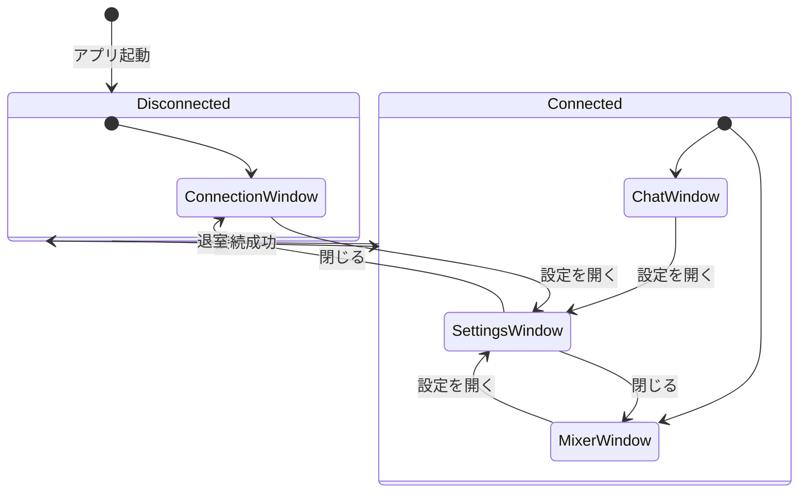
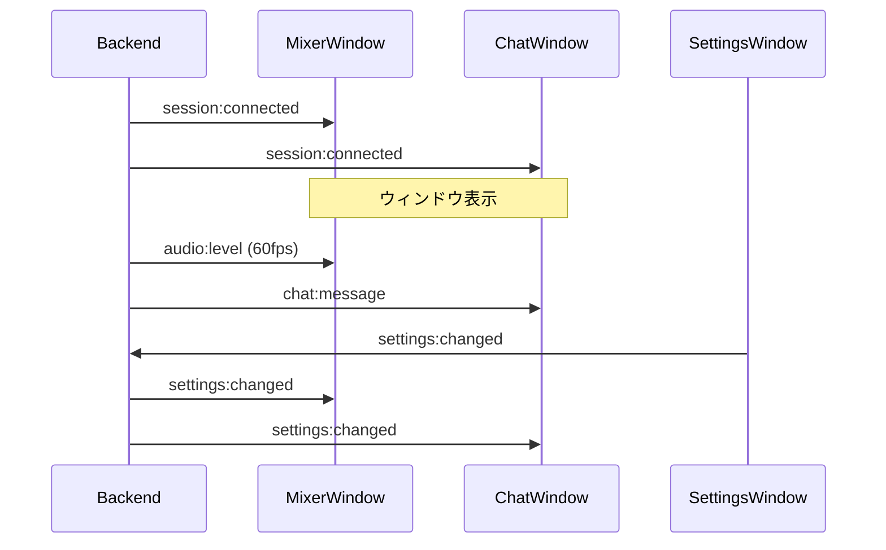
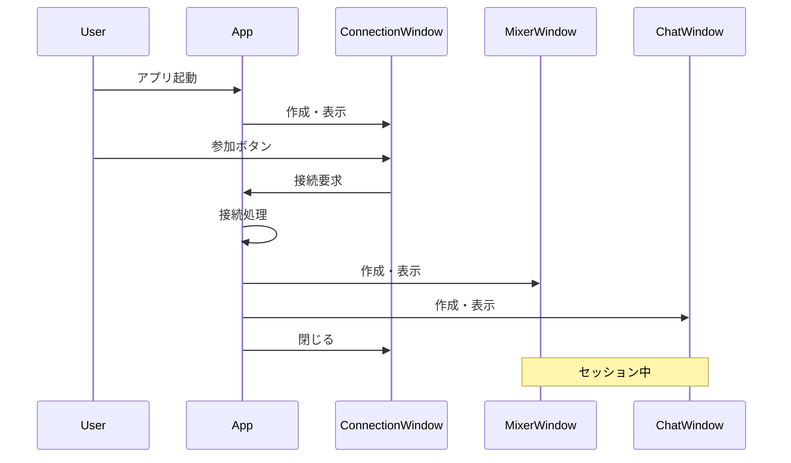

# マルチウィンドウアーキテクチャ

jamjam のマルチウィンドウ構成を定義する。

> **関連**: [architecture.md](../architecture.md) Section 8, [screens/README.md](./screens/README.md)

---

## 概要

### 設計目標

- マルチモニター環境での最適な操作性
- 各ウィンドウの役割を明確に分離
- 状態に応じた適切なウィンドウ表示

### ウィンドウ構成

| ウィンドウ | 表示タイミング | 主な役割 |
|-----------|--------------|---------|
| **接続画面** | 未接続時 | セッション作成/参加 |
| **ミキシングコンソール** | 接続後（メイン） | 音量・パン調整、退室 |
| **チャット** | 接続後（メイン） | テキストコミュニケーション |
| **設定画面** | 必要時 | オーディオデバイス、プリセット |

---

## 状態遷移

### アプリケーション状態とウィンドウ



### 状態別ウィンドウ表示

| アプリ状態 | 接続画面 | ミキサー | チャット | 設定 |
|-----------|---------|---------|---------|------|
| **未接続** | 表示（メイン） | 非表示 | 非表示 | オプション |
| **接続中** | 表示（ローディング） | 非表示 | 非表示 | オプション |
| **接続済み** | 非表示 | 表示（メイン） | 表示（メイン） | オプション |

---

## ウィンドウ詳細

### 1. 接続画面ウィンドウ (ConnectionWindow)

セッション参加/作成のシンプルなUI。ui.pen の Screens/JoinRoom に準拠。

#### 仕様

| 項目 | 値 |
|------|-----|
| デフォルトサイズ | 600 x 700 px（ui.pen Screens/JoinRoom に合わせる） |
| 最小サイズ | 600 x 500 px |
| リサイズ | 可 |
| 閉じる動作 | アプリ終了 |

**実装メモ**: 本項が想定する「接続画面用の専用ウィンドウ」は `src-tauri/src/windows.rs`
に `create_connection_window`/`transition_to_connected` として実装済みだが、現状
`MainScreen.tsx` からは呼び出されていない（未配線）。この未配線の `create_connection_window`
自体のサイズ（`inner_size(400.0, 300.0)` / `min_inner_size(320.0, 280.0)` / `resizable(false)`）
は本表の値と一致していない点に注意 -「別ウィンドウ方式」移行時に本表の値へ揃えるか、
本表を実装値に合わせて更新すること。

現在の実装は単一のメインウィンドウ（`tauri.conf.json` の `windows[0]`）を使い回し、
`window_resize_main` コマンドで未接続時は 600x700、接続後は 1134x700 に動的リサイズする
ことで、上記サイズ仕様を擬似的に満たしている。接続時はあわせて最小サイズも 800x500 に
引き上げ、3カラムレイアウトが崩れる幅まで縮小できないようにする（`window_resize_main`
は `width`/`height` に加え `min_width`/`min_height` も受け取り、`set_min_size` を呼ぶ）。
サイズの定数は `ui/src/lib/windowSizes.ts` に一元化されている
（`JOIN_WINDOW_SIZE`/`JOIN_MIN_SIZE`/`MIXER_WINDOW_SIZE`/`MIXER_MIN_SIZE`）。
別ウィンドウ方式への移行は将来のタスクとする。

**接続後のレイアウト（現在の実装 / ui.pen Screens/Main）**: 接続済み状態では、以下の
専用ウィンドウ（ミキサー / チャット）を別々に開くのではなく、単一のメインウィンドウ
（1134x700、ui.pen の 1134x666 アートボードに合わせる）を 3 カラム構成で描画する:

- 左（幅 240px）: ルームサイドバー = ルームコード表示（コピー可）・参加者一覧
  （自分=黄アイコン、参加者=緑アイコン + ↑/↓ レイテンシ）・マスター水平メーター・退出ボタン
- 中央（可変幅）: ミキサー（`MixerPanel`）
- 右（幅 280px）: チャット（`ChatPanelAdapter` → `ChatPanel`、常時表示のドッキング列）

**既知の制約**: 参加者一覧の ↑/↓ レイテンシは、現状バックエンドが単一の集計値
（`streaming_status` の `latency`）のみを提供するため、全参加者行に同じ値を表示する
（真の per-peer 値ではない）。出力メーターも同様に単一の値を全参加者行に出す。
フェーダー・パン・ミュートは参加者ごとにバックエンドの `mixer`（`mixer_get` / `mixer:changed` /
`mixer_set_peer_*`）が持つが、音声の相手は 1 人なので、実際に聞こえる音量・パンは
音声の相手（`streaming_peer_id`）の分だけが反映される。ほかの参加者の位置は覚えているだけで、
その人が音声の相手になったときに使われる。

上部に 48px のヘッダー（ロゴ + 設定ボタン）、下部に 32px のフッター（接続ステータス
ドット + テキスト）を持つ。退出はサイドバーの退出ボタン → 退室確認ダイアログ。

#### 機能

- ルーム作成ボタン
- 招待コード入力フィールド
- 参加ボタン
- 設定ボタン（設定ウィンドウを開く）

#### レイアウト

```
┌────────────────────────────────┐
│          jamjam               │
├────────────────────────────────┤
│                                │
│    ┌────────────────────┐      │
│    │  [ ルームを作成 ]  │      │
│    └────────────────────┘      │
│                                │
│    ─────── または ───────      │
│                                │
│    招待コード: [______]        │
│                [ 参加 ]        │
│                                │
│                        [⚙]    │
└────────────────────────────────┘
```

---

### 2. ミキシングコンソールウィンドウ (MixerWindow)

DAWスタイルのミキシングコンソール。

#### 仕様

| 項目 | 値 |
|------|-----|
| デフォルトサイズ | 800 x 600 px |
| 最小サイズ | 600 x 400 px |
| リサイズ | 可（水平方向優先） |
| 閉じる動作 | 退室確認ダイアログ → アプリ終了 |

#### 機能

- チャンネルストリップ（自分 + 参加者）
- マスターセクション
- 退室ボタン
- 設定ボタン

#### 既存コンポーネント

`ui/src/components/MixerPanel/` の以下のコンポーネントを使用:

- `MixerPanel` - ルートコンポーネント
- `ChannelStrip` - 個別チャンネル
- `MasterSection` - マスター出力
- `StereoMeter`, `StereoFader`, `PanSlider`

---

### 3. チャットウィンドウ (ChatWindow)

テキストコミュニケーション用ウィンドウ。

#### 仕様

| 項目 | 値 |
|------|-----|
| デフォルトサイズ | 400 x 500 px |
| 最小サイズ | 300 x 400 px |
| リサイズ | 可 |
| 閉じる動作 | ウィンドウを隠す（再表示可能） |

#### 機能

- メッセージ一覧
- 入力フィールド
- 絵文字リアクション
- システムメッセージ（参加/退室通知）

#### 既存コンポーネント

`ui/src/components/ChatPanel/` の以下のコンポーネントを使用:

- `ChatPanel` - ルートコンポーネント
- `ChatMessageList` - メッセージ一覧
- `ChatInput` - 入力フィールド
- `ReactionBar`, `EmojiPicker`

---

### 4. 設定画面ウィンドウ (SettingsWindow)

オーディオデバイス、プリセット、表示設定。

#### 仕様

| 項目 | 値 |
|------|-----|
| デフォルトサイズ | 720 x 560 px |
| 最小サイズ | - （リサイズ不可のため設定なし） |
| リサイズ | 不可 |
| 閉じる動作 | ウィンドウを閉じる |
| モーダル | いいえ（他ウィンドウ操作可能） |

サイズ・リサイズ可否は未配線の `create_settings_window`（`src-tauri/src/windows.rs`）の
実装値。

#### 機能

- 全般設定（言語）※テーマ切り替えUIは削除済み。理由は
  [design-tokens.md](./design-tokens.md#ライトテーマ) と
  [settings-panel.md](./components/settings-panel.md) を参照
- プロフィール（表示名）
- デバイス設定（入出力機器、サンプルレート）
- 診断

#### 既存コンポーネント

`ui/src/components/SettingsPanel/` の以下のコンポーネントを使用:

- `SettingsPanel` - ルートコンポーネント
- `VerticalTabs` - タブナビゲーション
- `GeneralTab`, `ProfileTab`, `DevicesTab`, `DiagnosticsTab`

---

## ウィンドウ間通信

### Tauri Events

ウィンドウ間の通信には Tauri の Event System を使用する。

#### イベント一覧

| イベント名 | 送信元 | 受信先 | ペイロード |
|-----------|-------|-------|-----------|
| `session:connected` | Backend | All | `{ roomId, participants }` |
| `session:disconnected` | Backend | All | `{ reason }` |
| `participant:joined` | Backend | Mixer, Chat | `{ id, name }` |
| `participant:left` | Backend | Mixer, Chat | `{ id, name }` |
| `audio:level` | Backend | Mixer | `{ channelId, levelL, levelR }` |
| `chat:message` | Backend | Chat | `{ id, type, content, ... }` |
| `settings:changed` | Settings | All | `{ key, value }` |

### 状態同期



---

## ウィンドウ管理

### 起動シーケンス



### ウィンドウ位置の記憶

各ウィンドウの位置・サイズは設定ファイルに保存し、次回起動時に復元する。

```toml
# config.toml

[windows.mixer]
x = 100
y = 100
width = 800
height = 600

[windows.chat]
x = 920
y = 100
width = 400
height = 500

[windows.settings]
x = 200
y = 150
width = 600
height = 500
```

---

## Tauri 実装

### tauri.conf.json

現在の単一メインウィンドウの実際の設定（`src-tauri/tauri.conf.json`）。未接続時の
JoinRoom サイズを初期値とし、接続後は `window_resize_main` が動的に 1134x700 へ広げる
（下記「動的ウィンドウ作成」参照）。

```json
{
  "app": {
    "windows": [
      {
        "title": "jamjam - P2P Audio",
        "width": 600,
        "height": 700,
        "resizable": true,
        "fullscreen": false,
        "minWidth": 600,
        "minHeight": 500
      }
    ]
  }
}
```

### 動的ウィンドウ作成（現在の実装）

```rust
// src-tauri/src/windows.rs

#[tauri::command]
pub fn window_resize_main(
    app: AppHandle,
    width: f64,
    height: f64,
    min_width: f64,
    min_height: f64,
) -> Result<(), String> {
    if let Some(window) = app.get_webview_window(labels::MAIN) {
        window.set_size(LogicalSize::new(width, height)).map_err(|e| e.to_string())?;
        window.set_min_size(Some(LogicalSize::new(min_width, min_height))).map_err(|e| e.to_string())
    } else {
        Err("Main window not found".to_string())
    }
}
```

```typescript
// ui/src/screens/MainScreen.tsx (要約) - 接続状態が実際に変化した時だけ呼ぶ
const target = isConnected ? MIXER_WINDOW_SIZE : JOIN_WINDOW_SIZE;
const minSize = isConnected ? MIXER_MIN_SIZE : JOIN_MIN_SIZE;
windowResizeMain(target.width, target.height, minSize.width, minSize.height);
```

### 動的ウィンドウ作成（別ウィンドウ方式・未配線）

`src-tauri/src/windows.rs` にはミキサー/チャット/設定を別ウィンドウで開く実装も既に
存在するが、現状どこからも呼び出されていない（上記の単一ウィンドウ方式が実際に使われる
経路）。将来この方式に切り替える場合の実装値:

```rust
// src-tauri/src/windows.rs

use tauri::{WebviewUrl, WebviewWindowBuilder};

pub fn create_mixer_window(app: &tauri::AppHandle) -> tauri::Result<()> {
    WebviewWindowBuilder::new(
        app,
        labels::MIXER,
        WebviewUrl::App("index.html#/mixer".into()),
    )
    .title("jamjam - Mixer")
    .inner_size(800.0, 600.0)
    .min_inner_size(600.0, 400.0)
    .resizable(true)
    .build()?;
    Ok(())
}

pub fn create_chat_window(app: &tauri::AppHandle) -> tauri::Result<()> {
    WebviewWindowBuilder::new(
        app,
        labels::CHAT,
        WebviewUrl::App("index.html#/chat".into()),
    )
    .title("jamjam - Chat")
    .inner_size(400.0, 500.0)
    .min_inner_size(300.0, 400.0)
    .resizable(true)
    .build()?;
    Ok(())
}
```
```

---

## アクセシビリティ

### キーボードショートカット

| ショートカット | 動作 | スコープ |
|--------------|------|---------|
| `Cmd/Ctrl + 1` | ミキサーウィンドウにフォーカス | グローバル |
| `Cmd/Ctrl + 2` | チャットウィンドウにフォーカス | グローバル |
| `Cmd/Ctrl + ,` | 設定ウィンドウを開く | グローバル |
| `Cmd/Ctrl + M` | ミュート切り替え | ミキサー |
| `Cmd/Ctrl + Enter` | メッセージ送信 | チャット |
| `Escape` | ウィンドウを閉じる | 設定 |

### フォーカス管理

- 新しいウィンドウが開いたらフォーカスを移動
- チャットウィンドウを閉じて再度開いた場合、入力フィールドにフォーカス
- 設定ウィンドウを閉じたら、元のウィンドウにフォーカスを戻す

---

## i18n キー

```json
{
  "window.connection.title": "jamjam",
  "window.mixer.title": "jamjam - ミキサー",
  "window.chat.title": "jamjam - チャット",
  "window.settings.title": "設定",
  "window.mixer.closeConfirm": "セッションから退室しますか？",
  "window.chat.hidden": "チャットウィンドウを非表示にしました"
}
```

---

## 関連ドキュメント

- [architecture.md](../architecture.md) Section 8 - GUI 仕様
- [screens/README.md](./screens/README.md) - 画面遷移図
- [components/mixer-panel.md](./components/mixer-panel.md) - MixerPanel 仕様
- [design-guide.md](./design-guide.md) - デザインガイド
