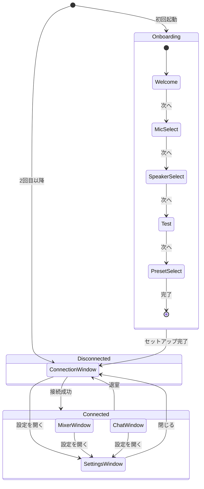
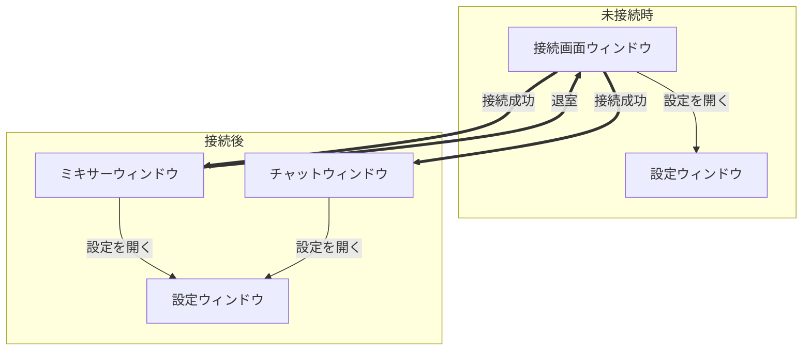

# 画面仕様

jamjam の画面構成と遷移を定義する。

> **関連**: [../user-stories.md](../user-stories.md), [../multi-window-architecture.md](../multi-window-architecture.md)

---

## ウィンドウ構成

jamjam はマルチウィンドウ構成を採用する。

jamjam は会員登録を持たない。端末の識別子は初回起動時に自動生成され、UI には現れない
（[ADR-024](../../adr/ADR-024-device-identity-instead-of-accounts.md)）。したがってサインイン画面は存在しない。

| ウィンドウ | 表示タイミング | 用途 | 優先度 |
|-----------|--------------|------|--------|
| 接続画面 | 未接続時 | セッション参加/作成 | 最高 |
| ミキシングコンソール | 接続後 | 音量・パン調整、接続情報 | 最高 |
| チャット | 接続後 | テキストコミュニケーション | 高 |
| 設定 | 必要時 | オーディオデバイス、プリセット | 中 |
| オンボーディング | 初回のみ | 初回セットアップ | 初回のみ |

---

## ウィンドウ遷移図

### 全体フロー



### ウィンドウ関係図



### 状態別ウィンドウ表示

| アプリ状態 | 接続画面 | ミキサー | チャット | 設定 |
|-----------|---------|---------|---------|------|
| **未接続** | 表示 | - | - | オプション |
| **接続中** | 表示（ローディング） | - | - | オプション |
| **接続済み** | - | 表示 | 表示 | オプション |

---

## ウィンドウ詳細

### 接続画面ウィンドウ (ConnectionWindow)

**役割**: セッション参加/作成の入口

**サイズ**: 600 x 700 px（`ui.pen` Screens/JoinRoom 準拠。旧仕様の400x300から拡大、詳細は
[connection-panel.md](../components/connection-panel.md) 参照）

#### レイアウト

```
┌──────────────────────────────────────┐
│ jamjam                          [⚙]  │  ← ヘッダー（ロゴ+設定、画面幅いっぱい）
├──────────────────────────────────────┤
│         jamjam へようこそ            │
│   低遅延で高品質な音声セッションを    │
│         始めましょう                 │
│    ┌────────────────────────────┐    │
│    │      [ ルームを作成 ]      │    │  ← プライマリCTA（accent-blue塗り）
│    └────────────────────────────┘    │
│    ─────────── または ───────────    │
│    招待コードで参加                  │
│    ┌──────────────────┐┌─────────┐   │
│    │  ABC-123          ││ [ 参加 ]│   │  ← コード入力 + 参加ボタン
│    └──────────────────┘└─────────┘   │
│    ┌────────────────────────────┐    │
│    │ ⚡ テストルーム (ABC234)   │    │  ← 緑ボーダーのテストルームカード
│    └────────────────────────────┘    │
└──────────────────────────────────────┘
```

#### 状態

| 状態 | 表示内容 |
|-----|---------|
| 初期 | ルーム作成/参加フォーム |
| 接続中 | ローディングスピナー |
| エラー | エラーメッセージ + 再試行ボタン |

---

### ミキサーウィンドウ (MixerWindow)

**役割**: 参加者ごとの音量・パン調整、接続情報表示

**サイズ**: 800 x 600 px（リサイズ可）

#### レイアウト

```
┌──────────────────────────────────────────────────────────────────┐
│  jamjam - Mixer                                         [⚙] [×] │
├────────┬────────┬────────┬────────┐         ┌───────────────────┤
│ 48kHz  │ 48kHz  │ 44.1kHz│        │         │   -12dB  -10dB    │
│ /2ch   │ /1ch   │ /2ch   │        │         │                   │
├────────┼────────┼────────┼────────┤         │   ┌───┐ ┌───┐    │
│├──┼──┤ │├──┼──┤ │├──┼──┤ │        │         │   │███│ │███│    │
├────────┼────────┼────────┼────────┤         │   │███│ │███│    │
│ ██ ██  │ ██ ██  │ ██ ░░  │        │         │   │░░░│ │░░░│    │
│ ██ ██  │ ██ ░░  │ ░░ ░░  │        │         │   └───┘ └───┘    │
│ ░░ ░░  │ ░░ ░░  │ ░░ ░░  │        │         │     L     R       │
│ [─][─] │ [─][─] │ [─][─] │        │         │                   │
├────────┼────────┼────────┼────────┤         │    マスター       │
│  自分  │ 健太   │ 美咲   │        │         │                   │
├────────┼────────┼────────┼────────┤         │  ┌─────────────┐  │
│   🎤   │   🔊   │   🔇   │        │         │  │   退室      │  │
└────────┴────────┴────────┴────────┘         └───┴─────────────┴──┘
```

#### 接続情報セクション（ツールチップ / パネル）

各チャンネルストリップに接続品質情報を表示（ホバーまたは展開）:

- RTT: 15ms
- Jitter: 0.8ms
- Packet Loss: 0.1%

#### コンポーネント

- ChannelStrip × 参加者数
- MasterSection（マスター出力 + 退室ボタン）
- 設定ボタン

---

### チャットウィンドウ (ChatWindow)

**役割**: テキストコミュニケーション

**サイズ**: 400 x 500 px（リサイズ可）

#### レイアウト

```
┌────────────────────────────────────┐
│  jamjam - Chat              [⚙] × │
├────────────────────────────────────┤
│ ┌────────────────────────────────┐ │
│ │ [システム] セッション開始      │ │
│ │ [システム] 健太が参加しました  │ │
│ │                                │ │
│ │ 健太: 今日もよろしく！         │ │
│ │       👍2 🎵1                  │ │
│ │                                │ │
│ │ 自分: よろしく！何から始める？ │ │
│ │                                │ │
│ │ 健太: BPM120のファンクで       │ │
│ │       いこう！                 │ │
│ │       👍3 ❤️1                  │ │
│ └────────────────────────────────┘ │
├────────────────────────────────────┤
│ [メッセージを入力...      ] [送信] │
└────────────────────────────────────┘
```

#### コンポーネント

- ChatMessageList（メッセージ一覧 + 自動スクロール）
- ChatInput（複数行入力）
- ReactionBar（絵文字リアクション）

---

### 設定ウィンドウ (SettingsWindow)

**役割**: オーディオ設定、プリセット選択、表示設定

**サイズ**: 600 x 500 px（リサイズ可）

#### レイアウト

```
┌──────────────────────────────────────────────────┐
│  設定                                        [×] │
├─────────────┬────────────────────────────────────┤
│             │                                    │
│  ▸ 全般     │  テーマ       [ ダーク        ▼]  │
│    プロフィ │                                    │
│    デバイス │  言語         [ 日本語        ▼]  │
│    診断     │                                    │
│             │                                    │
│             ├────────────────────────────────────┤
│             │  ▸ プロフィール                    │
│             │                                    │
│             │  表示名       [____________]       │
│             │                                    │
│             ├────────────────────────────────────┤
│             │  ▸ デバイス                        │
│             │                                    │
│             │  入力         [Built-in Mic   ▼]  │
│             │  出力         [Built-in Spk   ▼]  │
│             │  サンプルレート [48000 Hz     ▼]  │
│             │                                    │
└─────────────┴────────────────────────────────────┘
```

#### タブ構成

| タブ | 内容 |
|------|------|
| 全般 | テーマ、言語 |
| プロフィール | 表示名 |
| デバイス | 入出力機器、サンプルレート、バッファ |
| 診断 | 環境診断実行ボタン |

#### プリセット選択（デバイスタブ内）

| プリセット | バッファサイズ | 説明 |
|-----------|---------------|------|
| Zero Latency | 32 samples | 最小遅延、強力なCPU必要 |
| Ultra Low Latency | 64 samples | 非常に低い遅延 |
| Balanced | 128 samples | バランス型（推奨） |
| High Quality | 256 samples | 最も安定 |

---

### オンボーディング画面

**役割**: 初回セットアップガイド

#### 共通レイアウト

```
┌──────────────────────────────────────────┐
│                                          │
│  ● ● ○ ○ ○                               │  ← 進捗インジケーター
│                                          │
│  ┌────────────────────────────────┐      │
│  │                                │      │
│  │      [ ステップ内容 ]          │      │
│  │                                │      │
│  └────────────────────────────────┘      │
│                                          │
│  [← 戻る]              [次へ →]         │
│                                          │
│        または [後で設定する]             │
│                                          │
└──────────────────────────────────────────┘
```

#### ステップ詳細

| ステップ | 内容 |
|---------|------|
| 1. ようこそ | アプリ紹介、前提条件（ヘッドフォン推奨）|
| 2. マイク選択 | デバイス一覧、レベルメーター |
| 3. スピーカー選択 | デバイス一覧、テスト音再生 |
| 4. テスト | マイクテスト（録音→再生）|
| 5. モード選択 | プリセット4種から選択 |

---

## ウィンドウ管理

### ウィンドウ位置の記憶

各ウィンドウの位置・サイズは設定ファイルに保存し、次回起動時に復元する。

```toml
# config.toml
[windows.mixer]
x = 100
y = 100
width = 800
height = 600

[windows.chat]
x = 920
y = 100
width = 400
height = 500
```

### 閉じる動作

| ウィンドウ | 閉じるボタン押下時の動作 |
|-----------|------------------------|
| 接続画面 | アプリ終了 |
| ミキサー | 退室確認ダイアログ → アプリ終了 |
| チャット | ウィンドウを隠す（バックグラウンド動作） |
| 設定 | ウィンドウを閉じる |

---

## アクセシビリティ

### キーボードショートカット

#### グローバル（全ウィンドウ共通）

| キー | 動作 |
|-----|------|
| Cmd/Ctrl + 1 | ミキサーウィンドウにフォーカス |
| Cmd/Ctrl + 2 | チャットウィンドウにフォーカス |
| Cmd/Ctrl + , | 設定ウィンドウを開く |
| Cmd/Ctrl + M | ミュート切り替え |

#### ミキサーウィンドウ

| キー | 動作 |
|-----|------|
| Tab | チャンネル間のフォーカス移動 |
| ↑/↓ | フェーダー操作 |
| ←/→ | パンスライダー操作 |
| M | 選択チャンネルのミュート切り替え |

#### チャットウィンドウ

| キー | 動作 |
|-----|------|
| Cmd/Ctrl + Enter | メッセージ送信 |
| Escape | 入力キャンセル |
| ↑ | 前のメッセージを編集 |

#### 設定ウィンドウ

| キー | 動作 |
|-----|------|
| Tab | フィールド間移動 |
| Escape | ウィンドウを閉じる |
| ↑/↓ | タブ選択 |

### フォーカス管理

- 新しいウィンドウが開いたらフォーカスを移動
- チャットウィンドウを再表示した場合、入力フィールドにフォーカス
- 設定ウィンドウを閉じたら、元のウィンドウにフォーカスを戻す

---

## 関連ドキュメント

- [multi-window-architecture.md](../multi-window-architecture.md) - マルチウィンドウ詳細仕様
- [design-guide.md](../design-guide.md) - デザインガイド
- [components/mixer-panel.md](../components/mixer-panel.md) - MixerPanel 仕様
