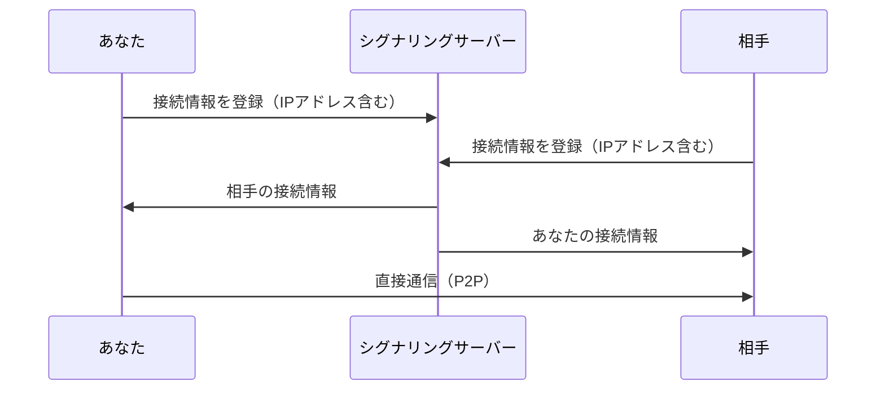

# プライバシーとセキュリティ

jamjamを使用する前に、以下のプライバシーに関する情報をご確認ください。使い始めるときの約束事は [利用規約](../terms.md) にあります。

## 利用規約への同意

初回起動の最初の画面で、[利用規約](../terms.md) に同意をお願いしています。**同意するまで、アプリはjamjamのサーバーにも、更新の確認のためのGitHubにも、何も送りません。** 同意した規約の版と日時は、お使いのパソコンの設定ファイルにだけ保存し、サーバーには送りません。規約が変わって改めての同意が必要になったときは、次の起動で同じ画面を出します。同意できないときは、画面を閉じてください（何も保存されません）。規約と、このページへのリンクは、設定の「規約など」からいつでも開けます。

## アカウント登録は不要です

jamjamに会員登録はありません。アプリがメールアドレスや電話番号を求めることはありません。初回起動で利用規約に同意すれば、そのまま
セッションに参加できます。

### 端末識別子について

アカウントの代わりに、**初回起動時にお使いの端末ごとの識別子が自動生成されます**。

| 項目 | 内容 |
|------|------|
| 生成場所 | お使いのパソコン内（サーバーには問い合わせません） |
| 保存場所 | アプリの設定フォルダ内の `device_identity.json` |
| 形式 | 26文字の英数字（例: `7K2MQ4XJ9VBTN3RHDW8FCL5PZY`） |
| 内容 | 端末内で生成した鍵から計算した値のみ。氏名・メールアドレス・ハードウェア情報は含みません |

この識別子は署名付きでシグナリングサーバーに提示されるため、**他の人があなたの識別子を名乗ることは
できません**。

識別子はセッションの他の参加者には送られず、参加者どうしで共有されることはありません。

## ベータ版の遠隔デバッグについて

**ベータ版（`-beta` の付いた版）だけ**、動作の検証のために、開発者が遠隔からアプリを操作できる仕組みを持っています。
正式リリース版には、この仕組みのコードそのものが入っていません。

- ベータ版は、利用規約に同意したあと、その起動時とその後 30 分ごとに、jamjam のサーバーへ**この端末が登録されているか**を問い合わせます。
  送るのは端末識別子の署名（[端末識別子について](#端末識別子について)と同じもの）だけです。
- サーバーに登録された端末だけが、サーバーへの接続を保ち、遠隔からの操作を受け付けます。登録は開発者がサーバー側で行い、
  お使いの端末の画面や設定には、有効にする操作も表示もありません。登録されていない端末は、問い合わせのほかに何も送りません。
- 登録された端末では、開発者が、アプリの画面、診断ログ、音声設定や音声デバイスの一覧を読み、アプリを操作できます。
  端末を登録するのは、開発者自身の検証用の機材だけです。

## 設定の手伝い

同じルームの人が、あなたの音声の設定を手伝ってくれる機能があります。**あなたが許可したときだけ**始まり、**あなたがいつでも止められます**。

- 手伝いたい人が申し出ると、あなたの画面に問いかけが出ます。許可を押すまで何も起きません。**許可は始めの 1 回だけ**で、そのあとの 1 つ 1 つの操作は聞かれません。
- 手伝う人の手元には、あなたのアプリと同じ画面が別のウィンドウで開きます。手伝う人がそこで操作すると、あなたのアプリに届きます。
  あなたの画面と、手伝う人の画面には、互いの状態（音声のメーター・ミュート・音量・左右の位置・設定など）が映ります。この通信は、jamjam のサーバーの中継を通ります。
- 手伝う人がしてよいことは決まっています。**マイクのミュートや音量・音声の設定の変更**、診断はできます。**あなたの代わりにチャットを送ること、
  退室やほかのルームへ移ること、接続先や利用状況の送信の設定を変えることはできません。**
  してよい操作の一覧は、あなたのアプリが 1 件ずつ確かめます。手伝う人のアプリがどう作られていても、この決まりは変わりません
  （一覧: [手伝いで相手に何をされうるか](../../docs-spec/api/remote-permissions.md)）。
- 手伝う人には、**機器のデバイス ID、失敗したときのエラーの文面、ほかの参加者のネットワークアドレスは渡りません。** 機器は名前で見えます。
- 手伝っているあいだ、あなたの画面には**手伝っている人の名前と「停止」**が出続けます。ルームのチャットには、手伝いの開始と終了、音声の設定を変えたことが記録されます
  （ミュートや音量の変更は記録されません）。
- 止めるのは、あなたの「停止」、手伝う人がやめる、どちらかが退室する、接続が切れる、のどれか。**アプリを起動し直しても、手伝いは続きません。**

## ルームに入るときにサーバーへ伝わるもの

ルームを作る・入るとき、アプリは自分の環境をjamjamのサーバーに1回伝えます。不具合が起きた環境を特定し、どの版・どのOSで使われているかを運営が把握するためです。**アプリ・OS・マシン・設定は、利用状況の送信の設定（下記）がオフでも伝わります。音声デバイスの名前とIDは、利用状況の送信をオンにした人だけです。**（デバイスの名前には「太郎のAirPods」のようにご自身の名前が入ることがあるためです。）

| 伝わるもの | 内容 |
|------------|------|
| アプリ・OS | アプリの版、OSの種類と版（メジャー・マイナーまで）、CPUの種類 |
| マシン | CPUのコア数、メモリ量（2の冪に丸めた値）、表示言語、オーディオAPIの種類 |
| 音声デバイス | 入力と出力の名前・ID・種類・チャンネル数・対応サンプルレート・最小バッファ。**利用状況の送信（下記）をオンにした人だけ**伝わります |
| 設定 | 設定ファイルの項目の値（表示名は除く） |

- **これはサーバーに保存されるだけで、同じルームの他の参加者には送られません。** 退室すると消えます。 相手に見える情報は、下の「相手に見える情報」の表のとおりです。
- 伝わるのは入る時点の値です。入ったあとに変えた設定は、次に入るときまで伝わりません。

## 運営者に見えるもの

jamjamの運営者は、**いま開いているルームについて、次のことを確認できます。** サービスの運用と、不具合の原因を調べるためにだけ見ます。

| 運営者に見えるもの | 内容 |
|--------------------|------|
| ルーム | ルームの名前、招待コード、人数 |
| 参加者 | 表示名、端末識別子、入った時刻 |
| アドレス | 公開IPアドレス、ローカルIPアドレス、接続に使える経路の候補 |
| 環境 | 上の「ルームに入るときにサーバーへ伝わるもの」の表の内容 |

- **見えるのは、ルームが開いているあいだだけです。** 参加者が退室するか接続が切れると、その人の情報は消えます。ルームは最後の人が出ると消えます。ルームごとの入退室の履歴は残しません。
- **例外として、終わったルームの数だけを、日ごとの件数として数えます。** jamjamがどれくらい使われているかを知るためのものです。ルームが終わるたびに、その日の「終わったルームの数」「一定時間以上開いていたルームの数」と、その内訳（端末が 1 台だけだったか、2 台以上いたか）に 1 を足します。**数えるのは件数だけで、どのルームか・誰がいたか・端末識別子・IPアドレス・いつ入ったかは残しません。** 後から特定の人やルームを引くことはできません。利用状況の送信の設定（下記）に関係なく数えます。
- チャットの本文と音声は、運営者には見えません。チャットはサーバーが相手に中継するだけで、保存しません。

## 保存期間

| 情報 | 保存期間 |
|------|----------|
| ルームと参加者の情報（上の表） | 退室・切断で消える |
| 終わったルームの日ごとの件数（上の「運営者に見えるもの」の例外） | 件数だけで個人を特定できないため、期限を決めずに残す |
| 利用状況の送信で送った内容 | 90日で自動的に削除 |
| 「問題を報告」で送った内容 | 30日で自動的に削除 |

## 第三者のサーバーへの問い合わせ

ルームを作る・入るとき、アプリは**お使いのネットワークの外から見えるIPアドレス（公開IPアドレス）を調べるために、STUNサーバーへ問い合わせます。** 問い合わせ先は次のとおりです。

| 問い合わせ先 |
|--------------|
| `stun.l.google.com`、`stun1.l.google.com`、`stun2.l.google.com`（Google） |
| `stun.cloudflare.com`（Cloudflare） |

問い合わせには、音声・名前・設定などは含まれません。ただし、**あなたのIPアドレスは問い合わせ先から見えます。** 同じ公開IPアドレスは、相手の参加者にも見えます（下記「P2P通信とIPアドレス」）。

## データの置き場所

jamjamのサーバーは、**米国の事業者が提供するクラウドの上**で動いています。利用状況と問題の報告の**保存先の地域は、アジア太平洋**です。

## P2P通信とIPアドレス

> [!WARNING]
> **重要**
> jamjamはP2P（Peer-to-Peer）通信を使用しています。**セッション参加者同士でIPアドレスが共有されます。**

### なぜIPアドレスが見えるのか

P2P通信では、音声データを直接相手に送信するために、お互いのIPアドレスを知る必要があります。

### 相手に見える情報

| 情報 | 見える？ | 説明 |
|------|----------|------|
| パブリックIPアドレス | ✓ | インターネット上のIPアドレス |
| 使用ポート番号 | ✓ | UDP通信に使用するポート |
| ユーザー名 | ✓ | セッション参加時に設定した名前 |
| 音声データ | ✓ | 送信した音声（相手にはそのまま聞こえます。通信の途中は暗号化されます） |
| ローカルIPアドレス | △ | 同一LAN内の場合のみ |
| 端末識別子 | ✗ | 他の参加者には送られません |

### 相手に見えない情報

- MACアドレス
- OSの種類・バージョン
- その他のネットワークトラフィック

## なぜリレーサーバーを使わないのか

IPアドレスを隠すにはリレーサーバー（TURN）経由で通信する方法がありますが、jamjamでは**遅延最小化を最優先**としているため採用していません。

| 方式 | IPアドレス | 追加遅延 |
|------|-----------|----------|
| P2P直接接続（現在） | 露出する | なし |
| TURN経由 | 隠せる | +10-50ms |

音楽セッションでは10ms以上の遅延増加が演奏体験に大きく影響するため、P2P直接接続を採用しています。

## 利用状況の送信（任意・既定はオフ）

jamjamは、お使いの端末での動作の様子をjamjamのサーバーに送る機能を持っています。特定の機材や回線で起きる不具合を見つけて直すためのものです。**既定ではオフで、初回起動でも確認のダイアログは出ません。** 設定の「診断」タブにある「利用状況を送る」を、ご自身でオンにしたときだけ動きます。

オフの間は、何も集めず、何も送らず、後述のインストールIDも作りません。

### 送るもの・送らないもの

| 送るもの | 内容 |
|----------|------|
| 環境 | アプリの版、OS（メジャー・マイナーまで）、CPUのコア数、メモリ量（2の冪に丸めた値）、表示言語、オーディオAPIの種類 |
| 音声デバイス | 入力と出力の**名前**と**ID**、種類（USB・内蔵など）、チャンネル数、対応するサンプルレートと最小バッファ |
| 設定 | 設定ファイルの項目のうち、下の「送らないもの」を除く全部（プリセット、サンプルレート、バッファサイズなど）。自前のサーバーを指定しているときは、そのURLの**ホストとポートまで**（ユーザー名・パスワード・パス・クエリは送りません）と、既定のサーバーかどうか |
| セッションごとの集計 | 部屋を作ったか入ったか、継続時間、終了の理由、再接続の回数、最大人数、遅延（RTT）・パケットロスの集計、音切れ（xrun）の回数、音声が通った経路の種類（同じネットワーク内か、公開アドレス経由か）、接続にかかった時間と最初の音声が届くまでの時間 |
| ご自身のIPアドレス | 相手に伝えた、お使いのネットワーク上のIPアドレスと、外から見える公開IPアドレス（ポート番号は送りません） |
| エラー | 起きた場所と種類（サーバーに繋がらなかった理由の区分、相手からの音声が途絶えたこと、など決まった区分だけ。メッセージ本文は送りません） |
| クラッシュ | 落ちた場所（ファイル名・行・関数名）だけ。次の起動で送ります |

| 送らないもの |
|--------------|
| 表示名、入った部屋の履歴、端末識別子、音声、チャット、部屋の名前・パスワード・招待コード、**相手の情報（相手のIPアドレスを含む）**、ホスト名、ユーザー名、ファイルのパス |

> [!WARNING]
> **デバイスの名前とIPアドレスについて**
> オーディオデバイスの名前は、お使いのOSが返すとおりに送ります。「太郎のAirPods」のように、**ご自身の名前がデバイス名に入っていると、それも送られます。** また、**ご自身のIPアドレスも送られます。** どちらも、オンにした人のものだけです。オンにする前に、次の「送る内容を見る」で実際の文字列を確かめてください。

### 送る内容を見る

設定の「診断」タブの「送る内容を見る」を押すと、**次に送る内容を、送る本文のままそのまま**表示します。

### インストールID

オンにすると、報告をひとまとめにするための**乱数のインストールID**を作ります。アカウント・端末識別子・ハードウェアの値とは結びつけません。端末識別子（上記）とは別のもので、設定ファイルとも別の場所に保存します。

### 止め方

設定の「利用状況を送る」をオフにします。**オフにすると、まだ送っていない内容と、インストールIDを捨てます。** オンにし直すと、別のインストールIDになります。

### 送り方

- アプリの起動時と、セッションが終わったときに、まとめて送ります（1回あたり64KB・200行まで）
- 送れなかった分は捨てます。溜め込んで送り直すことはしません
- 送り先は、アプリが接続先として持っているサーバーです。設定に自前のサーバーを指定していても、そちらには送りません
- 診断ログ`jamjam.log`は、この送信には含みません。利用状況の送信をオンにしていても、`jamjam.log`は自動では送られません。`jamjam.log`が送られるのは、次の「問題の報告」のときだけです

## 問題の報告（`jamjam.log`を送るとき）

不具合の調査のために、診断ログ`jamjam.log`をjamjamのサーバーに送る場合があります。**どれも、あなたが操作したときだけです。** 利用状況の送信をオンにしていても、確認なしでは送りません。

### 設定の「問題を報告」

設定の「診断」タブで「問題を報告する」を押したときだけ動きます。**送信する前に、送る`jamjam.log`の中身がそのまま画面に出ます。** 「送信する」を押すまで何も送りません。

| 送るもの | 内容 |
|----------|------|
| `jamjam.log` | 新しいほうから最大512KiB |
| コメント | ご自身が書いた文章（任意・2000文字まで） |
| 環境 | アプリの版、OSの種類、CPUの種類 |

### 前回、正常に終了しなかったとき

前回の終了がうまくいかなかったことを次の起動で見つけたときの扱いです。

- 落ちた場所・固まった場所（ファイル名・行・どの処理か）は、利用状況の送信をオンにしている端末だけが、確認なしで送ります。**`jamjam.log`は付けません。**
- 利用状況の送信が**オフ**の端末: 起動したときに確認が出ます。1.0.0より前のベータ版では、「報告を送る」を選んだときだけ、落ちた場所に加えて`jamjam.log`を送ります（確認の文面に、ログに何が入りうるかを書いてあります）。1.0.0以降の版では、落ちた場所だけを送り、`jamjam.log`は付けません

### ログに入りうるもの

`jamjam.log`には、接続先のサーバーのアドレスと、お使いの音声デバイスの名前が入ることがあります。次のものは、ログに書く時点で伏せています。

| 伏せるもの | 残るもの |
|------------|----------|
| IPアドレス | 末尾を除いた部分（IPv6は上位64ビット） |
| 音声デバイスのシリアル番号 | 製品名 |
| デバイス名の持ち主（「太郎のAirPods」の「太郎」、`Taro's AirPods` の `Taro`） | 「AirPods」の部分 |
| ルームIDと招待コード | 先頭の2文字 |
| ほかの参加者と自分の識別子 | 先頭の4文字 |
| 参加者の表示名 | `peer1` のような連番に置き換えます |
| パソコンのユーザー名（フォルダのパスの中） | `~` に置き換えます |
| パスワードやトークンのような値 | 値は残しません |

音声とチャットの本文は入りません。古い版のアプリは、伏せ方が上の表と異なる場合があります。

送ったログは、上の「保存期間」のとおり30日で自動的に削除します。

### 送られた内容の調べ方

運営者は、送られた報告（「問題を報告」の内容・正常終了しなかったあとの報告）と、利用状況の送信で送られた内容を、不具合の原因を調べるために読みます。調べる作業の一部では、**外部の事業者（米国）が提供するAIの道具に、送られた内容を読ませることがあります。**

- 利用状況は、ふだんは件数や割合に集計して見ます。個別のファイルを読ませるのは、特定の不具合を調べるときだけです。
- 読ませた内容は、その事業者の規約に従って、一定の期間そちらにも残ることがあります。上の「保存期間」で消える期限は、こちらには及びません。
- その事業者のアカウントの設定で、読ませた内容をAIの学習に使うことは許可していません。ただし事業者の規約では、安全性の確認のために使われる場合は、この設定にかかわらず例外とされています。
- 読ませる前に、IPアドレス・参加者の識別子・ルームID・表示名を、さらに伏せます（上の「ログに入りうるもの」の表のとおりに伏せてあるのが前提ですが、古い版のアプリのログはそうなっていないためです）。気になる場合は、「問題を報告」を押す前に、画面に出る内容を確かめてください。

## 自動更新のための通信

jamjamは、新しい版が出ていないかを確かめるために、（利用規約に同意したあとで）起動の少しあととその後6時間おきに、GitHub（`github.com`）へ接続します。取りに行くのは更新情報のファイルだけで、**アプリの版とOSの種類が相手に見える以外は、何も送りません**（あなたのIPアドレスは、GitHubから見えます）。上の「利用状況の送信」とは別のもので、設定の「利用状況を送る」がオフでも動きます。

新しい版があれば、アプリに埋め込んだ公開鍵で署名を確かめてから入れます。署名が合わないものは入れません。止め方は [インストール](./installation.md#自動更新) を参照してください。

## 推奨される使い方

### 信頼できる相手とのみセッションを行う

- 招待コードは信頼できる相手にのみ共有してください
- 公開ルームへの参加は、IPアドレスが他の参加者に見えることを理解した上で行ってください

### VPNの使用（オプション）

IPアドレスを隠したい場合は、VPNサービスを使用してからjamjamに接続することで、実際のIPアドレスの代わりにVPNサーバーのIPアドレスが相手に見えるようになります。

> [!NOTE]
> **VPN使用時の注意**
> VPNを使用すると遅延が増加する可能性があります。低遅延が重要な音楽セッションでは、VPNの遅延特性を確認してから使用してください。

## 通信の暗号化

jamjamは、相手とのあいだの音声などの通信（音声、遅延の測定、遅延の情報）を暗号化します：

| 対象 | 暗号化方式 | 説明 |
|------|-----------|------|
| 鍵交換 | X25519 | 接続のたびに作る一時的な鍵で、両端が共通の鍵を作ります |
| 音声などの通信 | AES-256-GCM | 暗号化と同時に、書き換えられていないことを確かめます。受け取り済みのパケットの再送も受け付けません |

通信の途中で**第三者が音声を傍受しても、内容を解読することはできません**。ただし、通信の宛先（IPアドレス）は暗号化できません。

> [!NOTE]
> **通信相手の確認**
> ルームに入るとき、アプリはその入室のあいだだけ使う署名用の鍵を作り、公開鍵をサーバー経由で同じルームの相手に渡します（端末識別子とは別のもので、端末識別子は渡りません）。鍵交換はこの鍵で署名され、相手は署名が合わない鍵交換を受け付けません。通信の途中でパケットを書き換えられる立場の人は、署名を作れないので、両端のあいだに割り込んで音声を聞くことができません。
>
> 確認の前提として、公開鍵を渡すサーバーは信頼する前提です。また、署名に対応する前の版のアプリを使っている相手とは**暗号化はされますが、相手が本人かどうかは確かめません**。

> [!CAUTION]
> **暗号化に対応していない古い版のアプリとの通信**
> 暗号化に対応する前の版のアプリとつないだときは、その相手との音声は暗号化されません。そのとき、画面に「この相手との音声は暗号化されていません」と表示されます。

## シグナリングサーバー

シグナリングサーバーは接続の仲介のみを行います：

- ルーム作成・参加の管理
- 参加者間の接続情報の交換
- **音声データはシグナリングサーバーを経由しません**

## まとめ

| 項目 | 状態 |
|------|------|
| アカウント登録 | ✓ 不要（アプリはメールアドレスを求めません） |
| 音声データの暗号化 | ✓ 暗号化（暗号化に対応していない古い版の相手とのときを除く） |
| IPアドレスの秘匿 | ✗ 参加者間で共有される |
| 端末識別子の秘匿 | ✓ 参加者間では共有されない |
| アプリの版・OS・設定 | ルームに入るときサーバーに伝わる。他の参加者には共有されない。音声デバイスの名前とIDは、利用状況の送信をオンにした人だけ |
| 設定の手伝い | あなたが許可したときだけ。範囲は決まっていて、いつでも止められる |
| 利用状況の送信 | 既定はオフ。オンにしたときだけ、上の内容を送る |
| 問題の報告（`jamjam.log`） | 「問題を報告」を押したとき。1.0.0より前の版は、正常終了しなかったあとの確認で「送る」を選んだときにも送る。確認なしでは送らない。識別子・表示名・ルームIDは伏せてある |
| 運営者に見えるもの | 開いているルームの参加者の名前・端末識別子・IPアドレス・環境。ルームが終わると消える。終わったルームの数だけは、個人を特定しない日ごとの件数として残る |
| 保存期間 | 利用状況は90日、問題の報告は30日で自動削除 |
| 送られた内容の調べ方 | 不具合を調べるために、外部の事業者（米国）のAIの道具に読ませることがある。その事業者側の保存は上の期限の外 |
| 第三者からの傍受 | ✓ 暗号化により保護（同上） |

## 問い合わせ先

個人の情報の扱いについての質問と、送ったデータを消してほしいという依頼は、メールで受け付けています。

**privacy@koeda.me**

- **利用状況の送信で送った内容を消したいときは、インストールIDを書いてください。** 設定の「診断」タブの「送る内容を見る」に出る `install_id` の値です。これが分かれば、その端末から送られた内容を探して消せます。
- 利用状況の送信をオフにしたあとや、アプリを入れ直したあとは、インストールIDが別のものになっています。前のIDが分からないと探せませんが、送った内容は上の「保存期間」のとおり90日で自動的に消えます。
- 「問題を報告」で送った内容を消したいときは、送った日時と、書いたコメントの書き出しを教えてください。報告にはインストールIDが付かないためです。
- いただいたメールのアドレスと本文は、返信と依頼への対応にだけ使います。
- 2週間以内を目安に返信します。

不具合の報告や要望は、これまでどおり [GitHubのIssues](https://github.com/koedame/jamjam-client/issues) へどうぞ。**Issuesは誰でも読める場所です。氏名・IPアドレス・ログなど、個人の情報は書かないでください。**

**jamjamは信頼できる相手との音楽セッションを想定して設計されています。** IPアドレスの共有が問題になる場合は、VPNの使用をご検討ください。
